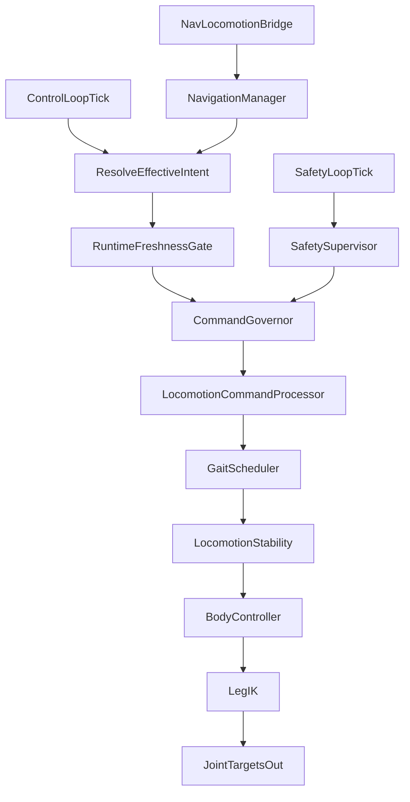

# `hexapod-server` Locomotion Architecture and Algorithms

This document explains how locomotion control is organized in `hexapod-server`, with explicit coverage of governors, supervisors, and modules.

## 1) Runtime loops and ownership

Core runtime orchestration is in:

- `hexapod-server/src/control/robot_control.cpp`
- `hexapod-server/src/control/robot_runtime.cpp`

Main loops:

- Bus loop
- Estimator loop
- Safety loop
- Control loop
- Diagnostics loop

`RobotControl` schedules loops, while `RobotRuntime` owns control-path state exchange and algorithm execution.

## 2) Roles: supervisor, governor, modules

### Supervisor (`SafetySupervisor`)

Location: `hexapod-server/src/control/safety_supervisor.cpp`.

Role:

- Evaluates fault rules (command freshness, estimator validity, contact count, bus health, power/current limits, tilt/body-rate, collapse).
- Prioritizes and latches faults (`FaultCode` priority map).
- Controls inhibition/torque-cut semantics and recovery hold behavior.

`SafetySupervisor` runs in the safety loop and produces `SafetyState` consumed by control.

### Governor (`CommandGovernor`)

Location: `hexapod-server/src/control/command_governor.cpp`.

Role:

- Shapes requested locomotion commands before gait/body/IK modules.
- Computes severity from support margin, tilt, body rate, fusion trust, contact mismatch, and command acceleration.
- Scales planar/yaw/body motion, cadence, and applies body-height squat and swing-floor adjustments.
- Emits reason bitmask and metrics for diagnostics.

`CommandGovernor` runs inside `ControlPipeline::runStep()`.

### Modules (control pipeline stages)

Primary implementation: `hexapod-server/src/control/control_pipeline.cpp`.

Pipeline stages, in order:

1. `CommandGovernor::apply(...)`
2. `LocomotionCommandProcessor::update(...)`
3. `GaitScheduler::update(...)`
4. `LocomotionStability::apply(...)`
5. `BodyController::update(...)`
6. `LegIK::solve(...)`

Output bundle (`PipelineStepResult`):

- `LegTargets`
- `JointTargets`
- `ControlStatus`
- `GaitState`
- `CommandGovernorState`

## 3) Control-step interaction walkthrough

`RobotRuntime::controlStep()` performs:

1. Read latest estimator and prior joint targets.
2. Refresh terrain snapshot from navigation (if enabled).
3. Apply fusion consistency policy (may force stand).
4. Resolve effective intent (`resolveEffectiveIntent`).
5. Run freshness gate (`RuntimeFreshnessGate`) in strict-control mode.
6. If freshness rejects: emit safe idle outputs and return.
7. Run `ControlPipeline::runStep(...)`.
8. Optionally clamp joint targets to servo dynamics in walk mode.
9. Publish outputs to shared buffers.
10. Emit telemetry and replay records.

## 4) Supervisory interactions in locomotion

There are two supervisory control boundaries:

- `SafetySupervisor`: fault policy and latching.
- `RuntimeFreshnessGate`: stream-validity control acceptance gate.

Interaction rule:

- Safety state and freshness both affect whether motion is accepted and which mode/fault is surfaced in control status.

## 5) Navigation-to-locomotion bridge

Primary files:

- `hexapod-server/src/control/navigation_manager.cpp`
- `hexapod-server/src/control/nav_locomotion_bridge.cpp`

Flow:

- `NavigationManager` manages route state, replans, blocked detection, and map-aware segment following.
- `NavLocomotionBridge` converts navigation objective state into motion intent deltas merged with fallback operator intent.
- `RobotRuntime::resolveEffectiveIntent(...)` selects/merges manual and navigation intent.

Bridge behaviors include:

- Fail policy modes (`FailStop`, `FailHold`, `FailRetryN`)
- Planar command slew filtering
- Optional body-frame position integral correction

## 6) Locomotion interaction diagram

## 7) Current caveats to document for operators

- `hexapod-server/README.md` has a simplified control-pipeline sequence that does not include all active stages in `ControlPipeline`.
- `ControlConfig` parses command-governor tuning, but `ControlPipeline` currently default-constructs `CommandGovernor` (config is not injected in current construction path).
- Freshness gating is supervisory but separate from `SafetySupervisor`; both should be treated as part of motion admission policy.
