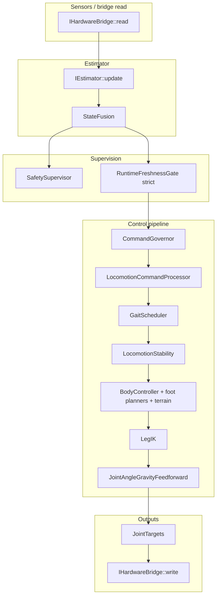

# `hexapod-server` locomotion, estimation, and kinematics pathway

This document describes how `hexapod-server` turns **sensor and bridge inputs** into **joint targets** sent back to hardware or simulation. It extends the earlier supervisor/governor/pipeline overview with a full **kinematics-relevant** pathway: every major module that influences foot placement, body pose, or joint angles is listed and ordered.

For global frame conventions (+X forward, +Y left, +Z up, body vs world), see [`REFERENCE_FRAMES.md`](REFERENCE_FRAMES.md).

---

## 1) Executive summary

| Phase | What happens | Primary sources |
|------|----------------|-----------------|
| **Bus** | Read `RobotState` from `IHardwareBridge`; write last `JointTargets`. | `robot_runtime.cpp` (`busStep`) |
| **Estimator** | Fuse / derive `RobotState` used by control (contacts, body twist, optional IMU/LiDAR passthrough). | `estimator.cpp`, `physics_sim_estimator.cpp`, `state_fusion.cpp` |
| **Safety** | Evaluate faults → `SafetyState` (inhibit motion, torque cut, leg masks). | `safety_supervisor.cpp` |
| **Control** | Resolve intent, terrain snapshot, fusion policy, freshness gate → `ControlPipeline::runStep` → optional servo dynamics clamp → publish buffers. | `robot_runtime.cpp` (`controlStep`), `control_pipeline.cpp` |
| **Pipeline** | Governor → locomotion twist shaping → gait timing → stability gates on gait → body/foot kinematics → IK → gravity feedforward on joints. | `control_pipeline.cpp`, modules below |

**Outputs of the kinematics chain:** `LegTargets` (per-foot position + velocity in body frame), then `JointTargets` (servo-space `LegState` per leg), then optional per-step rate limiting before `IHardwareBridge::write`.

**Key math and algorithms:** Section **18)** collects the main equations, blend constants, convex weights, and geometric constructions (with file pointers), plus a **quick-reference index** (**18.14**) and **SafetySupervisor** fault arbitration (**18.15**).

---

## 2) Core structs (data contracts)

### 2.1 `RobotState` — estimator output / control input

Defined in `hexapod-server/include/kinematics/types.hpp`. Fields that **directly** affect kinematics or contact logic:

| Field | Role |
|-------|------|
| `leg_states` | Measured joint positions/velocities (servo frame after bridge calibration). Used by IK fallback, stance velocity, fusion, safety, locomotion debug. |
| `foot_contacts` | **Fused** load-bearing boolean per leg (after `StateFusion`). This is what planners treat as “on ground” for support decisions. |
| `foot_contact_fusion` | Per-leg phase + confidence (`ContactPhase`, debouncing windows). Drives liftoff grace in `BodyController`, physics correction packets, debug. |
| `body_twist_state` | Body pose (`twist_pos_rad` roll/pitch/yaw), optional rates, body translation `body_trans_m` / `body_trans_mps`. Source varies by bridge (hardware odometry vs physics sim world state in body frame). |
| `fusion` | `FusionDiagnostics`: `model_trust`, `resync_requested`, `hard_reset_requested`, residuals (pose, velocity, contact mismatch, terrain). Feeds governor, fusion policy, physics corrections. |
| `imu` / `has_imu` | Gyro + accel in body axes. Used by `CommandGovernor` (body rate pressure), `LocomotionStability` (rate scaling), `JointAngleGravityFeedforward` (magnitude gate), `SafetySupervisor` (where applicable). |
| `matrix_lidar` / `has_matrix_lidar` | Optional ToF grid; may feed local mapping / terrain sampling when those subsystems are active (see navigation sources). |
| `voltage`, `current`, `bus_ok` | Power / transport health for safety and status. |

Raw bridge samples are stored separately in `RobotRuntime` (`raw_state_`) for logging, replay, and locomotion debug (`raw_contact` vs fused).

### 2.2 `MotionIntent` — operator / navigation command

Also in `types.hpp`. Locomotion-relevant fields:

- `requested_mode`, `gait`
- Planar walk: `cmd_vx_mps`, `cmd_vy_mps`, `cmd_yaw_radps` and/or legacy `speed_mps` + `heading_rad` (normalized in `motion_intent_utils.cpp`)
- `twist`: body translation offsets, translation velocity overlay, Euler attitude and body rates

### 2.3 `GaitState` — time structure for feet

Produced by `GaitScheduler`, then **mutated** by `LocomotionStability` and recovery logic in `ControlPipeline`. Contains per-leg phase, stance/swing flags, stride frequency, step length, swing height, support polygon margins, `cmd_accel_body_*` for swing shaping.

### 2.4 `LegTargets` / `JointTargets`

- `LegTargets`: per-leg `FootTarget` — desired foot **position and velocity in body frame** (m / m/s).
- `JointTargets`: per-leg commanded servo `LegState` (angles + optional rates) — what the bus writes after optional clamping.

---

## 3) Runtime loops and ordering

Orchestration:

- `hexapod-server/src/control/robot_control.cpp` — schedules periodic callbacks.
- `hexapod-server/src/control/robot_runtime.cpp` — owns double-buffered state, pipeline, safety, freshness, telemetry/replay.

Configured periods come from `control_config::ControlConfig::loop_timing` (`bus`, `estimator`, `control`, `safety`, `diagnostics`).

**Important ordering detail (`busStep`):** the bridge **read** runs first (populate `raw_state_`), then the latest `JointTargets` buffer is **written** to hardware. Estimator and control run on their own threads/timers; they do not execute inside `busStep`.

---

## 4) Stage A — Hardware bridge: raw `RobotState`

**Interface:** `hexapod-server/include/hardware/hardware_bridge.hpp` (`IHardwareBridge::read` / `write`).

Implementations (examples):

- `hardware_bridge.cpp` — serial firmware path: joint feedback, contacts, optional IMU, power, timestamps.
- `sim_hardware_bridge.cpp` — lightweight host sim.
- `physics_sim_bridge.cpp` — UDP physics engine: joint states, **world** body pose/velocity mapped to server body frame, foot contacts, IMU, matrix LiDAR when present.

Each implementation fills the same `RobotState` schema; bridges may leave some optional fields unset (`has_imu`, `has_body_twist_state`, etc.).

---

## 5) Stage B — Estimation and contact fusion

### 5.1 `IEstimator::update(raw)`

**`SimpleEstimator`** (`estimator.cpp`):

- Maintains continuous joint unwrapping for finite differences.
- Derives body twist from kinematics when needed; merges **measured** contacts and body fields through an internal `state_fusion::StateFusion` instance (`FusionSourceMode::Measured` in predictive/measured paths per `StateFusion::update`).
- Populates `foot_contact_fusion` and fused `foot_contacts`.

**`PhysicsSimEstimator`** (`physics_sim_estimator.cpp`):

- Thin wrapper: runs the same `StateFusion` stack on physics sim `RobotState` (already populated with body twist and contacts from the wire protocol).

### 5.2 `StateFusion` (`state_fusion.cpp`)

- Debounces raw per-leg booleans into phased `FootContactFusion` and **rewrites** `out.foot_contacts` to fused load-bearing support.
- Blends predicted vs measured body pose and velocity (`BodyTwistState`) using fixed blend constants for measured vs predictive modes.
- Updates `FusionDiagnostics` (trust, resync / hard reset requests, residuals including `contact_mismatch_ratio`).

**Downstream consequence:** kinematics code should treat `est.foot_contacts` as **fused support**, not raw bridge bits; use `raw_state_.foot_contacts` when debugging sensor vs planner disagreement.

---

## 6) Stage C — Safety supervisor

**File:** `safety_supervisor.cpp`

**Inputs:** `RobotState raw`, `RobotState est`, `MotionIntent intent`, and (on the safety loop path) `SafetySupervisor::FreshnessInputs` from `RuntimeFreshnessGate` in **lenient** mode.

**Output:** `SafetyState` — `inhibit_motion`, `torque_cut`, `active_fault`, `fault_lifecycle`, per-leg `leg_enabled`.

**Effect on kinematics:** when motion is inhibited or legs are disabled, `BodyController` treats the robot as non-walking / reduces foot planning aggressiveness; `LegIK` falls back to measured joint angles for disabled legs.

**Fault logic detail:** ordered instantaneous rules, priority map, and latch/recovery timing are summarized in **§18.15** (implementation: `SafetySupervisor::evaluateFaultRules` / `evaluate` in `safety_supervisor.cpp`).

---

## 7) Stage D — Control step admission (before `ControlPipeline`)

**File:** `robot_runtime.cpp` — `RobotRuntime::controlStep`.

Rough order:

1. **Read buffers:** previous `JointTargets`, previous `GaitState`, `estimated_state_`, `raw_state_`.
2. **Navigation terrain (optional):** `NavigationManager::refreshTerrainSnapshot` and `footTerrainSnapshot` pointer for body controller terrain aids.
3. **`applyFusionConsistency`:** may force stand intent when fusion diagnostics demand conservative behavior (policy reduces aggressiveness, can zero planar commands).
4. **`resolveEffectiveIntent`:** merges operator / scenario intent with `NavigationManager` + `NavLocomotionBridge` output (`navigation_manager.cpp`, `nav_locomotion_bridge.cpp`, `nav_to_locomotion.cpp`, `nav_primitives.cpp`).
5. **`RuntimeFreshnessGate`:** strict mode for control; on reject → safe idle joint targets, empty leg/gait buffers, early return.
6. **`ControlPipeline::runStep`** — Section 8.
7. **Walk-only servo dynamics clamp:** `clampJointTargetsToServoDynamics` limits joint step using `ServoDirectionDynamics` from geometry (`robot_runtime.cpp`).
8. **Publish:** `leg_targets_`, `gait_state_`, `command_governor_state_`, `joint_targets_`, `locomotion_debug_`, `status_`.
9. **Telemetry / replay** (`telemetry_publisher.cpp`, `replay_json.cpp`).

**Intent shaping before pipeline:** `locomotion_command.cpp` / `motion_intent_utils.cpp` are not invoked here directly; the pipeline’s `LocomotionCommandProcessor` consumes the resolved intent.

---

## 8) Stage E — `ControlPipeline::runStep` (kinematics core)

**File:** `control_pipeline.cpp`  
**Constructor wiring (`RobotRuntime` ctor):** the pipeline receives `config_.gait`, `config_.locomotion_cmd`, `config_.safety`, `config_.foot_terrain`, `config_.gravity_feedforward`, and the profiler pointer.

### 8.1 Preview pass (support assessment)

To break a circular dependency (governor wants support metrics that depend on gait preview), the pipeline:

1. Copies intent → `command_governor_.preview(...)` (does not commit recovery state).
2. Builds `BodyTwist` from previewed intent via `rawLocomotionTwistFromIntent` + `loco_cmd_.update` path skipped in preview; preview uses `gait_.preview(...)` with `preview_twist`.
3. `assessSupportState` (`support_assessment.cpp`) using `geometry_config::activeHexapodGeometry()` — computes support polygon style metrics consumed by the governor.

### 8.2 `CommandGovernor::apply` (`command_governor.cpp`)

- Mutates a copy of `MotionIntent` in place: scales planar speeds, yaw rate, twist rates, body height via squat envelope, sets cadence / swing floor hints in `CommandGovernorState`.
- Uses `SupportAssessment`, IMU body rates, fusion trust, contact mismatch, tilt, command acceleration.
- Interacts with recovery stages (`RecoveryStage`) and optional `latchRecoveryHold` / `finalizeRecovery`.

**Configuration caveat:** `ControlPipeline` constructs `CommandGovernor` with `CommandGovernorConfig{}` defaults plus `SafetyConfig` (`command_governor_({}, safety_config)` in `control_pipeline.cpp`). Parsed tuning for governor limits in `ControlConfig` is **not** wired into this constructor path today; governor behavior is therefore mostly **default** `CommandGovernorConfig` unless changed in code.

### 8.3 `LocomotionCommandProcessor` (`locomotion_command.cpp`)

- Converts governed intent + `PlanarMotionCommand` into a **smoothed or slew-limited** `BodyTwist` (`cmd_twist`) using `LocomotionCommandConfig` (accel limits, clamps, optional legacy smoothing).
- `rawLocomotionTwistFromIntent` defines how planar commands add to `twist.body_trans_mps` and yaw rate.

### 8.4 `GaitScheduler` (`gait_scheduler.cpp`, `gait_params.cpp`)

- Inputs: `RobotState`, governed intent, `SafetyState`, `BodyTwist cmd_twist`, `CommandGovernorState`.
- Selects `UnifiedGaitDescription` from gait family (tripod / ripple / wave / etc.), blends across gait transitions (`transition_blend_s` from config).
- Integrates global stride phase; applies governor cadence freeze / swing floor to `swing_height_m` and stride rate.
- Emits `GaitState` (phases, duty, step length, swing height, finite differenced `cmd_accel_body_*`).

### 8.5 `LocomotionStability::apply` (`locomotion_stability.cpp`)

- Reads support polygon via `assessSupportState`.
- Adjusts `gait.stability_hold_stance`, `support_liftoff_clearance_m`, `support_liftoff_safe_to_lift`, and `static_stability_margin_m` using commanded speed, IMU body rates, and tilt — **mutates gait in place** before feet are planned.

### 8.6 Recovery hold interaction (`control_pipeline.cpp`)

If support is deadlocked under high-demand walk, the pipeline may call `command_governor_.latchRecoveryHold`. Recovery forces stance-like gait fields and stand intent for `BodyController` on subsequent lines.

### 8.7 `BodyController::update` (`body_controller.cpp`)

Central **kinematics** stage from intent + gait → `LegTargets`:

| Submodule | File | Function |
|-----------|------|----------|
| Body pose setpoint | `body_pose_controller.cpp` | `computeBodyPoseSetpoint` — height from intent, nominal lean from planar command scaled by stability margin and stride rate. |
| Height hold & integrator | `body_controller.cpp` | Sag compensation + leaky integrator (`body_controller_detail::updateBodyHeightHoldIntegralM`). |
| Nominal stance | `body_controller.cpp` | `computeNominalStance` / reach limits from `HexapodGeometry`. |
| Terrain stance Z | `foot_terrain.cpp` | `applyTerrainStanceZBias` when `LocalMapSnapshot` present and config enables stance plane bias. |
| Stance foot track | `foot_planners.cpp` | `planStanceFoot` — anchor + support velocity (`supportFootVelocityAt` uses `bodyVelocityForFootPlanning` with `foot_estimator_blend_` and fusion trust scaling). |
| Swing foot track | `foot_planners.cpp` | `planSwingFoot` — uses `SwingFootInputs`, swing trajectory shaping, `foothold_planner.cpp` (`computeSwingFootPlacement`, capture limits, stability bias). |
| Terrain swing aids | `foot_terrain.cpp` | XY nudge + clearance when enabled (`FootTerrainConfig` + investigation toggles via `control_config.cpp`). |
| Stance tilt leveling | `contact_foot_response.cpp` | `stanceTiltLevelingDeltaZ` when enabled. |
| Contact-driven swing tweaks | `contact_foot_response.cpp` | `adjustSwingTauAndVerticalExtension` for early swing while still touching. |
| Reachability | `foot_reachability.cpp` | Workspace clamp + velocity clipping when not in pure stance kinematics branch. |
| Touch residuals | `touch_residuals.cpp` | Helpers for contact / plane fitting; used from `plane_estimation.cpp` and calibration tooling (`calibration_probe.cpp`), not the main walk IK loop. |

Body rotation composition applies roll/pitch/yaw to nominal foot targets; for walk, Coriolis-style term adds `cross(twist_vel, foot_position)` into foot velocity.

### 8.8 `LegIK::solve` (`leg_ik.cpp`, `leg_ik.hpp`)

- Per leg: analytic 3-DoF IK in leg frame after coxa mount transform.
- If solve fails or `SafetyState::leg_enabled` is false → **hold** measured joint angles from `est` for that leg.

### 8.9 `applyJointAngleGravityFeedforward` (`joint_angle_gravity_feedforward.cpp`)

- Uses `RobotState` (IMU, gait, estimated joints) to apply small delta offsets to **femur/tibia** commanded angles to counter sag / gravity effects within configured bounds.

---

## 9) Stage F — Bus write path (outputs)

After control publishes `joint_targets_`, the next `busStep` calls `IHardwareBridge::write(JointTargets)`.

Firmware / sim interprets `LegState` as **servo pulses** using calibrations from config (`control_config`, geometry, motor tables).

---

## 10) Stage G — Physics sim and navigation side channels

These do not replace the pipeline above but **feed** it:

| Mechanism | Role |
|-----------|------|
| `buildPhysicsSimCorrection` / UDP send (`robot_runtime.cpp`) | Sends pose, twist, fused contact phases, optional terrain plane / per-foot ground height back to `hexapod-physics-sim` when fusion requests correction / relocalize. |
| `NavigationManager` (`navigation_manager.cpp`) | Local grid, obstacles, planner hooks; exposes `LocalMapSnapshot` for terrain sampling. |
| `matrix_lidar_local_map_source.cpp`, `physics_sim_local_map_source.cpp` | Populate / refresh map layers used for terrain-aware foot aids. |
| `local_map.cpp`, `local_planner.cpp` | Map representation and search (navigation stack). |

---

## 11) Geometry and static kinematics helpers

| Module | File | Role |
|--------|------|------|
| Active geometry | `geometry_config.hpp/cpp`, `geometry_profile_service.cpp` | Selects `HexapodGeometry` (link lengths, mounts, servo dynamics, calibration). |
| Forward kinematics helpers | `hexapod-server/include/kinematics/leg_fk.hpp`, `src/kinematics/leg_fk.cpp` | Used in debug snapshots, support assessment, terrain queries. |
| Plane / terrain estimation | `plane_estimation.cpp` | Helper for terrain fitting where used. |

---

## 12) High-level interaction diagram

---

## 13) Locomotion debug signal semantics

`RobotRuntime` builds `telemetry::LocomotionDebugSnapshot` via `buildLocomotionDebugSnapshot` (`robot_runtime.cpp`):

| Signal | Meaning |
|--------|---------|
| `planned_stance` | Gait scheduler stance intent (`gait.in_stance`). |
| `raw_contact` | Raw bridge boolean. |
| `fused_support` / `fused_load_bearing` | Post-fusion support used by controllers. |
| `fused_contact_phase`, `fused_contact_confidence` | `FootContactFusion` per leg. |

Use **`planned_stance`** for gait timing questions and **`fused_support`** / phases for physical contact questions.

---

## 14) Lateral + yaw ownership (stability layering)

Intended ownership (see also `docs/PLAN_LATERAL_YAW_REVIEW.md`):

1. `body_pose_controller` — conservative nominal lean from commands + margin.
2. `locomotion_stability` — support margin preservation, hold gates, gait moderation.
3. `body_controller` — measured tilt feedback, height hold, foot placement realization.
4. `command_governor` — command envelope reduction, recovery.
5. `safety_supervisor` — terminal faults only.

---

## 15) Static support invariants (testing)

Before aggressive gait tuning, the stack should hold difficult reduced-support poses with bounded height creep, foot tracking error, and drift metrics. Baseline acceptance: `hexapod-server/tests/test_physics_sim_tripod_support_baseline.cpp`.

---

## 16) Module index — files that affect kinematics outputs

**Runtime / orchestration**

- `robot_runtime.cpp`, `robot_control.cpp`, `loop_executor.cpp`, `loop_timing.cpp`

**Bridges**

- `hardware_bridge.cpp`, `sim_hardware_bridge.cpp`, `physics_sim_bridge.cpp`

**Estimation / fusion**

- `estimator.cpp`, `physics_sim_estimator.cpp`, `state_fusion.cpp`, `freshness_policy.cpp`, `runtime_freshness_gate.cpp`

**Safety / intent**

- `safety_supervisor.cpp`, `motion_intent_utils.cpp`, `interactive_input_mapper.cpp`

**Navigation → intent / terrain**

- `navigation_manager.cpp`, `nav_locomotion_bridge.cpp`, `nav_to_locomotion.cpp`, `nav_primitives.cpp`, `local_map.cpp`, `local_planner.cpp`, `matrix_lidar_local_map_source.cpp`, `physics_sim_local_map_source.cpp`

**Pipeline**

- `control_pipeline.cpp`, `command_governor.cpp`, `locomotion_command.cpp`, `gait_scheduler.cpp`, `gait_params.cpp`, `locomotion_stability.cpp`, `support_assessment.cpp`

**Body / feet / IK**

- `body_controller.cpp`, `body_pose_controller.cpp`, `foot_planners.cpp`, `swing_trajectory.cpp`, `foothold_planner.cpp`, `foot_terrain.cpp`, `foot_reachability.cpp`, `contact_foot_response.cpp`, `touch_residuals.cpp`, `plane_estimation.cpp`, `leg_ik.cpp`, `leg_fk.cpp`

**Post IK**

- `joint_angle_gravity_feedforward.cpp`

**Geometry / calibration**

- `geometry_config.cpp`, `geometry_profile_service.cpp`, calibrations in config parsing under `hexapod-server/src/config/`

**Outputs / observability**

- `telemetry_publisher.cpp`, `replay_json.cpp`, `visualiser_telemetry.cpp`, `runtime_diagnostics_reporter.cpp`, `status_reporter.cpp`

---

## 17) Caveats and documentation debt

- `hexapod-server/README.md` may show a shortened pipeline; **this file** and `control_pipeline.cpp` are authoritative for stage order.
- **`CommandGovernorConfig` is not taken from parsed server config in `ControlPipeline` today** — the governor is constructed with default governor tuning plus `SafetyConfig` only. Parsed `Tuning.Governor*` keys in Toml may not affect runtime until wiring is added.
- Freshness gating (`RuntimeFreshnessGate`) is separate from `SafetySupervisor` but equally part of **motion admission** policy.
- Mode runners (`mode_runners.cpp`, scenarios) **inject** `MotionIntent` at a different layer than the pipeline; they do not bypass fusion/safety once intent reaches `RobotRuntime`.

---

## 18) Key calculations and algorithms (by stage)

This section maps **equations and algorithmic choices** to the pathway above. Constants are as in source at time of writing; prefer the `.cpp` files when tuning.

### 18.1 Planar command and locomotion twist

**Polar vs explicit planar command** (`motion_intent_utils.cpp` — `planarMotionCommand`):

- If \(\lvert v_x\rvert + \lvert v_y\rvert + \lvert \dot\psi_{\mathrm{cmd}}\rvert > \varepsilon\): use `cmd_vx_mps`, `cmd_vy_mps`, `cmd_yaw_radps` directly.
- Else: \(v_x = v_{\mathrm{speed}} \cos(\psi_{\mathrm{heading}})\), \(v_y = v_{\mathrm{speed}} \sin(\psi_{\mathrm{heading}})\), yaw rate from `twist.twist_vel_radps.z`.

**Body twist used by planners** (`locomotion_command.cpp` — `rawLocomotionTwistFromIntent`):

- Linear: \(\mathbf{v}_{\mathrm{cmd}} = (v_x + \dot{x}_{\mathrm{twist}},\, v_y + \dot{y}_{\mathrm{twist}},\, \dot{z}_{\mathrm{twist}})\).
- Angular: \(\boldsymbol{\omega}_{\mathrm{cmd}} = (\dot{\phi}_R,\, \dot{\theta}_P,\, \dot{\psi}_{\mathrm{twist}} + \dot\psi_{\mathrm{planar}})\).

**Rigid twist at a foot** (`twist_field.hpp` — `TwistField`):

- Point velocity: \(\mathbf{v}(\mathbf{p}) = \mathbf{v} + \boldsymbol{\omega} \times \mathbf{p}\) (body frame, \(\mathbf{p}\) foot position relative to body origin).
- **Stance convention** (world-fixed contact): \(\mathbf{v}_{\mathrm{stance}}(\mathbf{p}) = -\mathbf{v}(\mathbf{p})\) so commanded foot motion opposes body motion.

**Stance foot integration** (`foot_planners.cpp` — `planStanceFoot`):

- With stance phase \(\phi \in [0,1]\), stride frequency \(f\):  
  \(\mathbf{p} = \mathbf{a} + \mathbf{v}_{\mathrm{stance}}\,(\phi / f)\), \(\dot{\mathbf{p}} = \mathbf{v}_{\mathrm{stance}}\), where \(\mathbf{a}\) is the anchor and \(\mathbf{v}_{\mathrm{stance}} = \texttt{supportFootVelocityAt}(\mathbf{a}, \mathbf{body})\).

**Estimator blend for stance velocity** (`bodyVelocityForFootPlanning` in `foot_planners.cpp`):

- Linear foot planning uses **intent only** (measured linear velocity is not blended in).
- Yaw rate only: \(\omega_{z,\mathrm{out}} = (1-k)\,\omega_{z,\mathrm{cmd}} + k\,\hat{\omega}_{z,\mathrm{est}}\) with \(k = \texttt{clamp}(\texttt{foot\_estimator\_blend}, 0, 1)\) from gait config.

### 18.2 Contact fusion and body blending (`state_fusion.cpp`)

**Measurement vs prediction blend** (fixed constants for measured mode):

- Pose blend \(\alpha_p = 0.86\), velocity blend \(\alpha_v = 0.82\) toward the incoming measurement when a previous fused state exists.
- Contact phase confidence uses rise/decay constants (`kMeasuredRise` 0.22, `kMeasuredDecay` 0.10); predictive mode uses different constants.

**Residuals** (drive trust / resync policy elsewhere): position, velocity, orientation deltas between predicted and measured; per-leg contact mismatch; terrain residual on \(z\).

### 18.3 Support polygon and static margin (`support_assessment.cpp`)

**Nominal foot XY** (for support geometry): same geometric construction as nominal stance (`nominalStancePositions`): reach fraction **0.55** of femur+tibia length (minus margin), vertical target at foot \(z \approx -h_{\mathrm{body}}\), projected through leg frame with mount yaw.

**COM projection** (conservative load point in XY):

- \(\mathrm{COM}_x = 0.28\, x_{\mathrm{body\_offset}}\), \(\mathrm{COM}_y = 0.28\, y_{\mathrm{body\_offset}}\) (`kComFromBodyXYScale`).

**Static margin** (`staticStabilityMargin`):

- Collect **2D** support points for legs deemed supporting (`effective_support` rules combine fused contact, phase, and planned stance when observations exist).
- For \(\geq 3\) points: build **convex hull**, test if COM is inside; margin is shortest distance from COM to hull boundary (signed negative if outside).
- `supportPolygonClearance` subtracts required margin + inset when testing liftoff for a candidate leg (`supportPolygonClearanceExcludingLeg`).

### 18.4 Command governor (`command_governor.cpp`)

**Pressures** (each in \([0,1]\) via `smoothStep01` on normalized distance between soft/hard thresholds):

- `pressureWhenValueIsBelowSoft(value, soft, hard)` — rises when `value` drops below `soft` toward `hard`.
- `pressureWhenValueIsAboveSoft` — symmetric for high-side breaches.

**Signals** (examples):

- Support margin pressure from `supportMarginEstimate` (min of startup margin, static margin, per-leg liftoff clearances from **previous** gait snapshot).
- Tilt: \(\sqrt{\phi_R^2 + \theta_P^2}\) from estimated body twist.
- Body rate (governor): \(\sqrt{\omega_x^2 + \omega_y^2}\) from **IMU** gyro when valid.
- Fusion trust and contact mismatch from `est.fusion`.
- Command acceleration: magnitude of finite-difference change in \((v_x, v_y)\) and yaw rate request vs time.

**Severity** (fixed convex weights, sum then clamp to \([0,1]\)):

\[
s = \mathrm{clamp}_{[0,1]}\bigl(
  0.28\,p_{\mathrm{sup}} + 0.22\,p_{\mathrm{tilt}} + 0.18\,p_{\omega} + 0.14\,p_{\mathrm{trust}} +
  0.10\,p_{\mathrm{contact}} + 0.08\,p_{\mathrm{accel}}
\bigr)
\]

(in low-speed command regime, body-rate and accel pressures are scaled by \(0.5\)).

**Command / cadence scale**:

- `command_scale = clamp(1 - s\,(1 - m_{\mathrm{cmd}}),\, m_{\mathrm{cmd}},\, 1)` where \(m_{\mathrm{cmd}}\) is `active_min_scale` or `low_speed_min_scale` depending on command magnitude vs `low_speed_planar_cutoff_mps` / yaw cutoff.
- Cadence uses the analogous `cadence_min_scale` bounds; `cadence_scale` is clamped to \([0.25, 1]\) when applied in `GaitScheduler`.

**Intent scaling**: all planar commands, yaw rate, twist linear/angular rates multiplied by `command_scale` (`scaleLocomotionIntent`).

**Recovery timing constants**: healthy confirm \(300\,\mathrm{ms}\), settling \(250\,\mathrm{ms}\), ramp-out \(1.2\,\mathrm{s}\); “high demand” walk thresholds \(0.18\,\mathrm{m/s}\) planar speed or \(0.35\,\mathrm{rad/s}\) yaw.

### 18.5 Locomotion command shaping (`locomotion_command.cpp`)

- **Clamp**: per-axis limits from `LocomotionCommandConfig` (`clampLocomotionTwist`).
- **Slew / accel limit**: when enabled, planar XY step toward target limited by `max_linear_accel_xy_mps2` × \(\Delta t\) (similar for \(z\) and angular axes) — `slewBodyTwistToward`.
- **EMA option** (legacy path): \(\alpha = 1 - e^{-\Delta t / \tau}\) for exponential smoothing toward target.

### 18.6 Gait timing (`gait_scheduler.cpp`, `gait_params.cpp`)

- **Command acceleration** for gait tables: \(a_x = \mathrm{clamp}((v_x - v_{x,\mathrm{prev}})/\Delta t,\,-8,\,8)\) (same for \(a_y\)).
- **Phase integrator**: \(\Phi \leftarrow \mathrm{wrap}_{[0,1)}(\Phi + \Delta t \cdot f_{\mathrm{step}})\) where \(f_{\mathrm{step}} = \max(\texttt{blended.step\_frequency\_hz} \cdot \texttt{cadence\_scale},\,10^{-6})\) unless governor freezes phase.
- **Per leg**: \(p_\ell = \mathrm{wrap}(\Phi + \mathrm{offset}_\ell)\); **stance** if \(p_\ell < \texttt{duty\_factor}\).
- **Swing height floor**: \(\max(\texttt{swing\_height\_m},\, \texttt{governor.swing\_height\_floor\_m})\).

Adaptive tripod/ripple/wave tables (`gait_params.cpp`) map \((v_x, v_y, \dot\psi, a_x, a_y)\) plus `GaitConfig` into duty, step length, swing height, frequency, phase offsets (`UnifiedGaitDescription`), then **blend** toward that target over `gait_transition_blend_s` after a gait family change.

### 18.7 Locomotion stability (`locomotion_stability.cpp`)

Mutates `GaitState` after the scheduler:

- **Margin need** starts at `min_margin_required_m`, plus up to \(0.05\) from roll/pitch magnitude, scaled when stride rate below `slow_stride_hz_threshold`.
- **Tilt scale**: from \(\|\mathrm{RP}\|\), reduces `step_length_m` and scales stride rate via \(\mathrm{clamp}(0.75 + 0.25 \cdot \min(\text{tilt\_scale}, \text{body\_rate\_scale}),\, 0.55,\, 1)\).
- **Swing height boost** from body height sag and support deficit: \(\mathrm{clamp}(h_{\mathrm{deficit}} + 0.5\,m_{\mathrm{sup\_deficit}},\, 0,\, 0.06)\) meters added then re-clamped to preset floor and \(0.06\,\mathrm{m}\) max.
- **Per-leg liftoff**: clearance = `supportPolygonClearanceExcludingLeg` vs scaled margin; `stability_hold_stance` forced if unsafe or “supported swing leg” heuristic.
- **Emergency**: if high activity, non-positive static margin, and no leg may lift → all stance, zero step length and stride rate.

### 18.8 Body pose lean (`body_pose_controller.cpp`)

- **Margin scale** for how much nominal lean applies: smoothstep from static stability margin between hard \(0.004\,\mathrm{m}\) and soft \(0.022\,\mathrm{m}\); extra boost when stride rate \(< 0.78\,\mathrm{Hz}\).
- **Lean additions**: pitch from \(v_x\): \(-0.22 \cdot (v_x / 0.20) \cdot \text{margin\_scale}\); roll from yaw and lateral: \(0.18\,(\dot\psi/0.45) + 0.14\,(v_y/0.20)\) times margin scale, with oblique coupling blend cap \(0.45\) when yaw and lateral rolls agree in sign.

### 18.9 Body controller — measured tilt and height (`body_controller.cpp`)

- **Tilt feedback** (during walk, when pose valid): adds \(\Delta\phi, \Delta\theta\) proportional to \(-0.24 \cdot (\phi_{\mathrm{meas}} - \phi_{\mathrm{set}})\) (pitch analogous), clamped to \(\pm 0.24\,\mathrm{rad}\), scaled by fusion trust clamp \([0.2, 1]\).
- **Height hold**: proportional sag term + leaky integrator on height error (`updateBodyHeightHoldIntegralM` — decay, cap, fast-unwind rules).
- **Tilt squat**: reduces effective body height when \(\|\mathrm{RP}\| > 0.08\) up to \(0.06\,\mathrm{m}\) additional squat.
- **Terrain blend**: scales terrain stance bias / tilt leveling by a factor derived from height-hold magnitude (min scale **0.35**).

### 18.10 Swing trajectory (`foot_planners.cpp`, `swing_trajectory.cpp`)

**Planar path**: cubic Bézier in XY from liftoff \(\mathbf{p}_0\) to foothold \(\mathbf{p}_3\) with tangents scaled from liftoff velocity and touchdown velocity (`evalSwingPlanarBezier`); \(\tau\) may be time-warped for ease (`swing_trajectory::timeWarp`).

**Vertical shape** (`swingVerticalShape`):

- \(u = \tau(1-\tau)\), \(z_{\mathrm{rel}} = h_{\mathrm{swing}} \cdot 64 \cdot u^3\) (smooth zero derivative at \(\tau \in \{0,1\}\)); derivative w.r.t. \(\tau\) chained through time warp and swing span to world velocity.

**Foothold / stride** (`computeSwingFootPlacement`):

- Horizontally scale step length:  
  \(\texttt{vel\_scale} = \mathrm{clamp}(0.40 + 0.92\,v_{\mathrm{planar}}/0.18 + 0.38\,\|\boldsymbol{\omega}\|/0.42,\, 0.48,\, 1.55)\).
- Stride vector rotated by \(\cos(-\dot\psi\,T_{\mathrm{swing}})\), \(\sin(\cdots)\) for yaw over swing interval \(T_{\mathrm{swing}} = \texttt{swing\_span}/f\).
- Capture / stability corrections from `foothold_planner.cpp` (twist-integrated delta, stability bias, XY clamp by `kCaptureLimitScale` × step with min/max meters).

**Touchdown tangent cap**: \(\|\mathbf{m}_1\| \leq \max(0.02,\, 2.5 \cdot \|\mathbf{p}_3 - \mathbf{p}_0\|)\) for Bézier control arm aligned with touchdown velocity.

### 18.11 Leg IK (`leg_ik.cpp`)

Per leg (after coxa mount transform to leg frame \((x,y,z)\)):

1. **Coxa**: \(q_1 = \mathrm{atan2}(y, x)\).
2. **Reach**: \(r = \sqrt{x^2+y^2}\), \(\rho = r - L_{\mathrm{coxa}}\), \(d = \sqrt{\rho^2 + z^2}\); clamp \(d\) to \([|L_f - L_t|,\, L_f + L_t]\) and scale \((\rho, z)\) radially if needed.
3. **Tibia cosine law**:  
   \(D = (\rho^2 + z^2 - L_f^2 - L_t^2) / (2 L_f L_t)\), clamp to \([-1,1]\); \(q_3 = \mathrm{atan2}(\pm\sqrt{1-D^2}, D)\) (two branches).
4. **Femur**: from geometry closure (`buildCandidate`); pick branch with **higher knee** (`knee_height`).
5. Convert mechanical joint angles to **servo** pulses via `leg.servo.toServoAngles`.

### 18.12 Joint gravity feedforward (`joint_angle_gravity_feedforward.cpp`)

- Uses IMU gyro magnitude gate, estimated joint geometry, and a linearized torque → sag model (`sagDeltaRad`) with servo stiffness scale and torque clamp, applied as small \(\Delta q\) on femur/tibia targets (see file for joint-specific lever arms and filtering).

### 18.13 Walk joint slew (`robot_runtime.cpp` — `clampJointTargetsToServoDynamics`)

- Per joint, limits position step using configured `ServoDirectionDynamics` \(v_{\max}\) rad/s × control \(\Delta t\) so commanded servos do not jump faster than the dynamics model.

### 18.14 Quick reference index (symbols → meaning → code)

Use this table to jump from a quantity to its definition; **open the cited function** for exact thresholds (many come from `SafetyConfig` / `CommandGovernorConfig` / `LocomotionStabilityConfig` rather than literals).

| Topic | Symbol / name | Primary definition location |
|--------|----------------|------------------------------|
| Planar command | \(v_x, v_y, \dot\psi\) | `planarMotionCommand` — `motion_intent_utils.cpp` |
| Commanded body twist | \(\mathbf{v}_{\mathrm{cmd}}, \boldsymbol{\omega}_{\mathrm{cmd}}\) | `rawLocomotionTwistFromIntent` — `locomotion_command.cpp` |
| Foot point velocity | \(\mathbf{v}(\mathbf{p})\), stance \(\mathbf{v}_{\mathrm{stance}}\) | `TwistField::pointVelocity`, `stanceFootVelocity` — `twist_field.hpp` |
| Stance foot pose | \(\mathbf{p}(\phi)\) | `planStanceFoot` — `foot_planners.cpp` |
| Fusion pose/velocity blend | \(\alpha_p, \alpha_v\) | `StateFusion::update` — `state_fusion.cpp` (file-top constants) |
| COM projection XY | \(\mathrm{COM}_{xy}\) vs body offset | `assessSupportState` — `support_assessment.cpp` (`kComFromBodyXYScale`) |
| Support margin | hull distance, clearance | `staticStabilityMargin`, `supportPolygonClearance*` — `support_assessment.cpp` |
| Governor pressures | \(p_{\mathrm{sup}}, p_{\mathrm{tilt}}, \ldots\) | `CommandGovernor::apply` — `command_governor.cpp` |
| Governor severity | \(s\) | weighted sum + `localClamp01` — same |
| Command / cadence scale | `command_scale`, `cadence_scale` | same |
| Gait phase | \(\Phi, p_\ell\) | `GaitScheduler::compute` — `gait_scheduler.cpp` |
| Adaptive gait tables | duty, \(f\), step, swing | `gait_params.cpp` (`buildAdaptive*`, `buildTargetUnifiedGait`) |
| Locomotion stability gains | step/cadence/swing boosts | `LocomotionStability::apply` — `locomotion_stability.cpp` |
| Nominal lean | margin scale, roll/pitch deltas | `computeBodyPoseSetpoint` — `body_pose_controller.cpp` |
| Tilt feedback on pose | \(\Delta\phi, \Delta\theta\) | `BodyController::update` — `body_controller.cpp` |
| Swing vertical | \(z_{\mathrm{rel}}(\tau)\) | `swingVerticalShape` — `foot_planners.cpp` |
| Swing planar | Bézier | `swing_trajectory::evalSwingPlanarBezier` — `swing_trajectory.cpp` |
| Foothold velocity scale | `vel_scale` | `computeSwingFootPlacement` — `foot_planners.cpp` |
| Leg IK | \(q_1,\rho,d,D,q_2,q_3\) | `LegIK::solveOneLeg` — `leg_ik.cpp` |
| Gravity FF delta | \(\Delta q\) sag model | `applyJointAngleGravityFeedforward` — `joint_angle_gravity_feedforward.cpp` |
| Joint slew clamp | per-joint \(\Delta q_{\max}\) | `clampJointTargetsToServoDynamics` — `robot_runtime.cpp` |

### 18.15 Safety supervisor — fault arbitration

**File:** `hexapod-server/src/control/safety_supervisor.cpp`.

**Instantaneous rule list** (`evaluateFaultRules`): rules are evaluated **in array order**; the winning fault is the triggered rule with **highest** `faultPriority` (not “last match wins”). `shouldReplaceFault` compares priorities only.

| Order | Trigger (summary) | `FaultCode` | `torque_cut` |
|------:|---------------------|---------------|:------------:|
| 1 | Intent stream not fresh (`!freshness.intent_valid`) | `COMMAND_TIMEOUT` | no |
| 2 | Raw contact count outside `[min_foot_contacts, max_foot_contacts]` | `ESTIMATOR_INVALID` | no |
| 3 | Estimator stream not fresh (`!freshness.estimator_valid`) | `ESTIMATOR_INVALID` | no |
| 4 | `!raw.bus_ok` | `BUS_TIMEOUT` | **yes** |
| 5 | Power sample out of range (`voltage` / `current` vs config) | `MOTOR_FAULT` | **yes** |
| 6 | \(\lvert\phi_R\rvert\) or \(\lvert\theta_P\rvert\) exceeds `max_tilt_rad` | `TIP_OVER` | **yes** |
| 7 | Walk + high command activity + sparse support + planar gyro rate above `rapid_body_rate_radps` (uses raw vs fused contact count `max` for “support”) | `TIP_OVER` | **yes** |
| 8 | Walk + body height collapse vs command / `min_safe` | `BODY_COLLAPSE` | **yes** |

**Priority map** (`faultPriority`, higher wins): `COMMAND_TIMEOUT` 10, `ESTIMATOR_INVALID` 20, default bucket 50, `BODY_COLLAPSE` 70, `BUS_TIMEOUT` 80, `MOTOR_FAULT` 90, `TIP_OVER` 100. So simultaneous triggers resolve to the **most severe** code by this ordering.

**Latch / recovery** (`evaluate` after `evaluateCurrentFault`):

- New fault → `trip`: sets `active_fault`, `LATCHED`, `inhibit_motion`, may OR in `torque_cut`; records trip count / timestamp.
- No fault but fault latched → clear path requires `SAFE_IDLE` **and** `freshness.intent_valid` (`canAttemptClear`); then `RECOVERING` with `recovery_started_at_us_`; after **`kRecoveryHoldTimeUs` = 500 ms** elapsed, `clearActiveFault`.
- `inhibit_motion` is also true when intent requests `SAFE_IDLE` even without a fault.

---

## 19) Related documents

- [`REFERENCE_FRAMES.md`](REFERENCE_FRAMES.md) — axes and transforms.
- [`ALGORITHMS_OVERVIEW.md`](ALGORITHMS_OVERVIEW.md) — document map.
- [`PLAN_LATERAL_YAW_REVIEW.md`](PLAN_LATERAL_YAW_REVIEW.md) — lateral/yaw stability split.
- [`VISUALISER_TELEMETRY.md`](VISUALISER_TELEMETRY.md) — telemetry field references.
