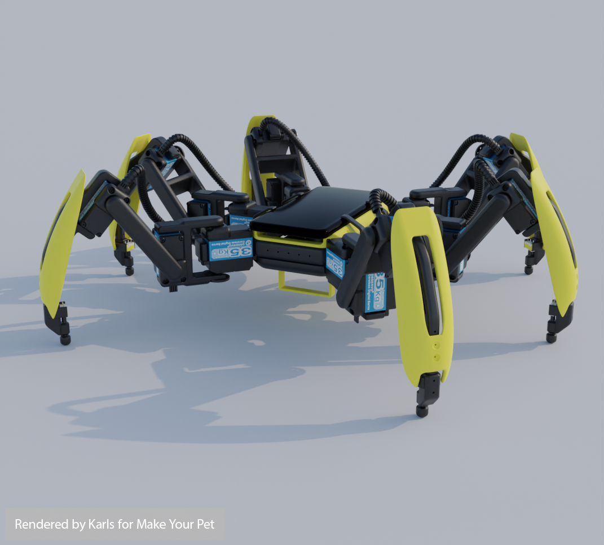
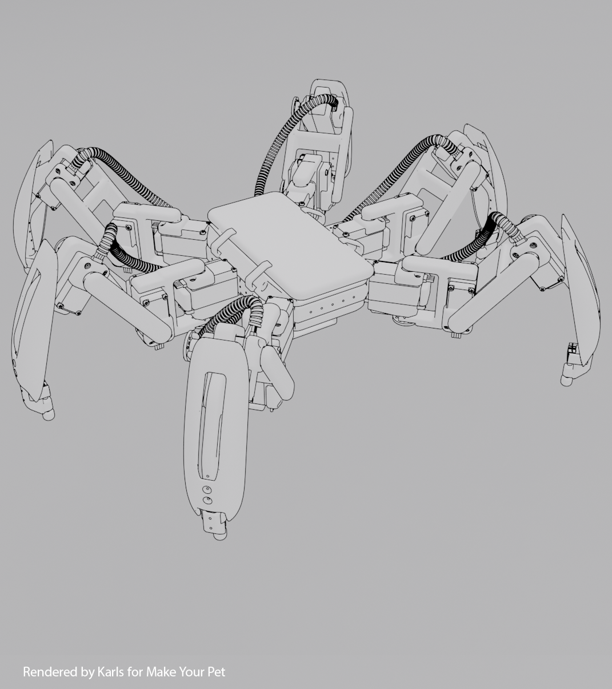
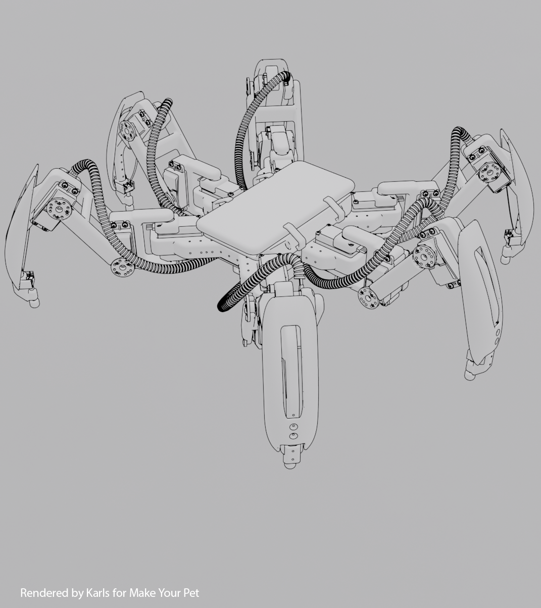
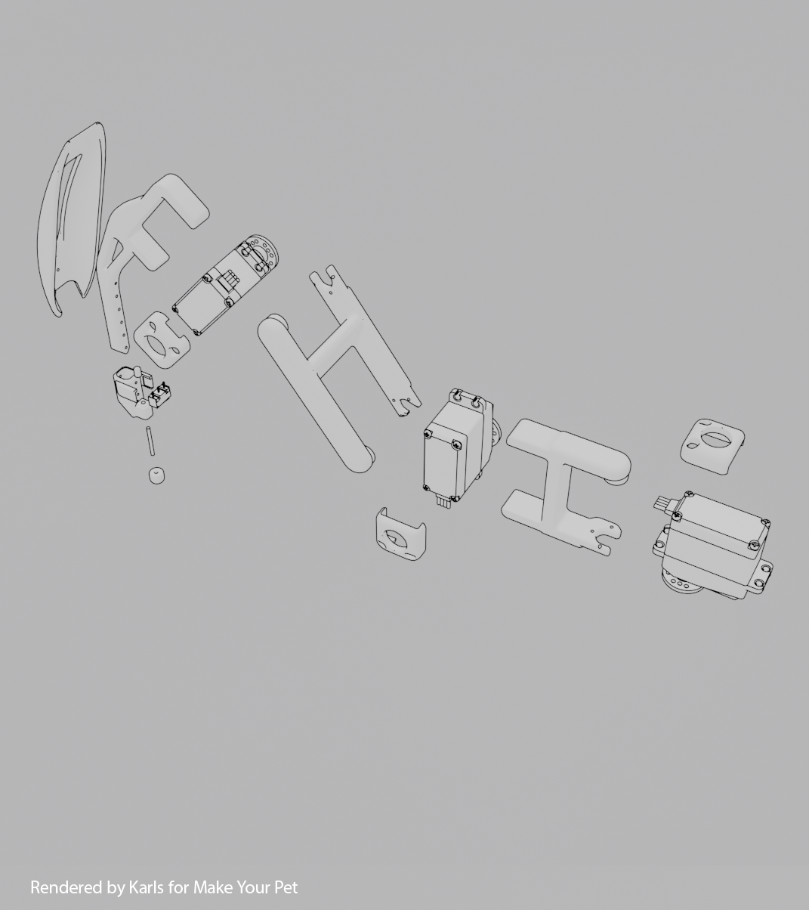
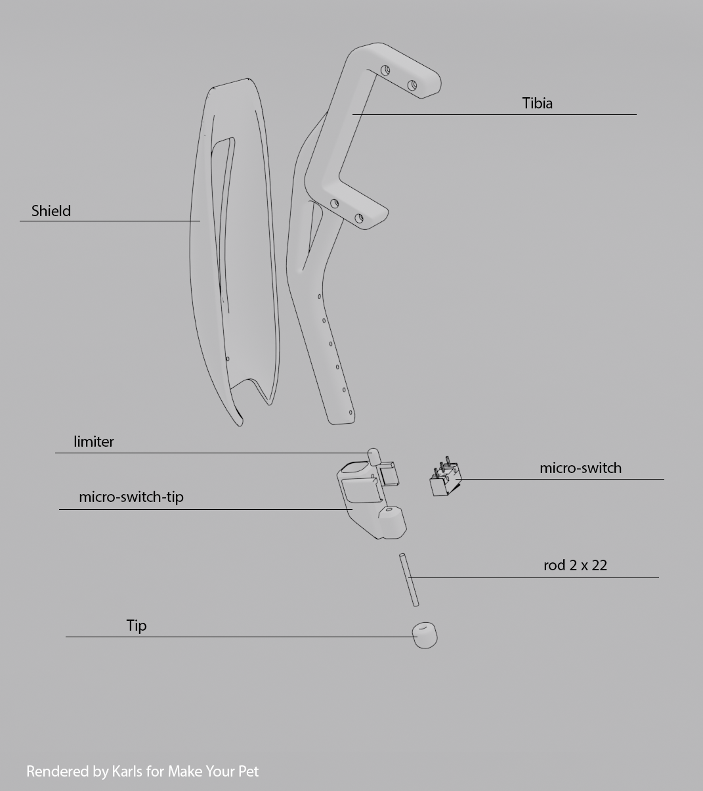
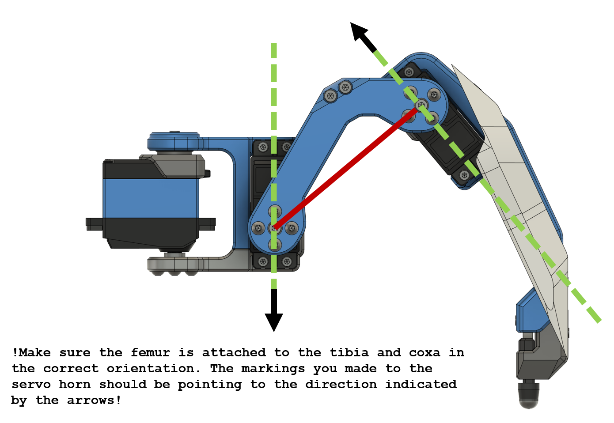
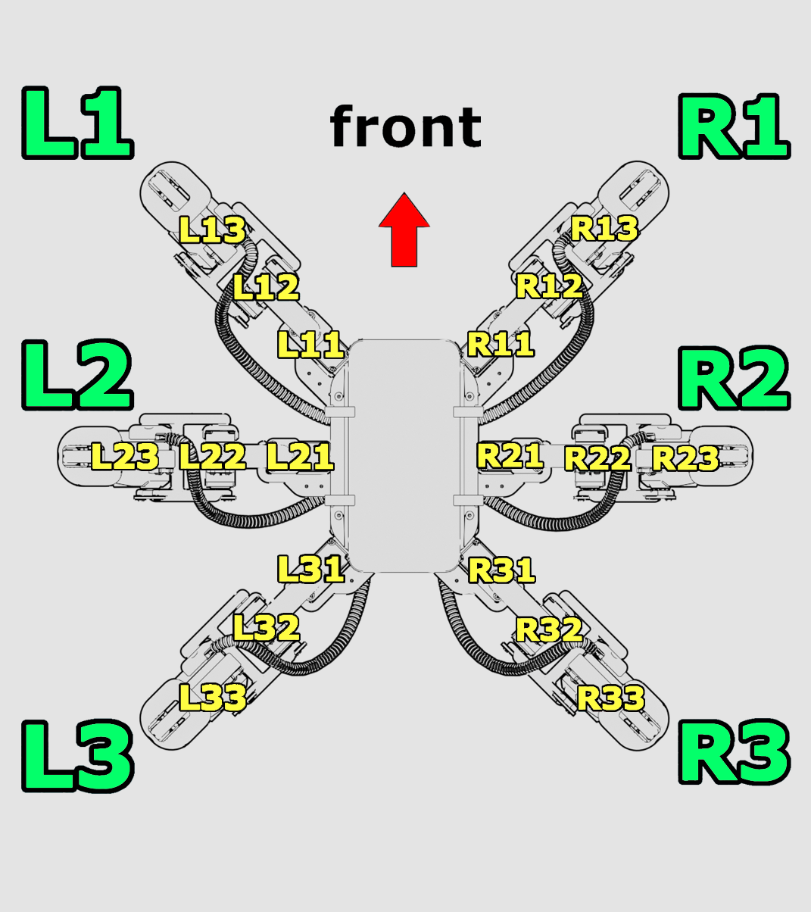

# Hexapod Hardware Reference

This document captures the mechanical and electrical reference data for the physical hexapod build.

## Mechanical build

The chassis is based on the Chipo design from MakeYourPet:

- GitHub build reference: <https://github.com/MakeYourPet/hexapod/tree/main>
- Printables model files: <https://www.printables.com/model/479169-make-your-pet-chipo/files>
- Servo limiter files: <https://www.printables.com/model/1021758-servo-limiter/files>

  
  
  
  

## Electrical components

### Battery and regulator

A 2S LiPo is used for the primary supply rail:

- Nominal voltage: `7.4 V`
- Fully charged: `8.4 V`
- Minimum recommended cutoff: `6.0 V`

Use a UBEC inline between battery and relay to provide stable servo voltage.

Example UBEC ratings used in this build:

- Continuous current: `8 A`
- Peak current: `16 A`
- Input range: `6 V` to `36 V`
- Selectable output: `5.2 V`, `6.0 V`, `7.4 V`, `8.4 V`

### Servos (MG996R)

Published values (model/vendor dependent):

- Stall torque:
  - `13 kg·cm` at `4.8 V`
  - `15 kg·cm` at `6.0 V`
- Speed:
  - `0.17 s / 60°` at `4.8 V` (no load)
  - `0.14 s / 60°` at `6.0 V` (no load)
- Operating range: `4.8 V` to `7.2 V`
- Dimensions: `40 x 19 x 43 mm`

## Wiring

Reference wiring diagram:

Integration reminder: place UBEC inline between battery output and relay/servo power path.

## Controller board (Servo 2040)

Servo 2040 capabilities used by this project:

- 18 servo outputs
- rail current and voltage monitoring
- 6 analog sensor inputs (used for foot contacts)
- 6 RGB LEDs for state indication
- GPIO/ADC pins (one is used for relay control)
- SWD interface for OpenOCD flashing

Useful links:

- Schematic: <https://cdn.shopify.com/s/files/1/0174/1800/files/servo2040_schematic.pdf>
- RP2040 getting started guide: <https://files.waveshare.com/upload/3/30/Getting_started_with_pico.pdf>
- Raspberry Pi 5 OpenOCD config discussion: <https://forums.raspberrypi.com/viewtopic.php?t=362826>
- Pico boilerplate: <https://github.com/pimoroni/pico-boilerplate>
- Pimoroni Pico SDK setup: <https://github.com/pimoroni/pimoroni-pico/blob/main/setting-up-the-pico-sdk.md>
- Servo 2040 examples: <https://github.com/pimoroni/pimoroni-pico/tree/main/examples/servo2040>
- Raspberry Pi Pico examples: <https://github.com/raspberrypi/pico-examples>

## Geometry constants

Leg segment lengths (mm):

- `COXA_LEN = 43`
- `FEMUR_LEN = 60`
- `TIBIA_LEN = 104`

Offsets between coxa rotation centers (mm):

- `L1_TO_R1 = 126`
- `L1_TO_L3 = 167`
- `L2_TO_R2 = 163`

Frame and sit-height references:

- `LEG_CONNECTION_Z = -7`
- `LEG_SITTING_Z = -40`

Servo attachment angle offsets (degrees):

- `COXA_ATTACH_ANGLE = -8`
- `FEMUR_ATTACH_ANGLE = 35`
- `TIBIA_ATTACH_ANGLE = 83`

  
  

