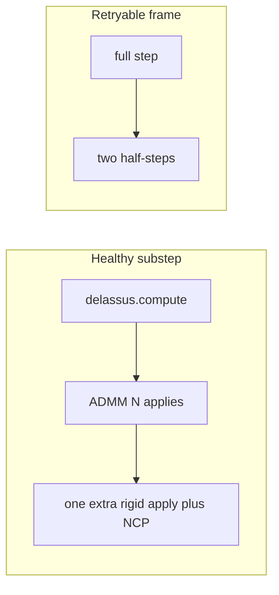

# Pinocchio ADMM, Delassus, and Retry Reduction

Date: 2026-09-11  
Reviewed: 2026-09-12 against `hexapod-physics-sim/src/demo/pinocchio_hexapod.cpp` (evening pass)

## Summary

Do not write a custom articulated Delassus. For this 24-DoF hexapod the remaining
order is: read the replay histograms we already emit, A/B the two opt-in
operators (dense ADMM vs contact precondition), then only change production
defaults or stop criteria with those numbers. Custom Featherstone apply will
not beat a dense ~36×36 GEMV.

Allocator / I/O / broadphase work is
[`PLAN_PINOCCHIO_PROXIMAL_RESOURCE_REDUCTION.md`](PLAN_PINOCCHIO_PROXIMAL_RESOURCE_REDUCTION.md).
That plan does not reduce ADMM iterations except by dropping coincident
contacts (its Phase 2). Retry **policy** is owned here, not there. When this
note is the right next step (versus stand/walk gates) is
[`PLAN_PINOCCHIO_DEFAULT_SWITCH.md`](PLAN_PINOCCHIO_DEFAULT_SWITCH.md).

These are three different knobs. They are not substitutes.

| Lever | Moves | Typical win on this robot |
| --- | --- | --- |
| Fewer **retries** | **p99 / worst frames** (1 failed step becomes 3 collision+Delassus+ADMM solves) | Large if `RecoveredRetry` is common; already done for unrecoverable reasons |
| Cheaper **Delassus apply** | Time **per ADMM iteration** | Implemented as opt-in dense GEMV; not the production default |
| Fewer **ADMM iterations** | Healthy-path `admmTimeMs` | Still open; gated by warm-start quality and stop criteria |

Production cap is `Runtime.PhysicsSim.SolverIterations` (server default **24**,
`ProximalSolverSettings` header default 50). Exact replay defaults to **50**
unless `HEXAPOD_EXACT_REPLAY_SOLVER_ITERATIONS` is set — do not confuse replay
exhaustion at 50 with production exhaustion at 24. [`plan.md`](plan.md) wants
ADMM p99 ≤ 20 with no 50-iteration exhaustion. Anderson history default is **5**
([`PHYSICS_SIM_CONFIG_REFERENCE.md`](PHYSICS_SIM_CONFIG_REFERENCE.md)).

Constraint size is `3 × n_contacts` with n typically 6–12 (18–36), `nv = 24`.

## Status (2026-09-12, evening)

| Item | State |
| --- | --- |
| Skip half-steps for unrecoverable failures | **Done.** Only `SolverNotConverged` and `SpeedLimit` retry. `NonFiniteVelocity` is **not** retried. |
| Replay instrumentation | **Mostly done.** JSON has `iteration_histogram`, per-contact-count and topology-age iteration percentiles, `failure_reason_histogram`, `solver_not_converged`, Delassus/ADMM/total p99, `dense_admm`, and `contact_precondition`. |
| `converged` vs `physicallyConverged` split | **Missing.** Telemetry does not say whether ADMM or the NCP post-pass accepted the step. `Healthy` folds both. |
| Contact Δv apply | **ABA of `Jᵀλ` (2026-09-13).** Delassus scratch `ddq` is not used. Isolated tripod travel stays above 70% at the stick/slip boundary. |
| Dense ADMM GEMV | **Implemented, opt-in. A/B 2026-09-12: do not promote.** Same holds as default at cap 24; ADMM time fell, total p99 did not. |
| Contact precondition | **Implemented, opt-in. A/B 2026-09-12: do not promote.** Slightly fewer holds, stand p99 rose to the cap. |
| Adaptive shorter Anderson on retry | **Removed.** Code comment: it increased held states on frozen and live gait streams. Retry uses the primary history (5) unless `HEXAPOD_PINOCCHIO_RETRY_ANDERSON_CAPACITY` is set. |
| Same-dt retry before half-steps | **Implemented** for `SolverNotConverged` only (2026-09-12). `SpeedLimit` still goes straight to half-steps. |
| Last-resort cold half-steps at 2× cap | **Implemented (2026-09-14).** After same-dt + warm `dt/2` miss, reset contact warm starts and retry two half-steps at `max(2 * SolverIterations, 48)`. Clears 100-seed `HeldLastGood` on v16 (15 → 0). Healthy-path cap stays 24. |
| Relative NCP stop / warmer new-contact guesses / keep rho on small topology edits | **Warm starts / same-size rho: done (2026-09-12).** Sliding ADMM stop **`1e-3`** when tangential free speed > 2 cm/s, else standing ADMM **`1e-8`** (2026-09-13). NCP accept floor `1e-3`. A global `1e-3` ADMM stop sags stand ~10 cm. Stand CTest stays at ADMM `1e-8` for non-sliding contacts. |

Do **not** implement a custom `DelassusOperatorRigidBody`. Pinocchio’s
articulated `compute()` / `applyOnTheRight` exists for large `n_c` on long
trees. Here `G` is at most about 36×36.

## Checklist

- [x] Restrict half-step recovery to `SolverNotConverged` and `SpeedLimit`
- [x] Exact replay: iteration histogram, failure-reason histogram, topology-age profiles, Delassus vs ADMM p99
- [x] Opt-in dense ADMM and opt-in contact precondition (not production defaults)
- [ ] Add telemetry (or a debug counter) for ADMM-converged vs NCP-`physicallyConverged` accepts
- [x] Replay A/B at cap 24 (2026-09-12): keep articulated default; neither opt-in operator cleared holds
- [x] Same-dt retry for `SolverNotConverged` before half-steps (do not revive shorter-Anderson retry without new evidence)
- [x] Last-resort cold half-steps at 2× cap after warm `dt/2` miss (2026-09-14); 100-seed held 15 → 0 on v16
- [x] Sliding ADMM stop `1e-3` (> 2 cm/s tangent) with standing ADMM `1e-8` (2026-09-13); warmer new-contact guesses already landed

## 1. Fewer retries (policy)

Current code matches the intended policy:

- `UnsupportedIsland` → hold, no half-steps (unchanged).
- `SolverNotConverged` and `SpeedLimit` → snapshot restore + two `dt/2` steps
  with the **same** Anderson capacity as the primary attempt (default 5).
  `SolverNotConverged` tries same-`dt` first. If warm half-steps still miss,
  a last-resort pair of half-steps starts from a full warm-start reset at
  `max(2 * SolverIterations, 48)`. If that still misses the NCP floor, two
  further cold `dt/2` half-steps run logged cone-QP recovery unless
  `HEXAPOD_PINOCCHIO_DISABLE_NCP_CCP_RECOVERY` is set.
- Everything else (`ExtremePenetration`, `ReadState`, `NonFinite*`, `WriteState`,
  `InvalidDt`, …) → immediate `HeldLastGood`.

That is already documented in [`PHYSICS_SIM_CONFIG_REFERENCE.md`](PHYSICS_SIM_CONFIG_REFERENCE.md)
and [`TESTING_FUNCTIONALITY.md`](TESTING_FUNCTIONALITY.md). Do not revive the
removed shorter-Anderson retry.

Accept path depends on the experiment flag:

- Default / dense-ADMM: `accepted = converged || physicallyConverged`.
  If ADMM fails but NCP is feasible, the step is **Healthy** (no retry).
- Precondition: `accepted = physicallyConverged` only. ADMM feasibility in
  scaled units is not enough.

What we still lack is a count of how often NCP (not ADMM) is doing the accepting
on the default path.

Before loosening production tolerances:

- Use existing replay JSON (`failure_reason_histogram`, `iteration_histogram`,
  `topology_age_iteration_profiles`, recovered/held counts).
- Add a counter for “ADMM false, NCP true” vs “ADMM true” if those fractions
  are needed to justify a relative-only cone check.
- If many `SolverNotConverged` frames hit the **production** cap (24), that is
  section 3, not retry policy.

**Optional retry change:** one same-`dt` attempt before the two half-steps, only
if replay still shows `SolverNotConverged` dominating p99 after the dense /
precondition A/B. On success → `RecoveredRetry`. On failure → today’s
half-steps. Applying it to every retryable frame makes the worst case 1+1+2 = 4
contact gens; measure held counts before keeping it. No new env vars. No
shorter Anderson.

## 2. Cheaper Delassus: densify, then GEMV

Each healthy contact substep already does:

1. Rigid `delassus.compute()` — OSIM build (`delassusTimeMs`)
2. Then one of:
   - default: nothing extra
   - `denseAdmm`: `contactDenseDelassus.rebuild(delassus, true)`
   - `contactPrecondition`: `undampedMatrix`, per-contact 3-axis scale,
     `rebuild(scaledMatrix)` (also timed inside `delassusTimeMs`)
3. ADMM: **N iterations** of `applyOnTheRight` on the dense operator if either
   experiment is on, else on the rigid operator (`admmTimeMs`). Precondition
   also tightens ADMM feasibility tols by `0.05 * min(scale, 1/max(scale))` and
   scales drift/warm into/out of that basis.
4. **Always** one articulated `delassus.applyOnTheRight` for NCP residuals in
   **physical** units. Contact Δv is a separate zero-g / zero-v WORLD ABA of
   `Jᵀλ` (`M⁻¹ Jᵀλ`); do not use `getInternalData().ddq` from that NCP apply.

The dense path is Pinocchio’s `DelassusOperatorDense`. Keep using that rather
than a second home-grown type. Precondition **implies** a dense inner loop; it
is not the same flag as `DENSE_ADMM`.

`G` is ~36×36. Forming it once per substep is one-time; 20 ADMM iterations
become 20 dense matvecs, not 20 articulated recursions. The NCP residual
apply stays articulated; the contact Δv apply is a separate articulated ABA.

**Do not** do:

- A hand-written Featherstone Delassus
- Skipping `compute()` when `q` changed (Jacobian and OSIM depend on pose)
- Switching the correctness oracle off; dense `G` must still match
  `ConstraintCholeskyDecomposition` at 1e-8 / 1e-6 as in `validateDelassusOracle`
- Assuming dense ADMM is free: `rebuild` copies/`matrix()` work shows up in
  `delassusTimeMs`. A/B must compare **total** step time, not only `admmTimeMs`.

If A/B shows `delassusTimeMs` rise enough to cancel the ADMM win, leave the
default articulated. Only then consider forming `G = J M⁻¹ Jᵀ + εI` from CRBA
and dropping articulated `compute()` — that is a larger change than flipping
the env default.

## 3. Fewer ADMM iterations (after apply cost is known)

Iteration count is a **conditioning and start-point** problem. Useful knobs, in
order:

**Warm start (already present, tighten it)**

- Persistent ID + `dt` scale + cone project: keep.
- Topology change currently `contactSolver.reset()` and drops rho when
  `contactIds` or regularisation change. Avoid resetting rho when the contact
  *set* is a small add/remove; reuse overlapping warm starts (already keyed by
  id).
- Gravity-split impulse guess for new contacts is coarse
  (`totalRobotMass * g * dt / n_support`). Prefer last step’s mean normal
  impulse, or `m g dt` only on the new foot. Standing impulse scale is
  `~ m g Δt ≈ 0.02–0.05` at 480 Hz for a ~2 kg robot; 1e-8 absolute is tight
  against that.

**Stop criteria**

- Production standing ADMM `absoluteTolerance = 1e-8`. Raising it globally to
  `1e-3` stops ADMM too early: stand is Healthy with ~10 cm height error.
  Sliding contacts (tangential free speed > 2 cm/s) use ADMM stop `1e-3` and
  an NCP accept floor of `1e-3`. NCP-only accept of a capped 1e-8 iterate does
  **not** match early-stop ADMM; the last cap iterate is worse.
- `solve_ncp = true` is required. Do not turn it off to “save iterations.”
- Production Anderson capacity is **5**. Do not cut retry history back to 2
  without new evidence; that experiment already increased held states.
- Precondition already changes spectral power (0.5) and disables rho warm-start.
  Do not copy those onto the default path from this note alone — they are part
  of the precondition A/B.

**Problem size / conditioning**

- Duplicate and coincident contacts inflate `G` and its condition number.
  Resource-plan Phase 2 (one manifold pass, coincident filter) helps
  **iterations**, not just allocs.
- `mu_prox = 1e-6` and `contactRegularization = 1e-10` interact with spectral
  rho. Sweep on replay (`HEXAPOD_PINOCCHIO_*` already exists) rather than
  inventing a new solver.
- Contact order seed is for determinism; don’t shuffle every frame.

**Do not** replace ADMM with PGS in this pass. If dense `G` is the default, a
small dense NCP (PGS or one LDLT on the active set) might later beat ADMM on
18-D problems, but that is a solver swap and a locomotion gate, not a Delassus
tweak.

## Recommended sequence

1. **Read existing replay JSON** before adding knobs. We already have iteration,
   topology-age, and failure-reason histograms. Add the ADMM-vs-NCP accept split
   only if the JSON cannot answer “why are we still retrying?”
2. **A/B the two opt-in operators** on the same fixture, at iteration cap 24:
   default articulated, `DENSE_ADMM=1`, `CONTACT_PRECONDITION=1`. Promote a
   default only if **total** p99 falls and oracle + standing/replay gates stay
   green. Precondition is the live “fewer iterations via conditioning”
   experiment; dense ADMM is the live “cheaper apply” experiment.
3. **Same-dt retry** only if `SolverNotConverged` still dominates p99 after (2).
   Do not restore shorter-Anderson retry.
4. **Only then**, on the production path, tighten warm starts / relative NCP
   stop to pull p99 iterations toward ≤ 20.
5. Resource-plan Phases 1–3 and 5 stay orthogonal except coincident-contact
   filtering.

## Verification

- `test_pinocchio_hexapod_model` (Delassus oracle, standing, support masks,
  penetration/speed rollback). Rollback tests already expect `HeldLastGood`
  without a successful retry.
- Exact command replay: `p99_solver_admm_time_ms`,
  `p99_solver_delassus_time_ms`, `p99_solver_total_step_time_ms`,
  `iteration_histogram`, `failure_reason_histogram`, recovered/held counts,
  height/drift gates. Set `HEXAPOD_EXACT_REPLAY_SOLVER_ITERATIONS=24` when the
  question is production exhaustion.
- If dense `G` changes impulses at 1e-10, fail the oracle test; do not “fix” by
  loosening it.
