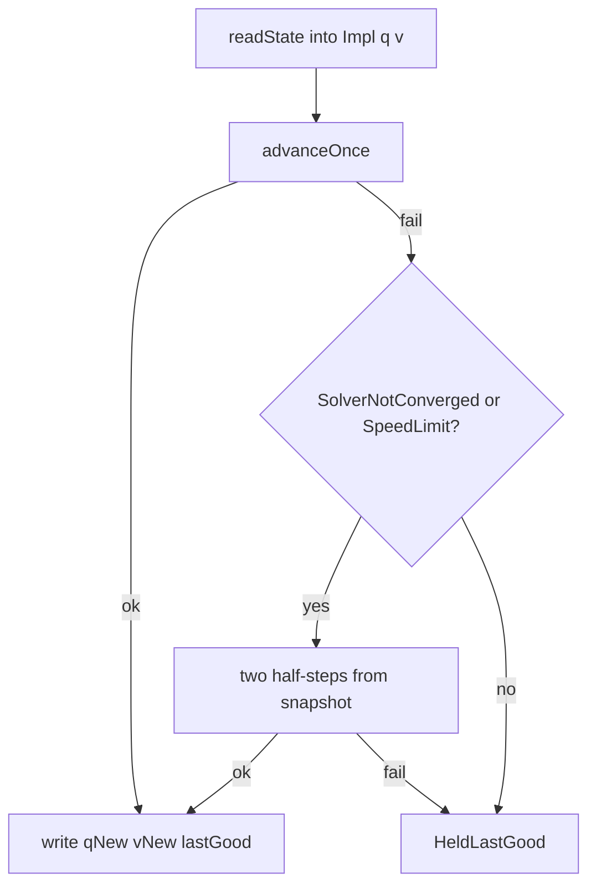

# Pinocchio Proximal Resource Reduction

Date: 2026-09-11  
Reviewed: 2026-09-12 against `hexapod-physics-sim/src/demo/pinocchio_hexapod.cpp` (evening pass)

## Summary

Cut proximal-step allocator traffic, redundant state I/O, and discarded
robot–robot broadphase pairs. Keep healthy-path contact equations, NCP
residuals, and public telemetry the same.

This note is the **allocator / I/O / collision-pair** plan. Solver-iteration,
Delassus apply, and retry-policy work lives in
[`PLAN_PINOCCHIO_ADMM_DELASSUS_RETRIES.md`](PLAN_PINOCCHIO_ADMM_DELASSUS_RETRIES.md).
Do not re-litigate ADMM knobs here. When to open this workstream versus
locomotion or ADMM work is
[`PLAN_PINOCCHIO_DEFAULT_SWITCH.md`](PLAN_PINOCCHIO_DEFAULT_SWITCH.md).

Expected healthy-path gain from **this** plan is still ~1.1–1.2×, unmeasured.
Broadphase pair filtering is for collision-setup, not a 2× mean speedup.

Target files:

- [`hexapod-physics-sim/src/demo/pinocchio_hexapod.cpp`](../hexapod-physics-sim/src/demo/pinocchio_hexapod.cpp)
- [`hexapod-physics-sim/src/core/world_collision.cpp`](../hexapod-physics-sim/src/core/world_collision.cpp)
- [`hexapod-physics-sim/src/core/world_broadphase.cpp`](../hexapod-physics-sim/src/core/world_broadphase.cpp)
- plus small World header, test, and doc updates

Keep the public `PinocchioHexapodModel` API (`std::vector` `readState`/`writeState`,
diagnostics fields, ADMM tolerances) unchanged. Do **not** skip the NCP residual
pass on success: [`test_pinocchio_hexapod_model.cpp`](../hexapod-physics-sim/tests/test_pinocchio_hexapod_model.cpp)
and serve telemetry require finite `ncpDualResidual` / `coneResidual`.

## Status (2026-09-12, evening)

Already landed **outside** this plan (do not duplicate):

- Half-step recovery is restricted to `SolverNotConverged` and `SpeedLimit`
  ([`PHYSICS_SIM_CONFIG_REFERENCE.md`](PHYSICS_SIM_CONFIG_REFERENCE.md)).
- Dense ADMM apply is an opt-in experiment (`HEXAPOD_PINOCCHIO_DENSE_ADMM=1`).
- Contact-block preconditioning is a separate opt-in experiment
  (`HEXAPOD_PINOCCHIO_CONTACT_PRECONDITION=1`). Both default off; production
  remains the articulated operator.
- Anderson history default is **5**, not 3. Half-step retry uses the same
  length unless `HEXAPOD_PINOCCHIO_RETRY_ANDERSON_CAPACITY` is set. The old
  “oscillatory → shorter Anderson” branch was removed after it increased held
  states.

Still open in this plan: Phases 1–3 and 5. Same-dt retry is **not** this
workstream; see the ADMM/retry note.

## Checklist

- [ ] Phase 1: Impl Eigen/STL workspaces; in-place `readState`; skip duplicate `readState`; copy `lastGood` from `qNew`/`vNew`; ABA without `VectorXd` copy; cache `I_local` energy; cache `TRACE_FAILURES`; size ADMM solver workspace to the configured cap
- [ ] Phase 2: Merge manifold passes; coincident filter on `pendingContacts`; dense `bodyJoints`; adjacent-pair set; single warm-start prune; vector warm starts
- [ ] Phase 3: Reuse Impl contact-space Eigen buffers for the NCP residual stack; keep computing residuals on success
- [ ] Phase 5: Cache articulated collision components; reject same-component dynamic pairs in `IsPairEligible` and brute-force pair gen
- [ ] Tests: keep pinocchio + determinism + `test_broadphase_dynamic_tree` green; add hexapod no-self-pair broadphase assertion; optional replay p99 A/B
- [x] Unrecoverable failures skip half-step retry (landed; owned by the ADMM/retry note)
- [ ] Same-dt retry (deferred to [`PLAN_PINOCCHIO_ADMM_DELASSUS_RETRIES.md`](PLAN_PINOCCHIO_ADMM_DELASSUS_RETRIES.md); do not implement here)

## Phase 1 — Impl workspaces and redundant I/O

All in `Impl` inside [`pinocchio_hexapod.cpp`](../hexapod-physics-sim/src/demo/pinocchio_hexapod.cpp).

`advanceOnce` is `(subDt, activeServoTargets, andersonCapacity, out)`. Target-velocity
feedforward is not in the production path. Workspace reuse must keep this
signature.

Add persistent Eigen / STL buffers, reserved to `nq`/`nv` at construction and
grown only when contact count grows:

- `q`, `v`, `tau`, `vNew`, `qNew`
- contact-space: `drift`, `warm`, `warmVelocity`, `impulses`, `contactVelocities`, `deSaxce`, `correctedVelocities`, `projectedDual`, `solvedContactVelocities`
- `contactIds`, `contactFrictions`, `contactRestitutions`, `contactPenetrations`, `pendingContacts`

Rewrite internal `readState` to fill `Impl::q` / `Impl::v` in place
(`pinocchio::neutral(model, q)` if available; otherwise assign once at init).
Public `readState` copies from those buffers into the caller vectors.

Healthy-path I/O changes in `stepProximal` / `advanceOnce`:

- Outer `readState` already snapshots the world into `snapshotQ`/`snapshotV`.
  Pass that into the first `advanceOnce` and **do not** `readState` again until
  a `writeState` has happened. Half-step retries still need a fresh `readState`
  after the snapshot is written back.
- After a successful integrate, copy `qNew`/`vNew` into `lastGoodQ`/`lastGoodV`
  instead of reconstructing via `readState(world, ...)`.
- `writeState`: keep the public vector overload; add an internal Eigen-map path
  used by `advanceOnce` so `qNewStorage`/`vNewStorage` temporaries go away.
- Capture ABA without copying: `pinocchio::aba` writes `data.ddq`. Use that (or
  a `const Eigen::VectorXd&`) when forming `vNew = v + subDt * ddq` into the
  persistent `vNew`. Confirm the Pinocchio 4.1 return type aliases `data.ddq`
  before assuming a copy elision.

Cache local inertia at model build (already inverted in `BodyInertia`) as
`I_local` per `BodyBinding`. Replace `totalMechanicalEnergy`'s per-body
`InvertMat3(InvInertiaWorld())` with `½ m ‖v‖² + ½ ω_body · I_local ω_body`
(`ω_body = Rᵀ ω_world`). `InvInertiaWorld()` is `R * invInertiaLocal * Rᵀ`, so
this is the same quadratic form if `I_local = inv(invInertiaLocal)`. Skip
bodies whose local inertia is singular, matching today’s `continue`.

Cache `HEXAPOD_PROXIMAL_TRACE_FAILURES` at `Impl` construction (same pattern as
the other env knobs). Stop calling `std::getenv` on the retry path.

`contactSolver{72}` pre-sizes ADMM workspace, not the runtime cap. The runtime
cap is `settings.maxIterations` (serve copies `ConfigCommand.solver_iterations`,
server default 24; tests often use 50). Size the constructor to at least that
configured cap if Pinocchio exposes it; this is a micro-optimisation.

Keep `lastGoodQ`/`lastGoodV` as `std::vector<double>` with `reserve(nq/nv)` so
the public rollback/`writeState` paths stay simple.

## Phase 2 — Contact assembly cleanup (same file, same contacts)

Still numerics-preserving if contact order and constraint models stay identical.
This also helps ADMM **iteration count** by not inflating `G` with coincident
rows; that overlap is intentional.

- Merge the two `DebugManifolds()` walks (ground-plane vs terrain choice +
  constraint build) into one pass.
- Drop `acceptedContactGeometry`; coincident filtering scans `pendingContacts`.
- Build an adjacent-link pair set once from the 18 servos (`min/max` body ids).
  Replace the O(18) servo scan for robot–robot manifolds with that lookup. This
  is a safety net: World already drops the whole articulated component in
  [`GenerateContacts`](../hexapod-physics-sim/src/core/world_collision.cpp)
  after pair generation. Do not treat this as a substitute for Phase 5.
- Replace `bodyJoints` `unordered_map` with a dense `vector<JointIndex>` keyed
  by body id (size = max body id + 1). Pinocchio joint 0 is the universe joint,
  so use a sentinel other than `0` (for example `JointIndex(-1)` or a parallel
  `vector<bool>`) for “not a robot body”.
- On a successful solve, stop the second warm-start prune (`activeIds`). The
  first prune against `contactIds` plus the following inserts already leave
  only current contacts. Keep the first prune: failed solves still drop the
  worst contact without inserting it.
- Store warm starts as `vector<{id, WarmContact}>` (n ≈ 6–12). Linear search is
  enough; retry snapshot copy stays cheap and contiguous.
- When topology is unchanged, keep the existing in-place
  `contactConstraintModels[i] = makePointModel(...)` path. Only probe Pinocchio
  4.1 for a placement/friction setter if it is a trivial in-place update; do
  not fight `ConstraintModel` if assignment is the API.

Leave diagnostic timer semantics alone (`contactSetupTimeMs` overlapping
collision/assembly/Delassus) so replay A/B stays comparable.

## Phase 3 — NCP residuals without heap traffic

Keep the DeSaxce / dual-projection / cone / complementarity stack and the
`physicallyConverged` accept path exactly as they are. Only redirect those
`Eigen::VectorXd` temporaries onto the Phase 1 buffers (`resize(3 * n_contacts)`
when needed).

Even with `HEXAPOD_PINOCCHIO_DENSE_ADMM=1`, the NCP pass still calls the
articulated `delassus.applyOnTheRight` for residual/cone diagnostics. Contact
Δv is **not** taken from that scratch vector; production apply is
`M⁻¹ Jᵀλ` via a zero-g / zero-v WORLD ABA. Do not skip the NCP residual pass
as part of this plan.

Do **not** skip this pass when ADMM reports `converged`: serve responses and
`CheckSelectedFootSupport` need the residuals.

## Phase 5 — Reject articulated pairs in broadphase

World already discards same-component dynamic pairs **after**
[`ComputePotentialPairs`](../hexapod-physics-sim/src/core/world_broadphase.cpp)
inside `GenerateContacts`. August PGS profiles showed
`generate_contacts.potential_pairs` dominating that slice (~20 µs/step vs
~0.7 µs for the split). Those numbers are from the legacy PGS path, not a
proximal profile; treat them as “pair gen is the collision cost”, not as a
proximal p99 prediction.

- Add `World::RefreshArticulatedCollisionComponents()` that runs the existing
  union-find over distance/hinge/ball/fixed/prismatic/servo joints into a
  member `articulatedCollisionComponent_`.
- Call it at the start of `GenerateContacts`, **before** `ComputePotentialPairs`.
  `ComputePotentialPairs()` is `const` and uses `IsPairEligible`; the component
  labels must already be on `World`.
- Rebuild when the joint set changes (`Create*Joint`), not only at contact gen,
  or `BroadphasePairCount()` between steps can disagree with the last generate.
- In `IsPairEligible`, after the existing static/sleep/mask/terrain-attachment
  checks, return false when both bodies are non-static and share a component
  (same predicate as `bodiesShareArticulatedComponent` today: static bodies
  still collide with the robot).
- Apply the same predicate in `ComputePotentialPairsBruteForce`.
  `test_broadphase_dynamic_tree` asserts `BroadphasePairCount() ==
  BruteForcePairCount()`; both paths must see the same skip.
- Pair-cache reuse (`cachedPotentialPairs_`) must re-run `IsPairEligible`,
  which it already does. After this change, stale articulated pairs drop out
  of the cache naturally.
- Keep the post-pair skip in `GenerateContacts` as defense in depth; it becomes
  a no-op for those pairs.

This also speeds legacy PGS `world.Step`, which shares `GenerateContacts`.
Contact sets must remain identical (pairs that were discarded later are now
discarded earlier). Hexapod self-collision is already disabled for the whole
articulated component, not only adjacent links; Phase 5 must preserve that.

## Tests

Must stay green, no new public flags:

- `test_pinocchio_hexapod_model` — standing, support masks, rollback, speed
  limit, penetration, ABA/dense, dt change.
- World: `test_world_step_determinism`, `test_broadphase_dynamic_tree`.
- Add a unit check that potential pairs on the built-in hexapod contain no two
  dynamic robot bodies. Prefer a focused world test so PGS coverage is
  included. `robotRobotManifoldCount == 0` on standing is necessary but not
  sufficient (manifolds are post-split; Phase 5 is about the pair list).

Do not weaken `CheckSelectedFootSupport` residual checks.

## Verification

From repo root / component dirs per [`AGENTS.md`](../AGENTS.md):

- Physics sim: `cmake -S hexapod-physics-sim -B hexapod-physics-sim/build` and
  `ctest` for `test_pinocchio_hexapod_model`, determinism, and broadphase tests.
- Optional A/B: `test_physics_sim_exact_command_replay --emit-metrics-json` and
  compare `p99_solver_total_step_time_ms`, `p99_solver_admm_time_ms` (should be
  ~flat for Phases 1–3), `p99_solver_collision_time_ms`, recovered/held counts.

Phases 1–3 and 5 should not change solver outcomes. If they do, stop and
compare contact signatures / iteration histograms before continuing.
