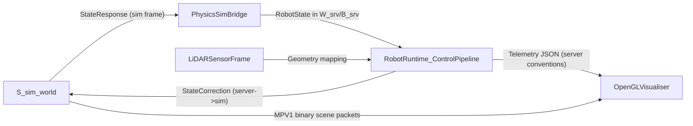

# Monorepo Reference Frames

This document is the canonical reference for coordinate frames and frame transforms used across the hexapod monorepo.

## 1) Canonical frame names

- `S_sim`: physics simulation world frame (`hexapod-physics-sim`, `physics_sim_protocol`).
- `W_srv`: server world/navigation frame (`hexapod-server` world XY + yaw about +Z).
- `B_srv`: server body frame (`hexapod-server` body-fixed frame).
- `L_i`: leg-local frame for leg `i` (IK/FK intermediate frame).
- `V_scene`: OpenGL visualiser scene frame.
- `LiDAR_optical`: matrix LiDAR optical/sensor ray frame.

## 2) Axis and yaw conventions

### `B_srv` / `W_srv` (server)

Primary convention used in control/navigation code:

- `+X` forward
- `+Y` left
- `+Z` up
- Positive yaw: counter-clockwise viewed from above (+Z axis)

Primary references:

- `hexapod-server/include/kinematics/types.hpp` (`MotionIntent` comments, IMU/body comments)
- `hexapod-server/src/hardware/physics_sim_bridge.cpp` (conversion comments)
- `hexapod-common/include/matrix_lidar_geometry.hpp`

### `S_sim` (physics sim)

- Sim world is Y-up.
- `StateResponse.body_position` and `body_orientation` are explicitly documented as sim-frame values.
- Obstacle yaw is about sim `+Y`.

Primary reference: `hexapod-common/include/physics_sim_protocol.hpp`.

### `V_scene` (visualiser)

Visualiser uses scene-space conventions with explicit conversion from server coordinates before rendering. Yaw conversion helper is:

- `scene_yaw = server_yaw - pi/2`

Primary reference: `hexapod-opengl-visualiser/include/visualiser/math/frame.hpp`.

## 3) Core transform equations

## 3.1 Sim <-> Server vector basis change

From `hexapod-server/src/hardware/physics_sim_bridge.cpp`:

- `v_srv = (-v_sim.z, v_sim.x, v_sim.y)`
- Matrix form (`C`):

```text
[x_srv]   [ 0  0 -1 ] [x_sim]
[y_srv] = [ 1  0  0 ] [y_sim]
[z_srv]   [ 0  1  0 ] [z_sim]
```

Inverse mapping used in `RobotRuntime` correction path:

- `v_sim = (v_srv.y, v_srv.z, -v_srv.x)`

## 3.2 Sim <-> Server orientation change

Bridge uses change-of-basis conjugation:

- `R_srv = C * R_sim * C^-1`
- With orthonormal `C`, `C^-1 = C^T`

Server-to-sim correction path uses:

- `R_sim = C^T * R_srv * C`

References:

- `hexapod-server/src/hardware/physics_sim_bridge.cpp`
- `hexapod-server/src/control/robot_runtime.cpp`

## 3.3 Server world/body velocity conversion

Bridge receives world-frame velocities from sim in `W_srv`, then rotates into `B_srv`:

- `v_body = R_srv^T * v_world`
- `w_body = R_srv^T * w_world`

Reference: `hexapod-server/src/hardware/physics_sim_bridge.cpp`.

## 3.4 Body <-> Leg transforms (IK/FK)

From `hexapod-server/src/kinematics/leg_ik.cpp` and `leg_fk.cpp`:

- IK body-to-leg:
  - `p_rel = p_body - coxaOffset`
  - `p_leg = Rz(-mountAngle) * p_rel`
- FK leg-to-body:
  - `p_body = coxaOffset + Rz(+mountAngle) * p_leg`
- Body-to-world:
  - `p_world = bodyPose.position + R_bw * p_body`
  - `R_bw = Rz(yaw) * Ry(pitch) * Rx(roll)` (see `BodyPose::rotationBodyToWorld()`)

## 3.5 Navigation world-error projection into body axes

From `hexapod-server/src/control/nav_locomotion_bridge.cpp`:

- `ex = wp.x - pose.x`
- `ey = wp.y - pose.y`
- `e_fwd = cos(yaw)*ex + sin(yaw)*ey`
- `e_lat = -sin(yaw)*ex + cos(yaw)*ey`

These are body-frame forward/lateral errors used by the integral outer loop.

## 3.6 Server <-> Visualiser transforms

Two server-to-scene mappings currently exist:

- Legacy runtime path (`legacy_main.cpp`):
  - `v_scene = (v_server.y, v_server.z, -v_server.x)`
- Modular kinematics path (`src/robot/kinematics.cpp`):
  - `v_scene = (v_server.x, v_server.z, -v_server.y)`

Both are present in build outputs (`hexapod-opengl-visualiser/CMakeLists.txt`) and must not be conflated.

## 4) Boundary handoff map



## 5) LiDAR reference mapping

From `hexapod-common/include/matrix_lidar_geometry.hpp`:

- Sensor offset is defined in server body frame (`+X forward, +Y left, +Z up`).
- Equivalent minphys body-axis mapping is explicitly documented:
  - `(X_m, Y_m, Z_m) = (+Y_left, +Z_up, -X_forward)`
- Optical axis pitch-down is defined relative to body `+X`.

## 6) Protocol frame semantics

- `physics_sim_protocol` (UDP bridge):
  - carries sim-frame vectors/quaternions for `StateResponse` and `StateCorrection`.
- `minphys_viz_protocol` (`MPV1`):
  - carries scene/entity packets as raw vectors/quaternions; frame interpretation is by producer/consumer contract.
- `hexapod-physics-sim/src/demo/frame_sink.cpp` transmits sim scene/body values directly into MPV1 packets.

## 7) Known ambiguities and caveats

1. `types.hpp` includes legacy frame-of-reference ASCII notes that can appear inconsistent with active server comments (`+X forward, +Y left, +Z up`).
2. Visualiser has two distinct server->scene mappings (`legacy_main.cpp` and `src/robot/kinematics.cpp`).
3. `LegFK::footInWorldFrame()` stores world-position output in field `pos_body_m` (name mismatch with payload semantics).
4. Nav code uses "world frame" terminology; in practice this is the server world estimate frame (`W_srv`).

## 8) Validation pointers

Use these tests when frame behavior is changed:

- `hexapod-server/tests/test_physics_sim_bridge_frame_conversion.cpp`
  - validates translation, yaw mapping, and world->body velocity conversion from sim responses.
- `hexapod-opengl-visualiser/tests/test_body_pose_transform.cpp`
  - validates body pose transform behavior in visualiser path.
- `hexapod-opengl-visualiser/tests/test_visualiser_frame_math.cpp`
  - validates server-yaw to scene-yaw conversion.

## 9) Debug checklist for frame mismatch issues

1. Identify the boundary where mismatch first appears (sim bridge, nav, telemetry, or visualiser render).
2. Verify the expected source frame and destination frame for that boundary.
3. Confirm vector basis conversion equation and orientation conjugation are both applied.
4. Check whether code path is legacy visualiser transform or modular transform.
5. Compare against frame-conversion tests before changing conventions.
