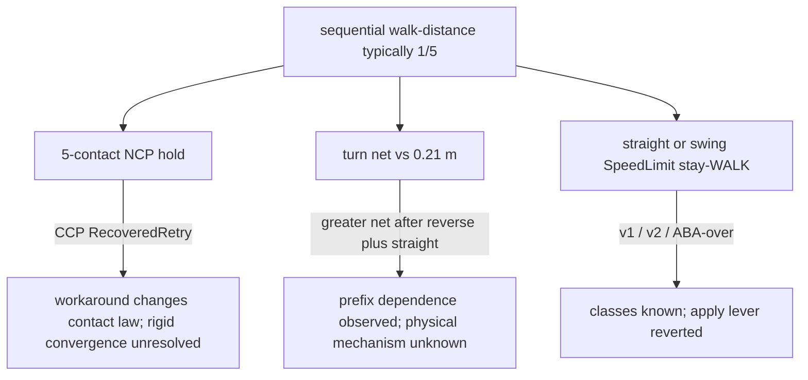

# Sequential walk-distance leftovers

Date: 2026-09-16  
Reviewed: 2026-09-22 support reacquisition and measured-contact clearance (§3.26).
Current: full server **102/102** with the contact-height candidate enabled;
walk-entry **10/10**, sequential and full long motion **5/5** each. The correction
is now default-on, with an explicit diagnostic opt-out. Final default root
server sweep is **99/100**: only legacy-PGS feedforward quiescence fails its
off/on comparison. Optional default stress and full long motion pass separately.
See §3.26. Legacy physics remains out of this batch;
no soak or dedicated performance qualification is claimed.

Further forward-progress, stroke, swing-contact, and servo-capacity work is tracked in
[the locomotion progress and actuator-capacity campaign](LOCOMOTION_PROGRESS_CAPACITY_CAMPAIGN.md).

Preceding §3.25 checkpoint: reverse/turn/sequential each **5/5**, aggressive two strides, both
tilt scenarios **5/5**, frozen v16 **100/100 seeds** with zero held/read failures.
Initial full server sweep **100/101**; the additional long motion test fails
measured swing lift. A later root sweep is **98/99**, exposing intermittent
walk-entry support-margin failure (focused repeats **4/5**). Physics **69/75**:
layout comparison repaired, six legacy tests still red. No ten-minute soak
or dedicated performance qualification is claimed. See §3.25; the paragraph
below records the preceding checkpoint and its corrected metric interpretation.

**Checkpoint 02a9bef status (historical):**
Latest: the rebuilt default path passes reverse **5/5**, isolated turn **5/5**,
and complete sequential walk-distance **5/5**, with zero held samples in all
15 processes. `aggressive_governor` passes with two strides. SpeedLimit retry
now reduces proportional demand without reducing braking damping; pure turns
have bounded translation feedback only on bridges providing trustworthy
absolute position (currently physics sim). No experimental environment flags
are needed. Wider server verification is **97/98**: only the known
`tilt_safety_trip` path-before-fault check fails (64.8 vs 100 mm, no holds).
The separate full physics suite is **68/75**, with seven legacy World/scene
failures reproduced with both new changes disabled. Firmware **3/3** and the
simple-sim smoke pass. This is not 100-seed, soak,
70%-translation, or pure rigid-NCP certification. Existing Mode 1 CCP recovery
is unchanged. §3.24 supersedes the default-off and still-red status below.

**Historical progression (preserved, not current qualification):**
moving damping lag is demonstrated on a supported leg, but raw and
filtered velocity-lead walking experiments are rejected. Final target velocity
metadata now follows post-safety target angles; angles and defaults are unchanged.
Walking is still unqualified. See §3.23 before treating better isolated tracking
as a safe gait fix.
Previous: the torque-to-angle conversion now uses reported nominal actuator Kp;
supported full-position error falls to 0.6–0.8 mm with existing clamps. The
IMU gate/filter bypass and hard-coded filter cadence are also corrected.
**Walking remains unqualified:** the final repeated screen is sequential 2/5
for both baseline and opt-in compensation. Default FF remains off. Read §3.22
before interpreting the intermediate 4/5 result as a solution.
Prior §3.21 decision: analytical gravity sign/mass/posture defects are corrected and
independently tested. **Do not enable self-weight FF for production walking:**
the corrected opt-in candidate scored sequential **0/5 vs baseline 4/5**.
The server stiffness proxy also differs from the actuator stiffness; the
supported single-leg comparison isolates a 4.5–4.6 mm full-position residual.
This does not prove that proxy error alone causes the live-walk regression.
Update: §3.20 closes the **supported slow-lift equilibrium** diagnosis:
measured sag matches gravity divided by actual PD stiffness. Test-local
self-weight compensation removes the vertical tracking error and, when applied
at lift onset, advances contact loss. This is not yet a live-gait fix.
No production setting changed. Sequential is still red. The new same-instant
budget does **not** support treating case peak-to-peak heave as the amount
cancelling each swing: average reverse body translation at commanded apex is
−0.8 mm, while command-to-measured height differs by about 19 mm.
The supported slow-lift probe also retains 11.7–11.8 mm of final vertical
tracking error. Joint tracking under load is the next narrow lead, not a
proven replacement-solver requirement. Historical campaign summary follows;
§3.19 supersedes the causal and timing interpretations noted there.

The commanded gait is
not executed: the reference is slewed at 100% of servo no-load speed, feet lag
41-79 mm against a 24-50 mm commanded swing clearance, legs drag 30-64% of
planned swing, and realised support is 4.2-4.5 feet against 3.0 planned.
SpeedLimit aborts are the release of 0.63-2.98 rad stored on a still-grounded
swing leg. **Scoring rule (§3.17): use per-process scored pass and the
`held==0` process rate; never summed `solver_held`.** Baseline is 7/15 scored
pass with `held==0` in 12/15 processes, so the abort class is rare and
catastrophic rather than endemic. Six candidate fixes are closed: a
contact-aware liftoff bound, a committed swing plan with a Cartesian output
bound, the Bounded gravity-FF on this plant, a WALK slew-fraction cap, a
load-aware phase hold, and near-cap-snap removal / a final feasibility clamp.
The first two regressed sequential 3/5 → 0/5; the second made the commanded path
Cartesian-speed-bounded (swing p99 8.70 → 0.735 m/s) and left drag at 76-82%.
That rejects this candidate, not command quality as a possible contributor:
Cartesian speed alone does not certify torque/acceleration feasibility. Gravity FF (§3.16) did not
unload femur sag (0.125 → 0.128 rad) and worsened isolated reverse 4/5 → 2/5
and sequential 4/5 → 2/5 via TIP_OVER / extra heave. **§4.2.1 demonstrates a promising turn-net candidate**, not completed qualification: the gated quantity is
open loop, and a bounded in-place translation hold
(`HEXAPOD_TURN_INPLACE_HOLD`, default off) takes isolated turn net 0.184 →
0.075 m *with more yaw*, and sequential turn-net failures 3/8 → **0/8**.
The candidate still needs arc-command, maximum-excursion and regression
qualification. The default still has both abort and turn-net failures.
`peak_solver_servo_torque_utilization`
reaches **1.0**. §3.16: that is PD chasing ~1 rad of tracking error and the
torque-speed wall, not a stall deficit for holding 0.14 m. Three-leg gravity
is 0.43 N·m (30% of 1.471 N·m); Pinocchio `G(q)` is 0.066 N·m. The robot can
stand on three feet. It cannot also track a no-load-slew reference while
30-64% of planned swing is still on the ground.  
Campaign preference: retain Pinocchio whole-body dynamics, minphys3d collision,
and the existing server/bridge/visualiser architecture. See §10 for the proposed
architecture-preserving campaign; engine replacement is a contingency only.
Status: Mode 1 leftover-patch campaign closed. **STAND untilt is an
improvement, not a complete turn-net fix**: isolated turn is green, but
§3.10 leftover-on sequential still has 2/5 scored turn-net **0.220 / 0.225 m**.
The 2.98 rad tibia windup class has a production 1.5 rad remainder tracking
cap. The modest-error femur ABA-over class (`sl-abort-after-1p5-v1`) has a
production **near-cap swing snap** (provisional heuristic; planned-swing
only). `sl-abort-near-cap-v1` wire-17 dense knockout avoids that frozen
trip; a live tibia remainder **regressed reverse** (`held=613`) and was
reverted. Latest isolated/sequential tables in §3.10–§3.12 used
`HEXAPOD_PINOCCHIO_IMPLICIT_DAMPING=1` and do **not** establish WSL-default
(implicit **off**) behaviour. Sequential remains **scored-not-green**.
This file records **current fails**, how far **root cause** work actually
got, and which levers are closed.

Related living documents (this file does not replace them):

- [`SOLVER_COMPLIANCE_RESEARCH.md`](SOLVER_COMPLIANCE_RESEARCH.md) — Mode 1 vs
  Mode 2 contact law, paths A/B/C
- [`PLAN_CONTACT_NCP_COMPLIANCE_AND_PRUNING.md`](PLAN_CONTACT_NCP_COMPLIANCE_AND_PRUNING.md)
  — campaign log (CCP, λ-scale revert, turn census)
- [`PLAN_COORDINATED_SWING_RATE_GOVERNOR.md`](PLAN_COORDINATED_SWING_RATE_GOVERNOR.md)
  — command-side rate leftover; 2026-09-16 turn command census
- [`PHYSICS_SIM_CONFIG_REFERENCE.md`](PHYSICS_SIM_CONFIG_REFERENCE.md) —
  solver keys, last-resort, speed guards
- [`TESTING_FUNCTIONALITY.md`](TESTING_FUNCTIONALITY.md) — walk-distance
  screens and JSON fields
- [`FAILING_TESTS.md`](FAILING_TESTS.md) — older 2026-05 tracker; not this
  leftover map

Frozen fixtures that this report must not overwrite:

- [`contact-snapshots/turn-sequential-census-v1.json`](contact-snapshots/turn-sequential-census-v1.json)
- [`contact-snapshots/speed-limit-rigid-v1.json`](contact-snapshots/speed-limit-rigid-v1.json)
- [`contact-snapshots/speed-limit-rigid-v2.json`](contact-snapshots/speed-limit-rigid-v2.json)
- [`contact-snapshots/speed-limit-sequential-contact-amplified-v1.json`](contact-snapshots/speed-limit-sequential-contact-amplified-v1.json)
- [`contact-snapshots/reverse-failure-v3.json`](contact-snapshots/reverse-failure-v3.json)
- v16 exact-replay hash `ddc6008e0cc1ac97`
- [`contact-snapshots/p0-turn-traj-isolated-v1.json`](contact-snapshots/p0-turn-traj-isolated-v1.json)
- [`contact-snapshots/p0-turn-traj-sequential-v1.json`](contact-snapshots/p0-turn-traj-sequential-v1.json)
- [`contact-snapshots/p0-turn-entry-isolated-v1.json`](contact-snapshots/p0-turn-entry-isolated-v1.json)
- [`contact-snapshots/p0-turn-entry-sequential-v1.json`](contact-snapshots/p0-turn-entry-sequential-v1.json)
- [`contact-snapshots/sl-abort-stand-untilt-v1.json`](contact-snapshots/sl-abort-stand-untilt-v1.json)
- [`contact-snapshots/sl-abort-after-1p5-v1.json`](contact-snapshots/sl-abort-after-1p5-v1.json)
- [`contact-snapshots/sl-abort-near-cap-v1.json`](contact-snapshots/sl-abort-near-cap-v1.json)

CCP-plant turn recensus (new paths):
[`contact-snapshots/turn-plant-state-census-v1.json`](contact-snapshots/turn-plant-state-census-v1.json).

## 1. Production plant

WSL / walk-distance harness:

| Knob | Value |
| --- | --- |
| `Runtime.PhysicsSim.SolverMode` | **1** (rigid first attempts plus automatic CCP recovery). Session-wide Mode 2 is not promoted |
| `SolverIterations` | 24; last-resort `max(2×, 48)` at two cold `dt/2` |
| Body height | 0.14 m |
| Speed guard | all-body WORLD_ALIGNED **2 m/s / 10 rad/s** after ABA+contact, then `writeValidatedState` |
| Turn net gate | **0.21 m** (`docs/testing-baselines/gates/default-v1.json`) |
| Last-resort CCP | **on** after rigid NCP miss; `RecoveredRetry`; always log `[proximal-ncp-ccp-recovery]` |
| λ-scale | **reverted** |
| Governor / predictor | off / test-local |
| `HeldLastGood` | `bus_ok=false` → `BUS_TIMEOUT`. Do not publish as healthy |

1/480 s is the **maximum** proximal substep, not a fixed internal cadence.
Serve mode uses `ceil(command_dt / max_substep)` equal substeps: a 5 ms bus
command therefore uses three approximately 1/600 s substeps. Retries subdivide
that actual substep. Record command dt and actual retry dt separately.
Turn command construction is explicit
`cmd_yaw = 0.45` (not `twist.z`). Filling only `twist.z` double-counts to 0.90
through `planarMotionCommand` + `rawLocomotionTwistFromIntent`.

Do not treat `./scripts/verify.sh` as production-green while sequential
walk-distance is red.

## 2. What is green

These are the cases the leftover classes care about, run **isolated**:

| Case | Latest remesure | Notes |
| --- | --- | --- |
| `HEXAPOD_WALK_TEST_CASE=reverse_walk` | **5/5**, `solver_held=0`, peak ω 8.00–9.67 | Leftover-on (`HEXAPOD_PINOCCHIO_IMPLICIT_DAMPING=1`). Not WSL default. Not starved. |
| `HEXAPOD_WALK_TEST_CASE=turn_in_place` | **5/5** net 0.176–0.188 m, r 0.099–0.106 m | Leftover-on. `yaw_delta` 2.14–2.19. |

Forward / slow / straight isolated were not the sequential plurality in the
2026-09-16 CCP remesures. Sequential red is **shared-plant** behaviour.

## 3. What is red

The failing test is sequential
[`hexapod-server/tests/test_physics_sim_walk_distance.cpp`](../hexapod-server/tests/test_physics_sim_walk_distance.cpp)
with `HEXAPOD_WALK_TEST_CASE` **unset**: one process, STAND prefixes,
`forward → slow → reverse → straight → turn`.

Typical score on the CCP plant: **1/5** (2/6 counting the first sequential
process after the CCP rebuild). That 1/5 is **not one bug**. Two later ×5
batches failed for different plurality classes. Mixing abort-before-turn into
turn-net stats is a classification error.



### 3.1 Batch A — CCP 5-repeat (plus one prior pass): 2/6

| Run | Result | Class |
| --- | --- | --- |
| prior | pass | turn net 0.197 m |
| 1 | fail stay-WALK | turn `held=2`, net 0.188 m (would pass 0.21). No CCP log |
| 2 | fail reverse | femur SpeedLimit cascade (`max_link_w` 9.87 → 11.49, 1233 swing femur). CCP `accept=0` twice, `reason=10` |
| 3 | pass | two CCP `accept=1`; turn net 0.207 m |
| 4 | fail turn net | 0.213 m, `held=0`, yaw-dominant, cmd 0.45 |
| 5 | fail turn net | 0.211 m, `held=0`; CCP `accept=1` |

### 3.2 Batch B — after λ-scale revert: 1/5

Reverse in the shared plant **5/5**. All four fails were **turn net**
(0.222 / 0.219 / 0.215 / 0.257 m, one pass 0.181). `held=0`, `cmd_yaw` 0.45.
CCP `accept=1` still fired (seq 4: 2, seq 5: 1).

### 3.3 Batch C — turn plant-state hunt sequential ×5: 1/5

The one scored turn **passed** at 0.185 m, r 0.104 m. **4/5 aborted on
`straight_walk` SpeedLimit stay-WALK** before turn:

| Run | Held | Frame mix | `ncp_dual` at first fail |
| --- | --- | --- | --- |
| 1 | 1604 | tibia 1603 | 0.0035 |
| 2 | 611 | femur 610 | 0.00026 |
| 3 | 4 | tibia 3 | 0.0083 |
| 4 | 430 | tibia 428 | 0.0014 |
| 5 | 0 | turn ran, pass 0.185 m | — |

Do not call sequential “the turn leftover” or “the SpeedLimit leftover” from a
single ×5. Score **scored turns** and **abort-before-turn** separately.

### 3.4 Post-floor implicit-on sequential ×5: 3/5

After the swing Y floor, five complete sequential processes with
`HEXAPOD_PINOCCHIO_IMPLICIT_DAMPING=1` (default still **off**),
`HEXAPOD_WALK_TEST_CASE` unset. Score **not** production-green.

| Run | Result | Class |
| --- | --- | --- |
| 1 | pass | turn net 0.189 m, `held=0`, `cmd_yaw` 0.45. CCP `accept=1` |
| 2 | fail abort-before-turn | `forward_walk` left WALK at step 1756, `final_fault=TIP_OVER` (`fault=3`), `solver_held=0`, `speed_limit_frames=none`, peak ω 8.17, min height 0.124 m, `tilt_max` 0.290 |
| 3 | pass | turn net 0.200 m, `held=0`. Forward peak ω 9.29 still under 10 |
| 4 | pass | turn net 0.173 m, `held=0` |
| 5 | fail scored turn-net | 0.221 m vs 0.21, `held=0`, `yaw_dominant=true`, `cmd_yaw` 0.45. Turn ran. Walks `solver_held=0` |

**3/5 green.** Abort-before-turn is **TIP_OVER**, not SpeedLimit. Scored turns:
3 pass (0.189 / 0.200 / 0.173 m) + 1 fail 0.221 m. No new first-trip dump (Phase
2 requires SpeedLimit). Frozen `p3-seq-first-trip-*` hashes unchanged. Do not
start P5. Do not promote implicit.

### 3.5 TIP_OVER abort census: no freeze in 5 sequential

Walk-distance harness `config.physics-sim-test-harness.txt` keeps
`MaxTiltRad = 0.60`, `RapidBodyRateRadps = 2.50`, `RapidBodyRateMaxContacts = 2`
(not regression `tilt_safety_trip` 0.25 / 0.45 / path 0.10). TIP_OVER is
angle (`|roll|` or `|pitch|` > 0.60) or sparse-support rate (WALK, planar ≥ 0.18
or yaw cmd ≥ 0.35, support ≤ 2, IMU gyro hypot(x,y) > 2.50). Test-only
never-overwrite `HEXAPOD_TIP_OVER_DUMP_PATH` writes first-tick JSON
`kind=tip_over_dump` with `rule=angle|rate|both|unknown`. Log `[tip-over-dump]`.
Do not point that env at frozen cutpoint or first-trip files. Host
`test_p0_tip_over_replay` parses the dump (skip `missing_fixture`). Intended
new fixture `docs/contact-snapshots/p0-seq-tip-over-forward-v1.json` was not
written: this census did not trip TIP_OVER.

Isolated `HEXAPOD_WALK_TEST_CASE=forward_walk` ×5 (implicit **on**, no dump):
**5/5 pass**, `solver_held=0`, no TIP_OVER. Sequential (`HEXAPOD_WALK_TEST_CASE`
unset, dump env set, implicit **on**) until freeze or 5 processes:

| Run | Result | Class |
| --- | --- | --- |
| 1 | fail scored turn-net | 0.211 m vs 0.21, `held=0`, `cmd_yaw` 0.45. Walks `solver_held=0`, no TIP_OVER. Forward `tilt_max` 0.256 |
| 2 | pass | turn net 0.160 m, `held=0`. Forward `tilt_max` 0.291 |
| 3 | pass | turn net 0.196 m, `held=0`. Forward `tilt_max` 0.274 |
| 4 | fail abort-before-turn | `straight_walk` left WALK at step 1675, `first_fault=BUS_TIMEOUT` (`fault=1`), `solver_held=4`, SpeedLimit tibia, peak ω 10.13. Not TIP_OVER. Forward completed `held=0`, `tilt_max` 0.272 |
| 5 | pass | turn net 0.163 m, `held=0`. Forward `tilt_max` 0.287 |

**0/5 TIP_OVER.** Host prints `classification=missing_fixture`. Prior §3.4 1/5
`forward_walk` TIP_OVER (`tilt_max` 0.290, below 0.60) did not reproduce; angle
vs rate is unpublished without a dump. Do not raise `MaxTiltRad` / 
`RapidBodyRateRadps`. Do not start P5. Sequential stays scored-not-green.

### 3.6 Post-floor turn-net geometry: `orbit`

Test-only never-overwrite `HEXAPOD_TURN_TRAJ_DUMP_PATH` from walk-distance
`checkTurnCase` (`kind=turn_traj_dump`, 2400 samples `{x,y,yaw,vx,vy,wz,support}`).
Log `[turn-traj-dump]`. Host `test_p0_turn_traj_replay` circle-fits XY, reports
instantaneous CoR when `|wz| > 0.05`, and body-frame halves. Implicit **on**.

Isolated `HEXAPOD_WALK_TEST_CASE=turn_in_place`: net 0.186 m vs 0.21, `held=0`,
`classification=orbit`, fit R 0.099 m, RMSE 3.6 mm. Sequential process 1 scored
the turn (no abort-before-turn): net **0.216 m**, `held=0`, `cmd_yaw` 0.45,
`classification=orbit`, fit R 0.118 m, RMSE 6.2 mm. Chord R 0.124 vs isolated
0.106. No SpeedLimit / TIP_OVER opportunistic dump. Frozen plant-state /
command-census hashes unchanged.

### 3.7 Post-floor turn-entry prefix: `entry_stance`

Test-only never-overwrite `HEXAPOD_TURN_ENTRY_DUMP_PATH` from walk-distance
`checkTurnCase` (`kind=turn_entry_dump`, stand-end and first WALK
`{x,y,z,roll,pitch,yaw,vx,vy,wz,support,stance_width,centroid,feet[]}`).
Log `[turn-entry-dump]`. Host `test_p0_turn_entry_replay` compares isolated vs
sequential first-WALK pose/stance and prints
`entry_pose|entry_stance|entry_match|unknown`. Implicit **on**. World XY is
reported, not used for the rule (sequential start is after the walk prefix).

Isolated `HEXAPOD_WALK_TEST_CASE=turn_in_place`: 6 fused support, tilt ~0,
stance width 0.486 m, body-frame centroid ~0, speed ~0. Fixture
[`p0-turn-entry-isolated-v1.json`](contact-snapshots/p0-turn-entry-isolated-v1.json)
sha256 `4dfd9329…79c10149`. Sequential process 1 scored the turn (no
abort-before-turn) and **passed** net 0.200 m vs 0.21, `held=0`. Prefix dump
[`p0-turn-entry-sequential-v1.json`](contact-snapshots/p0-turn-entry-sequential-v1.json)
sha256 `32506a54…4bb1c923`: 3 fused support, tilt 0.078 rad, residual planar
0.011 m/s, `wz` 0.059, yaw −0.125, body-frame centroid 66 mm, foot-body RMSE
23 mm. Host **`entry_stance`**. Stand-end already matches first WALK (STAND
warmup after the prefix does not restore the isolated 6-leg untilted plant).
Do not loosen 0.21 m. Do not start P5 from this dump.

Fail-only follow-up: `HEXAPOD_TURN_ENTRY_DUMP_MIN_NET_M=0.21` skips write unless
scored net ≥ 0.21. Intended fixture
[`p0-turn-entry-sequential-fail-v1.json`](contact-snapshots/p0-turn-entry-sequential-fail-v1.json)
was **not** written. Sequential ×5 implicit on: 3/5 scored turn **pass** (net
0.198 / 0.183 / 0.207 m, dump skipped); 2/5 abort-before-turn SpeedLimit
(`reverse_walk` held=3 femur; `straight_walk` held=937 femur/tibia). Host
`test_p0_turn_entry_replay` prints `vs_isolated=missing_fixture`
`vs_pass=missing_fixture`. Fail remains intermittent. Keep the pass fixture.
Do not start P5. Sequential stays scored-not-green.

### 3.8 Post-STAND-untilt 1.5 rad remainder cap remesure

Production `clampJointTargetsTowardMeasured` after successive-command slew,
remainder cap 1.5 rad (not \(10\,\mathrm{rad/s}\times\Delta t\)). Implicit
**on** leftover screens. Isolated reverse **5/5** `held=0`. Isolated turn
**4/5** under 0.21 (`yaw_delta` ~2.14); 1/5 net 0.212 m. Sequential ×5:

| Run | Result | Class |
| --- | --- | --- |
| 1 | fail scored turn-net | 0.245 m vs 0.21, r 0.139, `held=0`, `yaw_delta` 2.16, `cmd_yaw` 0.45. Walks `held=0`. |
| 2 | pass | turn net 0.181 m, r 0.101, `held=0` |
| 3 | pass | turn net 0.191 m, r 0.110, `held=0` |
| 4 | pass | turn net 0.158 m, r 0.088, `held=0` |
| 5 | fail abort-before-turn | `forward_walk` left WALK at step 1093, `first_fault=BUS_TIMEOUT`, `solver_held=1307` (`ncp=1285`, SpeedLimit tibia 22), `first_failed_reason=speed_limit` `max_link_w=9.83`, peak ω 10.23. Peak `[proximal-speed-limit]` joint err **0.57–1.02 rad**, case tracking 1.35. Not the 2.98 rad windup class. |

**3/5 green.** The 2.98 rad ABA-over windup class is latched. Remaining abort
is modest-error SpeedLimit plus an NCP hold cascade. Do not treat
`./scripts/verify.sh` as production-green. Do not recapture frozen hashes.
Do not raise 10 rad/s, promote implicit, or enable
`HEXAPOD_SWING_LINK_RATE_EXPERIMENT`.

### 3.9 After-1.5-cap first-trip: femur ABA-over, governor rejected

New never-overwrite hunt (implicit **on**, 1.5 rad cap in the tree):
[`contact-snapshots/sl-abort-after-1p5-v1.json`](contact-snapshots/sl-abort-after-1p5-v1.json)
sha256 `24bf7261…bdbeebab` plus history
[`contact-snapshots/sl-abort-after-1p5-history-v1.json`](contact-snapshots/sl-abort-after-1p5-history-v1.json)
sha256 `f836b507…2ac4441e`. Sequential run 2 `straight_walk` left WALK at
step 1989 (`held=411`). Python audit **`aba_over_cap`**: winner
`leg_1_femur_body` swing, `speed_in` 9.996, `speed_free` 10.210,
`speed_after` 10.063, incoming empty, contact reduced ω. Peak PD **0.71 rad**
on femur wire 4 (target rate already at slew vmax 7.48). Requested link rate
at current q **11.69**. Frozen `sl-abort-stand-untilt-*` and `p3-seq-first-trip-*`
hashes unchanged.

Named command lever: existing opt-in `HEXAPOD_SWING_LINK_RATE_EXPERIMENT=1`
budget 10 (scales swing-joint increments so predicted link ω ≤ 10). Screen
on this plant, implicit on:

| Screen | Result |
| --- | --- |
| isolated reverse ×5 | **5/5**, `held=0`, peak ω 7.21–8.05 (not starved) |
| isolated turn ×5 | **5/5**, net 0.172–0.201 m, `yaw_delta` 2.12–2.18 |
| sequential ×5 | **3/5** green (turn 0.183 / 0.191 / 0.199 m); 1/5 abort-before-turn `forward_walk` **TIP_OVER** `held=0` tilt_max 0.310; 1/5 scored turn-net **0.474 m** / yaw 0.75 |

**Reject production.** Governor does not close sequential: it replaced
SpeedLimit with TIP_OVER and damaged one turn. Leave the env gate. Do not
clamp `vNew`, raise 10 rad/s, or promote implicit. Remaining abort is
plant-side modest-error ABA-over (incoming already 9.996), not the 2.98
windup class.

### 3.10 Near-cap swing snap (production, not the governor)

Holding the successive-command increment does not cut PD torque on the
0.71 rad dump. Production `snapSwingTargetsNearMeasuredLinkCap` (WALK,
physics-sim convention, simulated provenance) snaps a **planned swing**
leg to the live angle when measured link ω ≥ 10 − 0.214 (captured
`speed_free − speed_in` on `sl-abort-after-1p5-v1`). Healthy 7–8 rad/s
walking is unchanged. Hardware / STAND / stance are unchanged. Experiment
env stays off.

Remesure, leftover-on (`HEXAPOD_PINOCCHIO_IMPLICIT_DAMPING=1`), experiment
**off**. These scores are **not** WSL-default (implicit off):

| Screen | Result |
| --- | --- |
| isolated reverse ×5 | **5/5**, `held=0`, peak ω 8.00–9.67 |
| isolated turn ×5 | **5/5**, net 0.176–0.188 m, `yaw_delta` 2.14–2.19 |
| sequential ×5 | **2/5** green (turn 0.184 / 0.187 m); 2/5 scored turn-net 0.225 / 0.220 m (`yaw_delta` 2.18 / 2.17, `held=0`); 1/5 abort-before-turn `forward_walk` tibia SpeedLimit `held=1` `max_link_w=10.02` |

Keep the femur snap as a provisional planned-swing heuristic; isolated is
green and not starved on this leftover-on plant. Sequential stays
scored-not-green. **Turn-net is not closed** (2/5 over 0.21 m). Do not
loosen 0.21 m. Do not raise 10 rad/s. Do not treat this table as the
implicit-off baseline.

### 3.11 Near-cap tibia dump: unload and coupling snaps reverted

New never-overwrite hunt (implicit **on**, gait-gated near-cap snap in the tree):
[`contact-snapshots/sl-abort-near-cap-v1.json`](contact-snapshots/sl-abort-near-cap-v1.json)
sha256 `11eeaef2…5e48e3dd` plus history
[`contact-snapshots/sl-abort-near-cap-history-v1.json`](contact-snapshots/sl-abort-near-cap-history-v1.json)
sha256 `cc1bb58d…c1b6fbe7`. Python audit **`aba_over_cap`**: winner
`leg_5_tibia_body` plant swing, `speed_in` 9.955, `speed_free` 10.020,
`speed_after` 10.024, incoming empty, contact accepted 4. Peak PD **0.630 rad**
on tibia wire 17 (`target_rate` ≈ 0). Requested link rate at current q
**1.89** (not the femur dump's 11.69). History load-bearing mask 14/30 (bit 5
off). Frozen `sl-abort-after-1p5-*`, `sl-abort-stand-untilt-*`, and
`p3-seq-first-trip-*` hashes unchanged.

Named miss: gait `in_stance` skipped an unloaded plant swing. Two dump
analogues remesured, implicit **on**, experiment **off**, then **reverted**:

Wide unload (skip `foot_contacts` instead of planned stance):

| Screen | Result |
| --- | --- |
| isolated reverse ×5 | **5/5**, `held=0`, peak ω 7.50–9.05 |
| isolated turn ×5 | **5/5**, net 0.177–0.188 m, `yaw_delta` 2.13–2.25 |
| sequential ×5 | **1/5** green (seq-1 turn net 0.202 m); 3/5 scored turn-net 0.247 / 0.214 / 0.215 m; 1/5 abort-before-turn `reverse_walk` tibia SpeedLimit `held=1370` first_non_walk=1030 |

Coupling disagreement (gait-stance + plant-unload + command-at-current-q under the near-cap):

| Screen | Result |
| --- | --- |
| isolated reverse ×5 | **5/5**, `held=0`, peak ω 7.58–9.64 |
| isolated turn ×5 | **5/5**, net 0.179–0.191 m, `yaw_delta` 2.08–2.15 |
| sequential ×5 | **2/5** green (turn 0.174 / 0.197 m); 1/5 abort-before-turn `reverse_walk` tibia SpeedLimit `held=1409` first_non_walk=991; 1/5 starved turn-net **0.493 m** / yaw 0.75; 1/5 scored turn-net 0.234 m |

**Reject both.** They replaced the gait-gated `held=1` leftover with a
1300-hold cascade and (coupling) a starved turn. Restore planned-swing as
the only near-cap gate. Sequential stays the §3.10 score (2/5 green, 2
turn-net, 1 tibia `held=1`). Do not enable
`HEXAPOD_SWING_LINK_RATE_EXPERIMENT`. Do not raise 10 rad/s.

### 3.12 Near-cap tibia: named wire 17, no production lever

Frozen inputs (do not recapture):
[`contact-snapshots/sl-abort-near-cap-v1.json`](contact-snapshots/sl-abort-near-cap-v1.json)
sha256 `11eeaef27a3284674a8e969baf68ab4f6aff1a42a40b6347b61512d65e48e3dd`,
history
[`contact-snapshots/sl-abort-near-cap-history-v1.json`](contact-snapshots/sl-abort-near-cap-history-v1.json)
sha256 `cc1bb58dd68f827bd2ac270f35843876dd4489a39aaa3cbb98ba316dc1b6fbe7`.
Python audit `/tmp/sl-near-cap-audit.json` (never overwrite the fixture):
**`aba_over_cap`**, winner `leg_5_tibia_body`, `speed_in` 9.955,
`speed_free` 10.020, `speed_after` 10.024 (`speed_after − speed_free` =
0.0047, not v2-scale). Requested-at-q **1.89**. Winner tibia wire 17:
`own_motor_coupled_acceleration` +93.2, `other_motors_acceleration`
−182.1, gravity ~0, coriolis +28.3, `free_acceleration` −60.6 (joint
slowing; link overshoot is coupled motor angular acc). Same-leg femur
wire 16: own +219.7, error 0.29, `target_rate` 1.49.

Dense M⁻¹ knockouts on winner `speed_free` (`tools/test_near_cap_tibia_knockout.py`,
hash-pinned) are **diagnostic**. Zeroing wire-17 torque on this frozen
sample lands under 10; that does **not** name a safe live command lever
(the 0.25 rad tibia remainder **regressed reverse**, `held=613`):

| Knockout | `speed_free` | Class | Δ vs dense baseline |
| --- | --- | --- | --- |
| identity (dense τ) | 10.020 | still_over | — |
| zero wire 17 (winner tibia) | 9.918 | **under_cap** | −0.102 (largest) |
| zero wire 16 (femur) | 10.047 | still_over | +0.028 |
| keep only wire 17 | 10.066 | still_over | +0.046 |
| contact Δω | +0.0047 | not v2 | — |
| remainder 0.25 on wire 17 τ | 9.958 | under_cap | — |

P3 H replay on this dump without recapture
(`test_pinocchio_p3_implicit_damping`, implicit default **off**): winner
`leg_5_tibia_body`, captured/implicit `speed_free` 10.020,
explicit ABA 9.996, classification **`legal_miss`**. H still overshoots;
P3 cannot close this trip even leftover-on. Error knockouts: zero wire 17
explicit 8.587 **under_cap**; zero wire 16 explicit 10.081 **still_over**.

History load-bearing mask is 14 or 30 on every sample (bit 5 off the
whole ring). `LostCandidate` still sets `use_stance_kinematics = true`.
Stance IK on an airborne tibia explains the 0.63 rad PD, but that is a
planner class; this batch does not retune gait Hz/duty/`walk_entry_blend_s`
and does not change `LostCandidate` select.

Decision table picked tibia-only remainder 0.25 rad as the single local
command lever (femur-16 not the largest knockout). Live remesure, leftover-on,
experiment **off**:

| Run | Result |
| --- | --- |
| 1 | abort `held=9` tibia SpeedLimit, `max_link_w=10.08`, first_non_walk=1769 |
| 2 | **ok**, `held=0`, peak ω 7.47 |
| 3 | abort **`held=613`** tibia SpeedLimit cascade, `max_link_w=10.63`, first_non_walk=1787 |
| 4 | **ok**, `held=0`, peak ω 8.29 |
| 5 | **ok**, `held=0`, peak ω 8.03 |

**Revert.** Isolated reverse is not 5/5 `held=0`; run 3 is the cascade
keep-or-revert gate. Turn and sequential were not scored on that plant.
`robot_runtime` does not call `clampNearCapTibiaTowardMeasured`. The
helper and host tests remain as the named-wire record. Sequential stays
the §3.10 score. Do not promote implicit. Do not start P2. Do not revive
whole-leg / all-unload / coupling-disagreement snaps.

### 3.13 Coupled-actuator batch (identical-binary plants; no new thresholds)

2026-09-18. One physics sim, one `test_physics_sim_walk_distance`, one
`test_locomotion_regression_suite`. Implicit-**off** is the WSL default
(§8 after unsets, no `HEXAPOD_PINOCCHIO_IMPLICIT_DAMPING` export).
Implicit-**on** exports that key only. Do **not** call implicit-on the
current default. Governor off. No production `pinocchio_hexapod.cpp`
change this batch.

Binaries (sha256):

| Binary | sha256 |
| --- | --- |
| `hexapod-physics-sim/build/hexapod-physics-sim` | `3ddeafcff6b7a07891c0ff509e4665ba0415633e049a89c58799b5e4a46ae09a` |
| `hexapod-server/build-tests/test_physics_sim_walk_distance` | `a699a9511d65da39dde9c42f1c32ef5084d8e4d143412bba74da33533732464a` |
| `hexapod-server/build-tests/test_locomotion_regression_suite` | `1f7fffee22ab8abfb636d1276e342f6b1afe901c5154945fba82a9199358cca9` |

Implicit-**off** (WSL default):

| Screen | Result |
| --- | --- |
| isolated reverse ×5 | **5/5**, `held=0`, peak ω 7.53–8.21 |
| isolated turn ×5 | **5/5**, net 0.176–0.187 m, `yaw_delta` 2.09–2.14 |
| sequential ×5 | **2/5** green (turn 0.191 / 0.161 m); 1/5 scored turn-net **0.220 m** (`yaw_delta` 2.10, `held=0`); 2/5 abort-before-turn: `straight_walk` tibia SpeedLimit `held=1223`; `reverse_walk` tibia SpeedLimit `held=3` |
| `aggressive_governor` | pass, `stride_count=2` |

Implicit-**on** (candidate; leftover-on):

| Screen | Result |
| --- | --- |
| isolated reverse ×5 | **5/5**, `held=0`, peak ω 7.54–9.92 |
| isolated turn ×5 | **5/5**, net 0.178–0.187 m, `yaw_delta` 2.13–2.20 |
| sequential ×5 | **3/5** green (turn 0.192 / 0.200 / 0.203 m); 1/5 scored turn-net **0.228 m** (`yaw_delta` 2.19, `held=0`); 1/5 turn tibia SpeedLimit `held=1` (net 0.177 m, not a 0.21 turn-net miss) |
| `aggressive_governor` | pass, `stride_count=2` |

Turn-net 0.21 m stays. Sequential is scored-not-green on **both** plants.
Implicit-on is not a promotion.

**Final-contact torque audit** (host, frozen dumps, read-only): after oracle
`v_free` / `τChosen` / `H`, reconstruct `v_after` from schema-2 kinematics
and score `τ_after = τP − D ⊙ v_after` on unsaturated wires (frozen-D wires
keep clamped `τP`). Both
[`sl-abort-near-cap-v1`](contact-snapshots/sl-abort-near-cap-v1.json) and
[`p3-seq-first-trip-buffer`](contact-snapshots/p3-seq-first-trip-buffer.json)
classify **`ok`**: `envelope_miss_after_contact=0`, `branch_would_change=0`,
`work_inconsistent=0` (work stays the same sign; after-contact magnitude is
smaller). Gap closed-by-audit. **No coupled motor/contact re-solve shipped.**

**Near-cap history** ([`sl-abort-near-cap-history-v1.json`](contact-snapshots/sl-abort-near-cap-history-v1.json)
sha256 `cc1bb58d…c1b6fbe7`, fixture hash unchanged). Census: mask bit 5 off
on all 8 samples; contact IDs never include tibia 19; tibia target stuck at
0.540. That is **planned stance + sustained physics unload**, not planned
swing and not a dump-named LostCandidate yield (`enable_contact_mode_planning`
is false; fusion `foot_contacts` is ConfirmedStance only; snap skip remains
gait `in_stance`). Host `test_pinocchio_p0_p1` ACCUM/RESEED with dumped
contacts:

| Plant | recorded ACCUM / RESEED | test-only `zero_error` wire 17 |
| --- | --- | --- |
| implicit-off | **reproduced_vin** 9.992 / 9.955 | **command_causal_under_cap** (ACCUM peak 8.38, RESEED 8.51) |
| implicit-on | **reproduced_vin** 9.955 / 9.955 | **command_causal_under_cap** (ACCUM peak 8.38, RESEED 8.80) |

Zero-error remains test-only. Do not ship kinematics-select.

**Near-cap snap characterization** (`test_swing_link_rate_governor`, no new
constants): fire/no-fire identical at dt 1/120, 1/240, 1/480; snap is to the
live angle (not `ω·dt`); discontinuity equals live − requested; peak 9.785
does not snap, 9.787 does; planned-stance / STAND / hardware / disabled
unchanged. Existing gate does not need extra hysteresis. Production snap
stays as-is.

P2 cone-QP, P4 compliance, implicit default-on, new command snaps/remainders,
LostCandidate/gait retune, and turn-entry P5 transplants stay deferred.

### 3.14 Stance acquisition / support-history (default first-failure)

2026-09-18. Implicit **off** (WSL default; §8 after unsets, no
`HEXAPOD_PINOCCHIO_IMPLICIT_DAMPING` export). No production remainder, snap
retune, unload gate, solver knob, or implicit promotion. Snapshot /
prefailure dumps skip-existing. Host classifier
[`tools/classify_support_divergence.py`](../tools/classify_support_divergence.py)
and [`tools/classify_turn_support_asymmetry.py`](../tools/classify_turn_support_asymmetry.py).

Binaries (sha256):

| Binary | sha256 |
| --- | --- |
| `hexapod-physics-sim/build/hexapod-physics-sim` | `3b363244a2ce52b7b7f5923fdd4c4625287cea4b8538f67e751d07e91ad97cd0` |
| `hexapod-server/build-tests/test_physics_sim_walk_distance` | `941adc53d3987ee1eef7b530e438b319294bf13adc7afa6ee12aae182179174d` |
| `hexapod-server/build-tests/test_locomotion_regression_suite` | `1b0e6a71fac0e0714b57a9fc8bfa18237d33dac18c426ff12741ca8c5f0d96ab` |

**Phase A — first full-PD trip (do not diagnose from hold count).** Sequential
hunt run 1 scored turn-net 0.216 m (`held=0`); no snapshot. Run 2 froze the
first full-PD SpeedLimit on **`reverse_walk`**, not `straight_walk` 1,223-hold
tibia. Fixture
[`sl-abort-default-straight-v1.json`](contact-snapshots/sl-abort-default-straight-v1.json)
sha256 `57e243fe…aca63584`, history
[`sl-abort-default-straight-history-v1.json`](contact-snapshots/sl-abort-default-straight-history-v1.json)
sha256 `d38e6747…84c8beab`. `implicit_damping=false`, `pd_gain=1`. Winner
`leg_5_femur_body`, class femur, **support=swing**, `speed_in` 9.902 /
`speed_free` 10.091 / `speed_after` 10.051, peak PD 1.078 (wire 15),
requested-at-q 8.75. Contact Δω small (femur after −0.11). Last history mask
20 (bits 2+4); tibia contact id 19 present samples 0–6, **gone on sample 7**
(IDs 10, 16). Host kinematics class **`aba_over_cap`**.

Host compare against frozen leftover-on
[`sl-abort-near-cap-v1.json`](contact-snapshots/sl-abort-near-cap-v1.json)
sha256 `11eeaef2…5e48e3dd` (**not recaptured**): **different family**. Near-cap
is leftover-on tibia wire 17, mask bit 5 off, planned-stance unload. This
default trip is implicit-off **swing femur** with gait `in_stance=false` on
the winner. Do not force the wire-17 narrative.

**Phase B — support layers.** Dump
[`support-divergence-default-straight-v1.json`](contact-snapshots/support-divergence-default-straight-v1.json)
sha256 `6a6d11bd…b8f59079` (`case=reverse_walk`, 256 trailing WALK ticks,
`held=1`). Winner leg 5: 126 planned-stance ticks with manifold/fused
ConfirmedStance (`supported`); the SpeedLimit tick itself is **planned swing**.
Legs 0 and 3 `acquired_then_lifted` are not the winner. Named class for the
trip: **`planned_swing`**, not `never_acquired` / `touching_undetected`.
Missing mask bit ≠ planned swing.

**Phase C — LIVE_COLLISION** (`test_pinocchio_p0_p1`, new history, `resetWarmStarts`
after restore so contacts regenerate). Winner wire 16 (femur). Implicit-off:

| Command | classification | replay ω | support | height | XY |
| --- | --- | --- | --- | --- | --- |
| recorded | **`support_recovered`** | 9.26 (not `reproduced_vin`) | 2→3, winner contact on | held | held |
| test-only `zero_error` wire 16 | **`support_recovered`** | 7.56 | 2→3 | held | held |

Regenerated contacts do not reproduce the dumped incoming over-cap. That is
attribution of dumped warm IDs, not a live production lever. Do not score
success as “ω fell.”

**Phase D — no production support-history write.** Phase B+C did not name
never-acquired (delay ConfirmedStance anchor), acquired-then-lifted
(invalidate after genuine manifold loss), or touching-undetected (collision
persistence) for the winner. Implicit stays default **off**. Snap stays
production-as-is.

**Phase E — sequential turn pass vs fail** (new dumps; do not recapture
`p0-turn-traj-*` / `p5-turn-entry-*`):

| Dump | sha256 | net | yaw | label | mean support | L/R fused |
| --- | --- | --- | --- | --- | --- | --- |
| [`seq-turn-support-pass-v1.json`](contact-snapshots/seq-turn-support-pass-v1.json) | `332a0025…16dec237` | 0.189 m | 2.18 | `unknown` | 3.75 | 1.77 / 1.79 |
| [`seq-turn-support-fail-v1.json`](contact-snapshots/seq-turn-support-fail-v1.json) | `6e320a6c…76dea2d8` | 0.221 m | 2.12 | `orbit` | 3.86 | 1.73 / 1.96 |

Left/right fused asymmetry is small (0.02 pass vs 0.23 fail). Height ~0.155 m
on both. Fail is a slightly larger orbit, not a support-asymmetric collapse.
No 0.21 retune. No turn-net gate change.

**Phase F — snap activation log** (`HEXAPOD_NEAR_CAP_SNAP_TRACE=1` on hunt run
2): one `fired` (leg 5, peak 10.75, `in_stance=0`); **zero**
`skipped_stance` over the production near-cap; 22 `unchanged` then one fire
as peak crossed ~9.0→10.75. Not a fire/no-fire chatter train. No hysteresis
added.

**Phase G remesure** (implicit-off, this plant; no walking operator shipped):

| Screen | Result |
| --- | --- |
| isolated reverse ×5 | **4/5** `held=0`, peak ω 7.74–9.36; 1/5 left WALK without SpeedLimit (`held=0`, peak 8.54) |
| isolated turn ×5 | **5/5**, net 0.175–0.189 m, `yaw_delta` 2.12–2.17 |
| sequential ×5 | **3/5** green (turn 0.194 / 0.200 / 0.195 m); 1/5 abort-before-turn `reverse_walk` tibia SpeedLimit cascade `held=1386`; 1/5 `slow_forward_walk` TIP_OVER from step 0 (path 0.040 m) |
| `aggressive_governor` | pass, `stride_count=2`, `held=0` |

Turn-net 0.21 m stays. Isolated reverse is not a hundreds-hold cascade.
Sequential green count is not worse than §3.13 implicit-off 2/5. Abort
classes remain mixed (SpeedLimit cascade + TIP_OVER + turn-net). Diagnostic
hooks kept; no walking revert because no walking change shipped.

### 3.15 Gait execution: the shared root, and the rejected loaded-swing bound

2026-09-19. Implicit **off**. This section is the first measurement of *whether
the commanded gait is executed at all*, rather than of a solver stage. It
supersedes the framing that SpeedLimit, turn net and support loss are three
independent leftovers.

**Always-on census added.** `test_physics_sim_walk_distance` now scores gait
execution on every case (see
[`TESTING_FUNCTIONALITY.md`](TESTING_FUNCTIONALITY.md)):
`planned_swing_contact_samples` / `planned_swing_samples` (drag),
`planned_stance_no_contact_samples` / `planned_stance_samples` (stance loss),
`max_liftoff_delay_samples`, `max_loaded_swing_joint_error_rad`,
`raw_contact_count_sum` vs `planned_stance_count_sum`. Stdout line
`<case> support_census …`.

**Measured baseline (no production change).**

| Quantity | Value |
| --- | --- |
| Reference slew pinned at no-load 7.479983 | **22-35%** of all samples; 28-42% of swing samples |
| Measured joint rate, mean | 1.5 (coxa) / 2.3 (femur) / 2.4 (tibia) rad/s; tibia max **12.8** |
| Foot-space commanded-vs-measured gap | **41-79 mm** mean per leg, **157 mm** max |
| Commanded swing apex, per leg | **24 mm (leg 5) to 127 mm (leg 0)** |
| Measured swing apex | **1.2 mm** (leg 5), 14 mm (leg 2) |
| Contact held past planned liftoff | **155-250 ms** in the ring; up to 183 samples across screens |
| Planned-swing drag | **54.7%** sequential, **63.8%** isolated reverse, **30.2%** isolated turn |
| Realised support vs planned | **4.2-4.5** feet against **3.0** planned |
| Planned-stance without contact | 4-28% per leg |
| Body height | **60 mm** peak-to-peak on a 140 mm nominal |
| Contact-anchor drift | up to **135 mm** |

The reference is slewed at 100% of the servo no-load speed by
`clampJointTargetsToServoDynamics` (`vmax_radps` defaults to
`kServoNoLoadSpeedRadPerSec`), which leaves no torque margin. The feet therefore
lag by more than the commanded swing clearance of several legs, and those feet
never leave the ground.

**The trip is a catapult release.** On
[`support-divergence-default-straight-v1.json`](contact-snapshots/support-divergence-default-straight-v1.json),
leg 5 is planned **swing** at phase 0.74-0.76 yet still in raw contact holding
**+1.03 rad** of tibia error. Over six ticks (30 ms) the tibia goes
8.6 → 9.4 → 10.2 → 11.0 → 12.1 → **12.8 rad/s** as the error bleeds 1.031 →
0.962; contact breaks at step 1758 and the guard trips at 1760
(`max_link_w` 10.05, femur, support swing). The precondition holds for every
frozen first-trip fixture: `peak_pd_abs_error` **0.63** (`near-cap`), **0.71**
(`after-1p5`), **1.08** (`default-straight`), **2.98** (`stand-untilt`) rad.
The single-joint form of the derived bound below returns 1.09 rad, which is the
1.08 observed.

Turn is the same mechanism, not a separate one. Pass vs fail differ in drag
(41% vs 49% of ticks with `raw > planned`; leg 5 drag 45% vs 61%), and the turn
realises **0.18 of 0.45 rad/s** commanded yaw with **0.04 m/s** of parasitic
translation. That is why P5 found no latch: the asymmetry is regenerated every
tick by dragging feet, so there is no state to clear.

**Rejected lever: contact-aware liftoff bound.**
`clampLoadedSwingTargetsTowardMeasured`
([`swing_link_rate_governor.hpp`](../hexapod-server/include/control/swing_link_rate_governor.hpp)),
opt-in via `HEXAPOD_LOADED_SWING_HOLD`, bounds the commanded error of a
planned-swing leg that is **still in raw contact**. The bound is derived, not
tuned: a critically damped position loop answers a step `e` with peak velocity
`0.3679 ωn e`, so three aligned joints of one leg may store at most
`guard / (3 · 0.3679 · ωn)` = **0.362 rad** at ωn = 25 and a 10 rad/s guard.
Unlike the reverted measured-unload snap it can never withdraw support, because
it only touches a leg gait has already scheduled to leave.

A/B on identical binaries, implicit off (`tools/run_loaded_swing_batch.sh`,
`tools/summarize_loaded_swing_ab.py`):

| Screen | Baseline | Candidate |
| --- | --- | --- |
| isolated reverse ×5 | **5/5**, `held=0` | **4/5**, `held=3` |
| isolated turn ×5 | 5/5, net 0.179-0.191 m | 5/5, net 0.177-0.203 m |
| sequential ×5 | **3/5** (2 scored turn-net 0.230 / 0.216 m) | **0/5**, `held=3934` (turn `held=2400` net 0.000; `straight_walk` `held=256`; `forward_walk` `held=1276`) |
| `aggressive_governor` | pass, `stride_count=2` | pass, `stride_count=2` |

Mechanism metrics explain the regression: sequential drag **54.7% → 57.6%**,
liftoff delay p50 **140 → 143**, realised support **4.17 → 4.38**, and peak
stored error went **up** (1.114 → 1.471 rad). Isolated reverse drag 63.8 →
64.5% with liftoff p50 138 → 143; isolated turn liftoff p50 91 → 100 (max 98 →
148).

**Why it fails, and what it retires.** The stored PD error is what eventually
frees a dragging leg. Bounding it removes the lifting authority that ends the
drag, so legs stay grounded longer, more feet are simultaneously loaded, and the
gait starves further. The discharge is not a defect to suppress; it is currently
the only mechanism completing the step. This retires the whole family of
"bound or dump the stored error" levers as a *cause-level* fix — the shipped
1.5 rad remainder cap and near-cap swing snap work only because they fire
rarely and late. A fix has to close the 41-79 mm command-versus-foot gap so the
leg lifts on schedule and never needs the catapult.

Default stays **off**; production behaviour is unchanged. Helper, host tests and
census are kept as characterization, matching the
`HEXAPOD_SWING_LINK_RATE_EXPERIMENT` / `clampNearCapTibiaTowardMeasured`
precedent. `physics_sim_walk_entry_tracking` flaked once under `ctest -j2` and
passes in isolation; that is the known child-process timing sensitivity, not
this change.

**Plan-stage attribution (read-only, 2026-09-19).** The support-divergence dump
now also records the body-frame commanded foot at three pipeline stages
(`planned_body` = planner Cartesian output, `pre_slew_body` = FK of the IK
solution, `post_clamp_body` = after the per-joint slew clamp) plus the body
velocity estimate. New never-overwrite fixture
[`plan-stage-attrib-v1.json`](contact-snapshots/plan-stage-attrib-v1.json)
sha256 `4c0f8875…7fa93a51` (implicit-off isolated `reverse_walk`, `held=987`).

Body-frame commanded foot speed, planned-swing ticks:

| Stage | mean | p99 | max |
| --- | --- | --- | --- |
| `planned_body` (planner) | 0.740 m/s | **8.701 m/s** | **18.352 m/s** |
| `pre_slew_body` (after IK) | 0.740 | 8.701 | 18.352 |
| `post_clamp_body` (after slew clamp) | 0.534 | 1.709 | 2.254 |

Planned-stance ticks are 0.453 / 8.095 / 11.483 m/s at the planner, where a
planted foot should only move at the sweep speed.

**The planner is the source.** `pre_slew_body` is bit-identical to
`planned_body`, so IK reproduces the request faithfully; the per-joint slew
clamp then cuts the tail by 4-8×. A foot at 8.7 m/s crosses the whole 40-60 mm
stroke in 7 ms, and 18.4 m/s is 92 mm inside one 5 ms sample. These are
discontinuities in the planner's own output, not a trajectory.

**Why the planner emits them.** Each foot target is re-derived from scratch every
control sample from live estimates — `anchor`, the foothold decision,
`stance_end = anchor + v_foot · (duty / f_hz)`, and contact-dependent `tau`
adjustment — with no continuity constraint on its own output. The measured gain
from a change in the body-velocity estimate to a swing-target jump is
**0.499 s**, matching the `duty / f_hz` lever arm exactly, so the 0.0106 m/s mean
per-sample velocity-estimate change alone produces ~5 mm of target jump per
sample (≈1 m/s of commanded foot speed). **5.2%** of leg-samples move more than
10 mm in one sample; of those, only 11% coincide with a stance/swing switch, 8%
with a raw-contact switch and 9% with a fusion-phase switch — **72% are
continuous re-derivation jitter with no discrete event**. The largest (92 and
90 mm in one sample) are on leg 1 at phase 0.516-0.520, immediately after
liftoff, while the fusion phase churns 5→1→3.

The reference is limited per joint after IK, allowing target slew at no-load
speed. Available motor torque depends on **measured joint speed**, not target
slew; these measurements do not establish zero torque at those samples. That
reduces the magnitude but cannot preserve the Cartesian shape, which is the
measured 24-127 mm per-leg swing-apex spread and stance feet commanded either
25 mm into the air or below the floor.

**Rejected lever: committed swing plan + Cartesian output bound**
(`HEXAPOD_SWING_PLAN_COMMIT`, default **off**). Two changes behind one gate:
`resolveSwingPlan` / `evalSwingPlan` split the planner so one plan is committed
per swing and only advanced on phase, and the emitted target step is bounded to
`max(1.5 · |planner velocity|, 0.5 · ω_noload · r) · dt`.

It achieved its stated objective completely. Swing commanded foot speed:

| Arm | mean | p99 | max | samples stepping >10 mm |
| --- | --- | --- | --- | --- |
| per-sample resolve (baseline) | 0.740 m/s | 8.701 | 18.352 | 6.80% (max 91.8 mm) |
| committed plan only | 0.722 | 14.576 | 21.353 | 4.58% (max 106.8 mm) |
| committed plan + Cartesian bound | **0.376** | **0.735** | **0.739** | **0.00%** (max 3.7 mm) |

The commanded path became Cartesian-speed-bounded, and every screen still
regressed:

| Screen | Baseline | Candidate |
| --- | --- | --- |
| isolated reverse ×5 | 4/5 | **1/5** |
| isolated turn ×5 | 5/5 | 4/5 |
| sequential ×5 | 3/5 | **0/5** |

Drag was unchanged at 76-82%. Committing the plan alone did *not* reduce the
demand (p99 rose 8.70 → 14.58) because the large steps are injected **after** the
Bezier: with the plan committed, the remaining 65-107 mm steps occur at normal
phase advance, 43% coinciding with a fused-contact-phase change and 14% with raw
contact appearing mid-swing. Those are the contact-reactive `tau` advance and the
stance/swing branch switch. Bounding them to a ramp removed the steps but also
removed the controller's reaction to early touchdown.

**What this establishes.** This committed-plan/output-bound candidate did not
resolve drag and regressed the screens. It does not prove dynamic feasibility
or rule out command quality: joint accelerations, load-dependent torque and
contact timing were not certified. Peak torque utilisation of 1.0 shows some
saturation, not that every low-clearance swing is torque-limited. The relative
roles of command discontinuities and plant tracking remain to be separated.

The `resolveSwingPlan` / `evalSwingPlan` split is behaviour-preserving and kept
(`planSwingFoot` is now resolve-then-evaluate). The commit and the Cartesian bound
are default off.

**Not authorized by this section.** Constraining planner output continuity,
reducing the planner's slew fraction below no-load speed, or slowing gait phase
when the envelope saturates all change command semantics or cadence and need
explicit authorization. Stance-depth referencing to measured contact is the other
named direction.

### 3.16 Servo torque authority at 0.14 m (not a stall-to-hold-the-robot problem)

2026-09-19. Implicit **off**. Read-only. Host table
[`tools/stance_torque_authority.py`](../tools/stance_torque_authority.py).
No production height, torque-scale, or gravity-FF change.

**Plant.** Total mass 1.528 kg (body 0.40 + 6×0.188), weight **14.98 N**.
MG996R stall **1.471 N·m**, no-load 7.480 rad/s, PD ωₙ = 25. Controller tibia
length is the **0.104 m assembly** (physics rigid tibia is 0.086 m plus the
18 mm foot sphere). Coxa mount z = −0.007 m, so body height *h* asks the
femur–tibia chain for *h* − 0.007 m of vertical reach against 0.159 m of
usable length.

**Quasi-static femur pitch torque** (equal-share upward foot reaction ×
horizontal lever `rho`; `rho` is `min(0.55(L₂+L₃), √(reach² − foot_z²))`):

| height | extension | ρ | 3-leg | 2-leg | 1-leg |
| --- | --- | --- | --- | --- | --- |
| 0.14 m | 84% | 0.087 m | **0.435 N·m (30% stall)** | 0.653 (44%) | 1.306 (89%) |
| 0.12–0.08 m | 71–46% | 0.090 m | 0.451 (31%) | 0.676 (46%) | 1.352 (92%) |

Lowering height does **not** unload the stance servos: below 0.14 m, `rho`
is already the planner's 55% reach and gravity torque is flat. 0.14 m is a
**workspace-ceiling** pose (the 60 mm body-heave to 0.167 m meets the 0.166 m
geometric max), not a high-torque crouch. Single-leg support would consume
the envelope; 3- and 4-leg support, which is what the census actually sees
(raw support 4.2–4.5), would not.

**Frozen first-trip
[`sl-abort-default-straight-v1.json`](contact-snapshots/sl-abort-default-straight-v1.json)
(not recaptured).** Pinocchio `gravity_force` on the 18 wires peaks at
**0.066 N·m (4.5% stall)** — that is link self-weight `G(q)`, not the contact
reaction. Applied PD `tau` peaks at **1.309 N·m (89% stall)** on leg-2 coxa
and stays 0.85–0.90 of stall across all eight history samples, against a
**1.08 rad** tracking error. Winner (leg-5 femur) is on the *speed* wall:
`v = 7.14` of 7.48 rad/s, available torque `stall·(1−ω/ω_nl) = 0.067 N·m`,
and the request equals that available. Gravity FF is **off** in
`test_physics_sim_walk_distance` (it is on, scale 0.30, only in the
locomotion-regression suite).

**What `peak_solver_servo_torque_utilization = 1.0` actually is.** It is PD
chasing a ~1 rad joint error, plus the torque-speed envelope collapsing on
joints already at no-load rate. It is not the 0.43 N·m of 3-leg gravity.
Because gravity FF is off, that 0.43 N·m *does* have to come from PD sag:
`e ≈ τ / (I ωₙ²) ≈ 0.43 / (0.00095 · 625) ≈ 0.73 rad` of persistent femur
error on a 3-share, which matches the support-ring femur stance mean / p99
(0.26 / 0.89 rad). The coxa 1.08 rad / 1.31 N·m channel is yaw tracking of a
dragging body, not gravity.

**Verdict.** The MG996R model can hold 0.14 m on three or more feet. It
cannot *also* track a reference that sits on the no-load slew cap for 22–35%
of samples while 30–64% of planned swing is still on the ground. Raising
`HEXAPOD_SERVO_TORQUE_SCALE` would change the plant and is not a walking
fix. Lowering body height is a workspace/stroke experiment, not a gravity-
torque one. Turning on the existing gravity FF (walk-distance currently
off) would remove the ~0.4–0.7 rad of *femur* sag that is doing the gravity
job; it would not touch the coxa 1 rad yaw error or the speed-wall winner.

**Screened lever: walk-distance gravity FF** (`HEXAPOD_WALK_TEST_GRAVITY_FF`,
default **off**). Opt-in copies the locomotion-regression Bounded numbers
(femur/tibia 0.30, coxa 0.0, stiffness 0.62, LPF 0.08 s, foot reaction on,
self-weight off). Implicit-off A/B (`tools/run_gravity_ff_batch.sh`,
`tools/summarize_gravity_ff_ab.py`):

| Screen | Baseline | Candidate |
| --- | --- | --- |
| isolated reverse ×5 | **4/5**, `held=602` on the fail | **2/5**, `held=901` plus one TIP_OVER (`held=0`, leave WALK at 899) |
| isolated turn ×5 | 5/5, net 0.182-0.186 m | 5/5, net 0.166-0.178 m |
| sequential ×5 | **4/5** (1 abort-before-turn reverse `held=1753`) | **2/5** (forward SpeedLimit `held=1115`; forward TIP_OVER `held=0`; scored turn-net 0.214 m) |
| `aggressive_governor` | pass, `stride_count=2` | pass, `stride_count=2` (roll_max 0.16 → 0.45) |

Mechanism: isolated-reverse femur stance error **0.125 → 0.128 rad**, heave
**34 → 49 mm**, drag 64.3 → 64.7%. Sequential femur 0.102 → 0.099, heave
27.6 → 32.2 mm, drag 55.5 → 59.8%. Isolated turn femur 0.064 → 0.056 but
drag 29.0 → 34.2%. The 0.30 scale did not take gravity off the PD sag
budget on this plant; it added height excursion and TIP_OVER. Leave off.

**Not authorized by this section.** `HEXAPOD_SERVO_TORQUE_SCALE`; a
production body-height change; enabling gravity FF on the walk-distance
plant (screened and rejected).

### 3.17 Command-feasibility mechanisms: the abort class is command-caused

2026-09-19. Implicit **off**. Authorized departure from the §3.15 "not
authorized" list: these two mechanisms change command semantics and cadence.
Both are env-gated and remain **default off**. Helpers
[`tools/run_gait_feasibility_screen.sh`](../tools/run_gait_feasibility_screen.sh),
[`tools/run_gait_feasibility_batch.sh`](../tools/run_gait_feasibility_batch.sh),
[`tools/summarize_gait_feasibility.py`](../tools/summarize_gait_feasibility.py).

**M1 — torque-margin slew cap** (`HEXAPOD_WALK_SLEW_FRACTION`, WALK only).
`clampJointTargetsToServoDynamics` gains a rate scale; available torque is
`stall · (1 − ω/ω_noload)` when assisting **measured** motion. Capping target
slew at fraction *f* does not itself reserve `stall · (1 − f)` torque; that
relationship requires actual joint speed to remain within the same fraction.

**Summed `solver_held` is a heavy-tailed statistic and must not be used to
score an arm.** Per-process counts, pooled across batches:

| Arm | processes | per-process `held` | `held==0` rate | scored pass | summed |
| --- | --- | --- | --- | --- | --- |
| baseline | 15 | twelve 0s, then 2, 476, 1257 | **12/15 (80%)** | **7/15** | 1735 |
| `slew0.6` | 10 | nine 0s, then 4 | 9/10 (90%) | **2/10** | 4 |
| `snapoff` | 5 | four 0s, then 396 | 4/5 | 2/5 | 396 |
| `finalclamp` | 5 | three 0s, then 847, 962 | 3/5 | 2/5 | 1809 |

The baseline sum of 1735 comes from **three of fifteen processes**. The abort
class is therefore **rare and catastrophic (~20% of processes), not endemic**,
and an 80% → 90% clean-process rate is not a demonstrated effect at these
sample sizes. An earlier draft of this section reported "holds 1735 → 4, the
abort class is command-caused"; that was an artifact of summing across
processes and **is withdrawn**. No command-side mechanism screened here is
shown to change the abort rate.

**`slew0.6` is not promotable on its own terms.** Scored pass is **worse**
(7/15 → 2/10) and the turn-net leftover degrades (max 0.234 → **0.320** m).
Fraction response is non-monotonic, so *f* is not a tuning dial (summed holds
×5: baseline 478, *f*=0.8 3621, *f*=0.7 2403 with isolated reverse peak rate
5.58× no-load, *f*=0.6 0) — read those sums as the same heavy-tailed statistic,
i.e. one or two bad processes each.

**Two follow-up hypotheses about the emitted command were also screened and
failed.** `snapSwingTargetsNearMeasuredLinkCap` assigns targets straight to
measured *after* the rate clamp, so it can emit an infeasible step, and its
firing coincided with high-hold arms. Neither removing it
(`HEXAPOD_NEAR_CAP_SNAP=0`) nor enforcing the envelope on the final emitted
command (`HEXAPOD_WALK_FINAL_SLEW_CLAMP=1`, a re-clamp after every
target-modifying stage) improved anything: scored pass 2/5 for both against a
same-batch baseline of **4/5**, and `finalclamp` sequential aborted 3/5 and 4/5
in two processes. Isolated turn is unaffected by all four arms (5/5, nets
0.169-0.207). Both gates stay **default off**; the snap keeps its production
default **on**.

Isolated reverse stays 5/5 and isolated turn 5/5 (nets 0.175-0.202) at every
fraction. `aggressive_governor` ×3 per arm: path 0.29-1.02 m baseline versus
0.29-0.42 m at 0.6, same band, stride 2; one BUS_TIMEOUT in each arm (known
flake). Isolated reverse drag rises 64 → 70% and heave 30 → 46 mm: a slower
reference falls further behind an unchanged schedule.

**The cap is not a hard bound.** `snapSwingTargetsNearMeasuredLinkCap` assigns
a planned-swing leg's targets directly to measured *after* the slew clamp, so
commanded rate can exceed the fraction in one sample. Observed peak target rate
5.58× no-load at *f* = 0.7 and 6.27× with M2 on. `f` held exactly (1.00, 0.60)
only in runs where the snap did not fire.

**M2 — load-aware phase hold** (`HEXAPOD_WALK_LOAD_PHASE`). The stride
integrator advances at `kLoadPhaseHoldScale` (0.25, the governor's existing
cadence floor) while any leg past `kLoadPhaseGraceFraction` (0.25) of its swing
is still in fused contact, budgeted to one swing duration so a permanently
loaded foot cannot deadlock.

**First mechanism in this campaign to reduce drag.** Isolated reverse ×3:

| Arm | drag | liftoff p50 | walk net | pass |
| --- | --- | --- | --- | --- |
| baseline | 65.1% | 139 | 0.708 m | 3/3 |
| `phase` | **58.0%** | 206 | 0.574 m | 2/3 |
| `slew0.6+phase` | **59.0%** | 233 | 0.598 m | 2/3 |

The cost is distance (0.708 → 0.574 m), liftoff delay (139 → 206-256) and heave
(31 → 66 mm), because this gait has a **single global phase integrator** with
fixed offsets: holding for one dragging swing leg also slows the propulsive
stance legs. A per-leg swing-phase hold is the version worth testing and is an
architectural change, not a constant.

**M2 does not fix turn net, and its drag figure is confounded.** Screened
`slew0.6+phase` ×5 against `slew0.6`: isolated turn stays 5/5 but nets get
*worse* (max 0.195 → **0.208** m), isolated reverse falls 5/5 → 3/5
(`held=3127`), and sequential is **0/5** with `held=4187`, aborting early in
every process (walk net 0.613 → 0.314 m). Turn drag also *rose* 30.2 → 48.8%
with liftoff p50 95 → 283, the opposite direction from isolated reverse. The
hold changes the planned-swing sample count itself, so drag as a ratio is not
comparable across a phase-hold arm; read liftoff delay and realised support
instead. M2 is closed as a production direction.

**Verdict.** All four gates stay **default off** and none closes sequential.
What this section actually establishes is mostly negative, plus one methodology
result worth more than the mechanisms: **score sequential on per-process scored
pass and on the `held==0` process rate, never on summed `solver_held`.** The
baseline rate is 7/15 scored pass with 12/15 clean processes; every arm here is
equal or worse. Drag does respond to load-aware cadence (M2), but its ratio is
confounded by the hold itself. Do not treat a low summed `held` as progress.

### 3.18 Abort class: heave correlation and preliminary height-hold screen

2026-09-19. Implicit **off**. The abort class is **rare and catastrophic**, not
endemic: pooled baseline is `held==0` in **12/15** sequential processes (§3.17).
Scoring it therefore needs the per-process rate, and a mechanism screen of five
processes cannot resolve it.

**What the abort class correlates with.** 112 pooled baseline walk-distance cases:

| Group | n | heave | drag | stored swing error |
| --- | --- | --- | --- | --- |
| cases with `held > 0` | 4 | **40.0 mm** | 62.7% | 1.101 rad |
| cases with `held == 0` | 108 | **27.1 mm** | 55.7% | 0.864 rad |

Pearson **r(heave, drag) = +0.663** over all 112 cases (heave 9.8-61.8 mm, drag
28.3-68.6%). The four-case abort group is too small to stand alone, but the
heave-drag relation is not.

**Why that matters: heave is the same size as the swing.** Body heave is
**27-40 mm** against a commanded `swing_height_m` of **24-31 mm**. A foot
commanded up in the body frame while the body sinks by a comparable amount does
not rise in the world, which is exactly what the independent
`motion_performance_suite_long` stride gate measures: 20th-percentile **measured**
swing lift of **0.0002-0.0012 m** on seven cases (see
[`FAILING_TESTS.md`](FAILING_TESTS.md)). That closes the loop on §3.15's
1.2-14 mm measured swing apex from a second, unrelated test.

**Initial height-hold intervention (not a causal exclusion).**
`HEXAPOD_HEIGHT_HOLD_SCALE` (default **1.0** = production) scales the
proportional-plus-integral hold. Isolated reverse ×5:

| Arm | heave | drag | femur stance err | liftoff p50 | pass | `held` | walk net |
| --- | --- | --- | --- | --- | --- | --- | --- |
| baseline | 25.7 mm | 64.4% | 0.125 | 138 | 5/5 | 0 | 0.696 m |
| `hh0.5` | **44.2 mm** | 64.8% | 0.126 | 140 | **3/5** | 950 | 0.639 m |
| `hh0` | 28.2 mm | **59.6%** | **0.107** | **125** | 5/5 | 0 | 0.650 m |

With the hold **fully off**, comparable peak-to-peak heave remains (28.2 vs
25.7 mm). That does not establish the source of heave or exclude phase-dependent
height-hold effects. Half-gain is worse
than both endpoints — the same non-monotonicity seen in the §3.17 slew fraction,
and another reason not to treat these as tuning dials.

**Follow-up screen now completed in §3.19.** `hh0` gave the best gait-execution
numbers of any mechanism in this campaign — drag 64.4 → 59.6%, femur stance error
0.125 → 0.107 rad, liftoff delay 138 → 125 — at 5/5 with zero holds and a modest
distance cost (0.696 → 0.650 m). That is the opposite trade from every mechanism
in §3.17. At this historical point it had not been screened on sequential,
turn, or `aggressive_governor`; §3.19 supplies those results.
`hh0.5` regressing to 3/5 is a caution. Default stays
**1.0**; do not enable without the full remesure.

**Still open.** What drives 27-40 mm of heave on a 140 mm stand. Candidates not
yet separated: servo compliance under cyclic load, the 3.0 → 4.2-4.5 support
count swing, and stance-depth referencing to the commanded rather than measured
contact plane (the remaining named §3.15 direction).

### 3.19 Event-resolved clearance, slow liftoff and height-hold A/B

2026-09-21. **Diagnostic changes only; no production plant, controller setting,
gate or frozen fixture changed.** Mode 1, cap 24, 0.14 m, implicit off. New
artifact: [`clearance-height-hold-20260921.json`](contact-snapshots/clearance-height-hold-20260921.json).
It records per-case/per-leg summaries, binary/log hashes and reporting-time
dirty-tree provenance. Raw logs: `/tmp/hexapod-clearance-20260921` (local,
temporary; not a portable replacement for the retained report).

**Measurement correction.** Earlier tables labelled `liftoff p50` are the
median across cases of the **maximum consecutive planned-swing/contact run**,
in samples. The counter can restart on recontact. It is not median first
liftoff latency. Keep those historical numbers but do not use that interpretation.
The summary tool now prints the actual name. Summed holds remain unsuitable
for scoring: use complete processes with all cases present and zero held
samples; incomplete sequential runs cannot count as clean.

New `swing_event_schema=1` instrumentation records each planned swing, first raw
contact loss, subsequent recontact, completed-without-contact-loss swings, and
left/right censoring at run/mode/bus boundaries. First contact loss has no dwell
filter and does **not** guarantee geometric clearance. Recontact includes normal
late touchdown; its count alone is not a fault measure.

The simultaneous geometric budget uses measured FK and the same fused body pose:

`Δfoot_z = Δbody_z + [(R−R0) foot_body0]_z + [R(foot_body−foot_body0)]_z`.

The rotation/joint interaction is assigned to the joint term. Record the budget
at both commanded and measured peak; never subtract independently timed maxima.
Command means post-joint-clamp FK, not the upstream Bezier. FK height is not
collision-sphere-bottom clearance. Unit tests cover closure, recontact, never
losing contact, invalid-sample interruption and censoring; report tests cover
aggregation. Maximum observed budget closure: **5.55e-17 m**.

**Fresh same-binary screen:** five processes per arm/screen; one governor screen
per arm. These counts are a mechanism screen, not reliability qualification.

| Screen | Baseline | Height hold off (`hh0`) |
| --- | --- | --- |
| Isolated reverse | 4/5 pass, 4/5 complete/held-zero | 5/5 pass, 5/5 complete/held-zero |
| Isolated turn | 5/5 pass, nets 0.177–0.189 m | 5/5 pass, nets 0.172–0.208 m |
| Sequential | 3/5 pass; two reverse aborts (held 1 / 271) | 4/5 pass; all 5 complete/held-zero; one turn net 0.214 m > 0.21 m |
| Aggressive governor | pass, two strides | pass, two strides |

After rebuilding the governor and height-test executables, an additional
one-run-per-arm screen also passed governor (two strides), slow-forward height
and WAVE height. Slow-forward minima were **0.14398 / 0.14221 m** baseline/hh0;
WAVE minima **0.13954 / 0.13449 m**, so WAVE's undershoot worsened from
**0.46 to 5.51 mm** despite both passing the unchanged 10 mm gate. This is
another reason not to promote from the improved held count. Results and rebuilt
binary hashes: [`height follow-up`](contact-snapshots/clearance-height-followup-20260921.json).

Reverse first-contact-loss median among observed events is **80 → 30 ms**;
completed never-loss events **12 → 8**. These pooled event medians exclude
left-censored entries, separately report swings censored before contact loss,
and are not independent-trial confidence estimates. Reverse mean distance
falls **0.695 → 0.645 m** and planned-swing contact fraction falls
**63.4% → 59.6%**. Sequential heave falls **28.2 → 23.6 mm** in the observed
cases, but baseline aborts truncate its case mix; this is not a matched
full-sequence heave comparison. Do not promote `hh0` from 5/5 held-zero.

**Same-instant budget, millimetres:** completed non-left-censored events,
event averages within each case followed by equal weighting of five isolated
case runs. These are means, not worst-swing bounds.

| Screen/arm | Body | Rotation | Joint | Measured rise | Commanded rise |
| --- | ---: | ---: | ---: | ---: | ---: |
| Reverse baseline | −0.81 | +1.27 | +12.45 | 12.91 | 31.99 |
| Reverse hh0 | −0.35 | −0.00 | +14.45 | 14.10 | 35.88 |
| Turn baseline | +0.31 | +0.44 | +8.99 | 9.74 | 26.13 |
| Turn hh0 | +0.03 | +0.62 | +9.40 | 10.05 | 26.34 |

Thus case-wide 27–40 mm heave is not evidence of that much cancellation at
commanded swing apex. Particular dips may still matter; inspect per-leg/event
tails before excluding them. At the mean commanded apex, **joint-relative
tracking remains the larger missing component**.

**Slow physical-sphere probe:** new manual executable
`test_pinocchio_liftoff_probe`, no runtime mode. Construct a reachable geometric
stand with chassis at 0.14 m, settle 3 s, lift one actual compound-sphere target
30 mm with a one-second quintic ramp, hold 2 s. Compare legs 2 and 5 separately,
free chassis versus a static chassis-only pedestal. All other servo commands
remain fixed. IK is verified against physical hinge ordering; temporary IK
queries restore the real physical state. This is a deliberately constructed
pose, **not the production BodyController pose or a locomotion acceptance test**.

| Leg / support | Peak sphere rise | Final vertical command error | Final body / rotation / joint contribution |
| --- | ---: | ---: | --- |
| 2 free | 11.54 mm | 13.09 mm | −1.67 / −1.13 / +12.22 mm |
| 2 pedestal | 15.61 mm | 11.77 mm | +0.23 / −0.85 / +16.23 mm |
| 5 free | 10.84 mm | 13.06 mm | −1.22 / −0.98 / +12.25 mm |
| 5 pedestal | 15.64 mm | 11.66 mm | +0.28 / −0.98 / +16.34 mm |

Initial vertical command error is −4.69 mm free and about −2.00 mm supported;
the final tracking deficit is not merely inherited initial error. All four
have zero holds. Free runs have 7/5 recovered retries, supported runs zero.
Peak all-link angular speed is 1.06–1.39 rad/s, peak torque utilisation across
the robot 0.045–0.133; peak lifted-leg joint error 0.180–0.186 rad. The supported
shortfall survives slow motion, tiny chassis translation and low speed. This
does not identify a broken contact solver, and robot-wide peaks do not replace
per-joint torque balance.

**Decision / next bounded work:** retain height-hold scale 1, implicit off and
the existing contact architecture. Next, instrument the slow supported probe
with settled per-joint requested/applied torque, gravity/bias and acceleration;
compare against a loaded equilibrium oracle (D6). Determine whether the
11–13 mm residual is the expected finite-PD equilibrium, an actuator calculation
defect, or another modeled load. Test the exact demonstrated correction in this
probe before revisiting a live gain/FF change; the rejected global FF experiment
is not automatically reopened. Then replay low-clearance gait events against
that finding. Qualify turn hold separately (pure yaw versus commanded arcs,
maximum excursion, yaw, entry/exit and all established green screens); do not
combine it with `hh0` yet. Full verification/promotion remains blocked by the
sequential default failures.

Reproduce from the repository, with the documented Pinocchio environment and
fresh output paths:

```sh
tools/run_gait_feasibility_batch.sh /tmp/clearance-new 5 baseline hh0
python3 tools/summarize_gait_feasibility.py /tmp/clearance-new
source scripts/lib/pinocchio_env.sh
hexapod-physics-sim/build/test_pinocchio_liftoff_probe
```

Build the probe explicitly. `report_swing_clearance.py RUN_DIR --output NEW.json`
retains machine-readable case/leg budgets and refuses to overwrite an artifact;
place the probe output at `RUN_DIR/liftoff-probe-v2.stdout` before reporting.

### 3.20 Supported-leg torque balance: finite-PD self-weight sag

2026-09-21. Follow-up to §3.19, preserving the dirty tree. **No production gain,
gravity compensation, solver mode, contact law, protocol or gate changed.**
Retained artifact with all twelve probe results and binary/source/log hashes:
[`liftoff-servo-balance-20260921.json`](contact-snapshots/liftoff-servo-balance-20260921.json).

**Question resolved for this probe:** why is the already-airborne foot still
11–13 mm below its command at low speed and low torque utilisation? It is the
equilibrium error required by the existing proportional position controller to
carry the leg's own weight. It is not missing applied torque or a demonstrated
contact-solver defect in this state.

Added a read-only accessor to the already-recorded last accepted actuator sample:
actual pre-integration error, applied torque, effective inertia, gain scale and
substep dt. No torque calculation changed. Audit the final 500 ms every 5 ms,
exclude recovered/held steps rather than mixing their half-step data with a
full-step difference. Recompute the actual PD request/envelope, obtain the dense
mass and nonlinear bias from the existing oracle, and independently compute
gravity from centered finite differences of the **physical bodies' potential**.
Geometric queries restore body poses/velocities exactly, avoiding q/v round-trip
noise changing the free-chassis contact history.

For an airborne settled joint, the testable prediction is
`error ≈ (gravity + Kd * measured_velocity) / Kp`.
The diagnostic `M Δv/dt + bias − applied_torque` estimates generalized contact
torque; it is not an independently assembled contact-Jacobian oracle. All
settled audit samples had zero contacts on the lifted leg.

| Supported joint | Actual Kp (N·m/rad) | Gravity (N·m) | Measured error | Predicted error |
| --- | ---: | ---: | ---: | ---: |
| Leg 2 femur / wire 7 | 0.52372 | 0.063063 | 0.120415 rad | 0.120415 rad |
| Leg 2 tibia / wire 8 | 0.15645 | 0.005567 | 0.035584 rad | 0.035584 rad |
| Leg 5 femur / wire 16 | 0.53006 | 0.063085 | 0.119015 rad | 0.119015 rad |
| Leg 5 tibia / wire 17 | 0.15645 | 0.005594 | 0.035760 rad | 0.035760 rad |

Supported femur applied torque is about **0.063 N·m (4.3% of stall)**. Applied
torque matches the explicit motor law to printed zero residual; physical-energy
and Pinocchio gravity agree to about **2.2e-10 N·m**. Supported equilibrium error
prediction differs by less than 1e-7 rad; inferred airborne contact torque is
around 1e-16 N·m. The free-chassis arms also have near-matching mean balance but
non-negligible oscillatory accelerations, so do not call those exactly static.

**Controlled intervention, not a production feature:** the probe adds a target
offset `g/Kp` to just the selected leg, using independent physical-energy gravity
and the actual stiffness. In this unsaturated PD law it supplies the missing
gravity torque without increasing Kp or stall torque. The first arm begins
1.5 s after lift onset, once already airborne, and ramps over 250 ms. The second
arm starts at lift onset, including the load-transfer period. The nominal 30 mm,
one-second geometric lift and other five legs' commands are unchanged.

| Probe | Baseline final vertical error | Compensated final vertical error | First contact loss: baseline → onset compensation |
| --- | ---: | ---: | ---: |
| Leg 2, free chassis | 13.09 mm | under 0.04 mm | 335 → 255 ms |
| Leg 2, pedestal | 11.77 mm | under 0.00001 mm | 352 → 233 ms |
| Leg 5, free chassis | 13.02 mm | under 0.04 mm | 345 → 170 ms |
| Leg 5, pedestal | 11.66 mm | under 0.00001 mm | 350 → 250 ms |

Both compensation timings remove the settled error. Supported measured rise
becomes about **27.3–27.4 mm**, not exactly 30 mm in world coordinates: body
pose and the initial loaded reference still contribute. Final error compares
the physical sphere to nominal IK transformed through the **current** chassis
pose, not to a frozen world target. Onset compensation peaks below 1.09 rad/s
all-link angular speed and 14% robot-wide torque utilisation. All twelve runs
have zero held states; free-chassis recovered retries remain. This is neither a
claim of zero recoveries nor proof that the rare sequential abort is solved.

**Why this differs from the rejected §3.16 FF:** that experiment compensated
foot reaction with femur/tibia scale 0.30 and **self-weight off**. This experiment
isolates leg self-weight with no stance-force redistribution or global gain
change. It justifies a new narrow self-weight-only experiment, not re-enabling
the rejected configuration or increasing stance forces.

**Next implementation direction:** carry a bounded self-weight-only correction
through the normal command path in an opt-in test arm, after verifying server
axis/sign and stiffness mapping against this oracle. Keep foot-reaction FF off;
measure touchdown/liftoff and compensation ramp-down explicitly. Preserve target
rate/angle limits, stall/speed envelope, rollback and the 10 rad/s guard. First
screen reverse, turn, sequential and aggressive governor, then WAVE/slow height,
stand, tripod and cadence replay if those pass. Score true FK clearance,
per-process pass/holds and actuator work, not error to the biased servo target.
Do not deploy the probe's ideal access to actual Kp/gravity as a hidden production
oracle; establish how the controller obtains or estimates those quantities.

**Integration pitfall found in the existing server path:**
`applyJointAngleGravityFeedforward` currently skips non-stance legs even when
`include_self_weight` is true, and its angle offset uses a point-mass inertia
proxy rather than the simulator's current reflected stiffness. Simply enabling
that flag will therefore not reproduce the airborne-leg result. Its self-weight
helper also includes a coxa-weight moment in the femur sum, although the coxa
is proximal to the femur hinge. Check/correct this with a descendant-only
potential-gradient unit test before reusing the helper. Keep support-reaction
and self-weight gating separate; do not remove stance gating from reaction forces.

Added CTests: `test_pinocchio_liftoff_balance`,
`test_pinocchio_liftoff_gravity_bias`, `test_pinocchio_liftoff_gravity_onset`.
They check motor-law reconstruction, independent gravity, supported equilibrium
and compensated supported tracking. Existing model and implicit-damping oracle
tests also pass. No full live-gait verification or promotion was attempted.

### 3.21 Gravity-model corrections, rejected walking screen, and stiffness contract

Date: 2026-09-21. Tree: `055940da3a5bb7bc3983e5b120fa1258e25b32fe`
plus the existing dirty campaign and this batch. Mode 1 / cap 24, implicit off,
normal height hold; production default and gates unchanged. The live screen
used identical binaries across arms. `/tmp/hexapod-selfweight-20260922` is a
run label, not the experiment date. No full verification/promotion claim.

**Verified defects corrected in the server's optional analytical helper:**

- Holding torque was negated twice relative to the FK pitch axis. A regression
  test failed on the old sign before the correction. Upward support reaction
  and downward self-weight now produce opposite mechanical-angle corrections.
- Coxa mass incorrectly contributed to downstream femur holding torque.
- Tibia/foot mass placement did not match the actual compound physics body:
  the current plant puts combined 0.063 kg at 43 mm along the 104 mm kinematic
  tibia. The helper now matches that model; this is not a hardware COM calibration.
- Self-weight was restricted to stance/contact, though an airborne leg also
  needs gravity torque. It now uses valid measured joint posture in stance and
  swing; support-reaction torque remains gated to stance with contact. Invalid
  feedback and non-finite sensor/joint inputs cannot inject a correction.

Independent actual-body potential differentiation across 250 poses and all
six legs validates 3,000 pitch-torque comparisons, maximum error
`4.03725e-9 N·m`. Server analytical tests include 600 tilted-gravity checks,
mirrored signs, airborne and mixed-support cases, and invalid feedback.
The existing linear-scaling unit fixture was moved below its angle clamps;
no locomotion acceptance threshold changed. Enabled reaction-FF users must
requalify their tuning because the old sign was wrong. FF remains off by default.

**Single-lever live screen:** `HEXAPOD_WALK_TEST_SELF_WEIGHT=1` enables Bounded
self-weight only, femur/tibia scale 1, reaction off, LPF 80 ms, existing 0.12 rad
angle clamps and normal IMU/feedback gates. It goes through the real controller
path, not an injected physical force or exact-Kp oracle. Five processes per
walking screen, one aggressive-governor process per arm:

| Screen | Baseline scored pass | Self-weight scored pass | Important failure |
| --- | --- | --- | --- |
| Reverse | 5/5 | 4/5 | Candidate failed process held 4 times |
| Turn | 5/5 | 4/5 | Candidate turn net 0.215 m; all held zero |
| Sequential | 4/5 | **0/5** | Candidate held 1 / 739 / 1 in three aborted processes; two completed turn misses 0.218 / 0.412 m |
| Aggressive governor | pass, stride 2 | pass, stride 2 | Does not rescue sequential result |

Baseline sequential has five complete held-zero processes but one turn-net
miss at 0.241 m. Candidate has only two complete held-zero processes. These
are process scores, not summed held counts or a claim that baseline is fixed.
Reverse drag improved only 64.4% → 62.4%; first-loss median did not improve
(65 → 67.5 ms). Do not compare sequential aggregate kinematics as matched
full-run populations: the candidate aborts early in three processes.

Retained machine-readable screen, parameters, binary/log hashes and case
metrics: [selfweight-controller-screen-20260921.json](contact-snapshots/selfweight-controller-screen-20260921.json).
Reproduce with the `selfweight` arm in `tools/run_gait_feasibility_batch.sh`;
`tools/report_gait_screen.py RUN_DIR NEW_REPORT.json` retains a new report
without overwriting an existing artifact.

**Controlled stiffness comparison:** the slow one-leg probe now accepts
`--server-self-weight`. At 1.5 s it ramps the corrected helper's angle output
over 250 ms, matching the post-liftoff oracle schedule. It intentionally
bypasses live IMU gates and LPF to isolate the static conversion. No bias acts
while that selected leg is in contact. Both supported legs hit the helper's
0.12 rad femur and tibia clamps. Proxy stiffness is approximately
0.299 / 0.0728 N·m/rad, versus actual supported actuator stiffness
0.524–0.530 / 0.1564. The exact oracle needs approximately
0.125 / 0.061 rad, so one scalar correction cannot match both pitch channels.

| Supported leg | Server-helper final 3D error | Exact-Kp oracle final 3D error |
| --- | --- | --- |
| 2 | 4.479 mm (vertical −1.230 mm) | 4.62e-9 m |
| 5 | 4.626 mm (vertical −1.373 mm) | 3.99e-9 m |

All eight free/supported comparison runs held zero. Free-body full-position
errors are 3.37–3.43 mm with the helper versus 45–49 µm with the oracle.
Vertical-only scoring hides horizontal error and opposing joint errors.
Both post-liftoff variants necessarily share the same first contact-loss time;
this comparison is **not** evidence of earlier liftoff. The oracle also
compensates coxa gravity, whereas the server helper is pitch-only; its tiny
supported coxa error is reported, not silently equated to pitch compensation.
Retained comparison: [selfweight-stiffness-probe-20260921.json](contact-snapshots/selfweight-stiffness-probe-20260921.json).

**Decision:** keep independently verified helper corrections and regression
tests; reject enabling the present helper for walking. Do not promote implicit
damping, change contact selection, raise torque/rate caps, or loosen gates.

**Next bounded direction:** define and test an actuator stiffness contract
before another live FF candidate. The server's distal point-mass proxy is not
the plant's contact-dependent reflected-inertia gain. Compare exact versus
estimated conversion over moving/contact-transition states, with full 3D
tracking and correction rate recorded. Separately measure gate-off/LPF/stance
transitions before attributing live failures to them. Only then test one
rate-continuous candidate, with reverse/turn/sequential ×5 and aggressive
governor on identical binaries. Do not copy simulator-only oracle data into a
production hardware path without an explicit interface/calibration decision.
This batch establishes a conversion defect and a rejected candidate, not a
complete explanation or solution for the sequential failure.

Validation: five physics CTests (cross-model gravity, three liftoff balances,
model consistency), server gravity-FF/census tests, and report unit tests pass.
Stand/WAVE/v16/soak/full verify were not rerun for this rejected candidate.

### 3.22 Explicit actuator stiffness and gate/filter continuity

Date: 2026-09-22. Same dirty-tree base `055940d`; unrelated campaign work
preserved. Mode 1 / cap 24 / implicit off. No gait, friction, solver, motor
envelope, angle cap or safety threshold retuning. No fixture recapture.

**Torque-to-angle root cause and fix.** The point-mass analytical denominator
is not the actuator's Kp. The actual plant uses contact-dependent articulated
inertia and gain scaling. Replacing this with one empirical scalar cannot
simultaneously match femur and tibia or changing contact state. The simulator
now reports its 18 nominal Kp values in Nm/rad, wire order, through a versioned
state-response tail. The bridge and both estimators preserve those values.
The server helper uses `holding torque / reported Kp`, retaining compensation
scales, motor torque and angle limits. Analytical `StiffnessGainScale` applies
only when explicit calibration is unavailable, not on top of a reported gain.
No force/torque oracle is injected into production.

Reported gains describe the last accepted substep, not a prediction. Retry-only
gain reductions are excluded: treating a half-gain recovery as the next nominal
servo would double the command correction. Gains are restored on rollback with
the gain-controller state. Legacy PGS reports all zeros (unavailable).
Malformed/partial gain arrays and unknown tail revisions are rejected. Server
and simulator must be rebuilt together; both application binaries were rebuilt.
Hardware still requires its own actuator calibration rather than adopting
simulator-specific contact gains.

Same supported probe, same 0.12 rad angle caps:

| Leg | Point-mass proxy 3D error | Reported Kp 3D error |
| --- | --- | --- |
| 2 | 4.479 mm | 0.776 mm |
| 5 | 4.626 mm | 0.586 mm |

The tibia correction falls from its erroneous 0.12 rad saturation to about
0.060 rad. Femur still reaches the unchanged 0.12 rad bound; the unconstrained
oracle needs about 0.125 rad supported and 0.142 rad free. Free-body errors
remain about 2.75 mm. This is bounded compensation, not perfect tracking or
permission to raise the limit. All four probe runs held zero; healthy-step
reported gains match independently reconstructed actual PD gains to 1e-10.
[Probe record](contact-snapshots/reported-stiffness-probe-20260922.json).

**First identical-binary walking screen, conversion only:**

| Screen | FF off | Self-weight with reported Kp |
| --- | --- | --- |
| Reverse ×5 | 4/5; one held cascade | 4/5; one held cascade |
| Turn ×5 | 5/5 | 5/5 |
| Sequential ×5 | 1/5; 3/5 complete held-zero | 4/5; 4/5 complete held-zero |
| Aggressive governor | pass, stride 2 | pass, stride 2 |

This was encouraging, not statistically established reliability. Reverse drag
was essentially unchanged: 63.5% versus 63.7%.
[Full process record](contact-snapshots/reported-stiffness-walk-20260922.json).

**A second verified defect in the candidate path:** the IMU gate returned before
the low-pass filter, dropping its applied offset to zero immediately while
retaining the old filter state. Reopening the gate resumed stale compensation.
The filter also initialized directly at its input and used hard-coded 4 ms,
despite the live harness's configured 5 ms control loop.

A passive same-estimator census found, in candidate reverse, 1,046 of 2,286
WALK samples permitted by the default IMU gate, 1,240 rejected by gyro, zero
rejected by acceleration, and 99 gate transitions. All 13,716 leg samples had
reported stiffness. Baseline reverse had 130 gate transitions. These are
eligibility counts, not a claim that baseline FF was enabled. A regression test
failed on the old zero-jump behavior before the change.
[Census record](contact-snapshots/reported-stiffness-gate-census-20260922.json).

The filter now starts from zero, receives zero input when the IMU/contact gate
rejects compensation, and evolves with the configured control period using
`alpha = 1 - exp(-dt/tau)`. Explicit disable and invalid joint feedback still
clear compensation immediately; LPF=0 still disables smoothing. Gyro and
acceleration thresholds are unchanged. Unit tests prove gate-off decay and
equivalent elapsed-time responses at 120/240/480 Hz. This is a correction to
the optional FF path, **not an explanation for FF-off baseline failures**.

**Second identical-binary walking screen, conversion plus filter fix:**

| Screen | FF off | Corrected self-weight candidate |
| --- | --- | --- |
| Reverse ×5 | 5/5, all held-zero | 4/5, all held-zero; one leave-WALK failure |
| Turn ×5 | 5/5 | 5/5 |
| Sequential ×5 | 2/5; 2/5 complete held-zero | 2/5; 2/5 complete held-zero |
| Aggressive governor | pass, stride 2 | pass, stride 2 |

Candidate sequential aborts: straight held 1,384, forward held 4, reverse held
1. Baseline also has three aborted processes. Reverse drag remains about 63%.
Do not combine these screens into a claimed cure, or mistake fewer holds in
isolated reverse for sequential success. Five repeats are a screen, not a
reliability qualification. [Final process record](contact-snapshots/reported-stiffness-continuous-walk-20260922.json).

Remaining first-trip examples from final candidate stderr:

- Straight: `leg_1_tibia_body`, world angular speed 10.0319 rad/s, chassis
  0.5132; femur incoming/free/contact-final 6.9228/7.1914/6.9527 and tibia
  2.5246/2.6271/2.8209. Peak PD error 0.7058 rad.
- Forward: `leg_1_femur_body`, world angular speed 10.188, chassis 1.8804;
  femur incoming −7.4261, free −7.6097, final −7.5283. Peak error 1.2544 rad.
- Reverse: `leg_4_tibia_body`, world angular speed 10.0167, chassis 0.8901;
  femur final 6.7417 and tibia final 3.6304. Peak error 0.6326 rad.

These remain moving, coupled link-speed failures. They are not evidence of a
remaining static Kp conversion mismatch, nor a reason to raise 10 rad/s.
The current PD damps measured joint velocity; transmitted target velocity is
diagnostic, not a tracking feedforward term. Its nominal `Kd/Kp = 2*zeta/omega_n
= 0.08 s` implies a moving-reference tracking contribution beyond gravity.
That code fact is a lead, **not proof** that adding velocity feedforward is safe
or sufficient on loaded contacts.

**Decision / next root-cause work:** keep the validated conversion and filter
correctness fixes, but do not enable FF by default or claim walking is fixed.
Next isolate moving-leg balance and target feasibility around these first
trips: partition gravity, damping, acceleration and contact impulse in the
tracking error, using the actual reported gain and full-link speed. Test one
bounded tracking intervention against the same reference before another live
screen. Do not replace the solver, add a guessed stiffness multiplier, extend
static gain boosts into gait, or bypass the speed guard.

Validation: two focused server CTests and five physics gravity/liftoff CTests
pass. Default FF-off stand 60 s, WAVE, tripod and frozen replay at
200/120/240/480 Hz all pass (seven CTests). These are default-path regression
checks, not FF-on qualification. Full verify/100-seed/soak were not claimed.

### 3.23 Moving damping balance, rejected velocity lead, final target-rate repair

Date: 2026-09-22. Dirty tree based on `055940d`, unrelated work preserved.
Mode 1 / cap 24 / implicit off / production gravity FF off. No fixture,
production plant, gait, torque envelope, safety cap or acceptance gate change.

**Moving-reference isolation.** The existing liftoff probe now also lifts 30 mm
over 250 ms, separately on legs 2 and 5, with free and pedestal-supported
chassis. It records the first 400 ms, splitting loaded/unloaded samples and
gravity, damping, inertia, Coriolis, inferred contact and saturation terms in
the *unbiased reference* angle error. Retries are excluded. Contact torque is
inferred from `M dv/dt + bias - torque`: closure is an algebraic identity, not
an independent `Jᵀλ` validation. Absolute component magnitudes do not sum;
signed terms can cancel. Motor-law reconstruction and physical-potential
gravity checks remain independent tests.

Supported legs 2 / 5, same binary and reference:

| Test-only arm | Moving RMS position error | Error at commanded apex | First contact loss |
| --- | --- | --- | --- |
| No compensation | 16.99 / 17.26 mm | 22.24 / 22.50 mm | 105 / 103 ms |
| Oracle gravity `g/Kp` | 9.81 / 9.80 mm | 10.07 / 10.06 mm | 97 / 95 ms |
| Gravity plus `0.08*qdot_reference` | 5.80 / 5.83 mm | 1.63 / 1.63 mm | 52 / 50 ms |

The baseline unloaded femur mean absolute error is 0.208 rad: gravity and
damping contributions are about 0.114 and 0.094 rad, respectively. Inertia is
about 0.011 rad. Gravity compensation leaves a substantial moving damping
term. All twelve runs held zero, and the lead arm's peak link speed remained
below 3.70 rad/s. This demonstrates moving lag in the constructed probe; it
does not demonstrate a feasible whole-body gait.

The oracle lead reaches approximately **0.365 rad** of motor-target offset.
It does **not** obey the server gravity helper's 0.12 rad compensation bound.
Physical motor torque and full-link speed guards are unchanged. Do not report
this as a bounded production gravity-helper result.
[Frozen report](contact-snapshots/moving-liftoff-balance-20260922.json).

**Live counterfactual, rejected.** A test-only bridge adapter sends
`q_motor = q_reference + (Kd/Kp)*clip(qdot_reference, ±omega_no_load)`;
`Kd/Kp = 0.08 s` comes from the existing motor model. Unlike the isolated lead
arm, this live arm has **no gravity feedforward**. It acts after the reference
limiter, so the anticipated motor target is not itself reference-slew bounded.
Applied-target diagnostics use the actual biased command; gait/clearance gates
remain measured against the original task. Neither application binary has this
adapter; it exists only in the walk-distance/regression test harnesses.

| Identical-binary screen | Baseline | Raw velocity lead |
| --- | --- | --- |
| Reverse ×5 | 5/5, held zero | 0/5, held in every process |
| Turn ×5 | 5/5, held zero | 0/5, held in every process |
| Sequential ×5 | 2/5 | 0/5; all aborted before completion |
| Aggressive governor | pass, stride 2 | fail, stride 0, BUS_TIMEOUT |

Reverse planned-swing contact fraction falls from 63.3% to 15.6%, but this
comes with a much shorter failed walk and safety holds, not successful walking.
Raw lead emits command differences up to about 33 times the motor no-load
rate. That is a **command** derivative, not a claim that measured joints reach
33 times no-load. [Process record](contact-snapshots/velocity-lead-rejected-20260922.json).

**Independent correctness defect, repaired.** Runtime computed target velocity
at the initial slew stage, then near-cap snap/remainder/optional loaded-swing
interventions changed positions without updating that velocity. The wire could
therefore describe a different motion from its final angle request. A new
regression failed on the old behavior at 120/200/240/480 Hz. Runtime now refreshes
velocity after all interventions in STAND/WALK from the previous and final
emitted angles and configured control period. It preserves **every angle**;
it is neither a second slew clamp nor velocity feedforward. The derivative uses
the same unwrapped servo coordinates as the original slew limiter, and does
not conceal a discontinuity by wrapping it. Invalid cadence/state is an atomic
no-op. Tests cover snap, reversal, unchanged targets, cadence and invalid input.
Production Pinocchio uses target velocity for diagnostics, not motor torque.

A one-repeat screen after the metadata fix still rejects raw lead on all four
screens. Baseline passed those four single runs; that is not a reliability
claim. [Post-fix record](contact-snapshots/final-target-rate-screen-20260922.json).

**Continuity counterfactual, also rejected.** A second test-only arm low-pass
filters the lead with the existing 80 ms `Kd/Kp` timescale, zero initialization
and exact exponential integration. No empirical gain multiplier was selected.
Cadence tests verify the same elapsed-time response at 120/200/240/480 Hz.
One screen gives reverse 0/1 (712 held samples), turn 1/1, sequential 0/1
(forward held 3), aggressive 0/1 (stride 0, BUS_TIMEOUT). Its baseline also
flakes on sequential/aggressive, so no comparative reliability claim is made.
Reverse dragging is reduced to 36.3%, but safe completion is not achieved.
Filtering is not a bound on composed link velocity or total motor-target rate.
[Filtered-lead record](contact-snapshots/filtered-velocity-lead-rejected-20260922.json).

**Decision and next discriminating experiment.** Keep the independently tested
metadata repair and diagnostic tools; do not promote either lead or enable
gravity FF. Static torque conversion and moving damping lag are real, but
neither alone explains or fixes walking. Before another controller lever,
compare the *first* held transition with the preceding accepted state under an
identical frozen reference: separate motor-target discontinuity, commanded
joint acceleration, base rotation, and contact-induced velocity. A useful
next candidate must constrain the final anticipated motor request in the
full-body state, not merely cap each reference rate or smooth an angle offset.
Use the physical torque-speed envelope and composed link-speed bounds as a
feasibility oracle first. Do not revive a global governor that already starved
aggressive stride count without that new evidence. No basis for a solver-mode
change, higher cap, stronger stall torque or looser gates was found here.

Validation: seven liftoff/balance CTests pass. Ten focused server/regression
CTests pass: FF and target-rate unit tests, bridge conversion, stand 60 s,
WAVE, tripod support, v16 at 200/120/240/480 Hz. Server application rebuilt.
These green checks are default-path regressions, **not walking qualification**.
Full verification, 100-seed campaign and soak were not claimed or rerun.

### 3.24 Recovery damping and feedback-scoped turn hold (2026-09-22)

**Outcome.** The final rebuilt default (Mode 1, cap 24, 0.14 m, implicit off,
gravity FF off) passes reverse ×5, isolated turn ×5, sequential ×5 and canonical
aggressive governor. Every process has exit code zero; all 15 walking processes
complete with zero held samples. No gates, stall envelope, contact parameters,
all-body speed limits, gait parameters, or frozen v16 inputs were changed.
This preserves the existing Mode 1 plant, including its previously installed
CCP NCP recovery; it does not establish purely rigid NCP convergence.

**Root cause 1: recovery also removed braking.** The explicit actuator's old
SpeedLimit retry multiplied both `Kp * error` and `Kd * velocity` by 0.5.
Reducing drive at high velocity is reasonable; simultaneously removing half
the damping can leave the retry accelerating a joint that needs braking.
The retry now uses `(proportional scale, damping scale) = (0.5, 1.0)`.
Healthy steps retain their original expression, NCP retries remain 1.0/1.0,
and the separate implicit-actuator experiment is unchanged. Torque is still
clipped by the same assisting/braking torque-speed envelope. Diagnostic override
`HEXAPOD_PINOCCHIO_RETRY_KEEP_DAMPING=0` restores the old retry for comparisons.
Accepted-state records and balance probes now retain both scales rather than
incorrectly reconstructing damping from the proportional scale.

The deliberately captured
[`reverse-speed-first-trip-20260922.json`](contact-snapshots/reverse-speed-first-trip-20260922.json)
first reproduces its free dynamics. The
[`frozen retry audit`](contact-snapshots/retry-damping-frozen-audit-20260922.json)
then predicts peak free angular speed 9.931 → 9.530 rad/s and actuator work
+0.00321 → −0.00749 J with preserved damping. Holding the captured contact
impulse fixed predicts 9.998 → 9.598 rad/s. **That last calculation is not a
contact re-solve**; live repeats, not this counterfactual, establish the walking
result. `test_servo_pd_request` covers pure damping, velocity signs and an
explicit accelerate-versus-brake example.

**Root cause 2: turn drift was unregulated.** The existing §4.2.1 experiment
already demonstrated that small stride asymmetries accumulate translation
during a nominally zero-planar turn. Its existing 0.20/s position feedback and
0.03 m/s correction cap are now enabled only through the explicit bridge
capability `supportsAbsoluteBodyPositionFeedback()` (default false;
`PhysicsSimBridge` true). Neither serial hardware nor the simple sim opts in.
The anchor applies only to true zero-planar WALK turns, not yaw-dominant arcs.
It resets on invalid feedback, leaving a pure turn, mode exit and recovery.
Yaw demand is untouched. `HEXAPOD_TURN_INPLACE_HOLD=0` is a diagnostic disable;
an environment flag cannot bypass the bridge capability. Unit tests cover
world/body conversion, bounds, arc passthrough, invalid state and anchor reset.

| Final default screen | Result | Additional evidence |
| --- | --- | --- |
| Reverse ×5 | 5/5 | All complete, held zero |
| Isolated turn ×5 | 5/5 | Net translation 0.060–0.073 m |
| Full sequential ×5 | 5/5 | Turn net 0.044–0.084 m; all five cases completed in every process, held zero |
| Canonical aggressive governor | pass | Two strides, no fault |

Machine-readable, process-exit-aware evidence:
[`walk-fix-default-screen-20260922.json`](contact-snapshots/walk-fix-default-screen-20260922.json).
Raw logs: `/tmp/hexapod-walk-fix-default-20260922`.

**Intermediate A/B evidence and remaining uncertainty.** Before default
promotion, the identical-binary
[`retry-only screen`](contact-snapshots/retry-damping-screen-20260922.json)
kept sequential scored passes at 2/5 but improved complete/held-zero processes
from 3/5 to 5/5: preserving damping addressed aborts, not unregulated turn drift.
The following
[`combined opt-in screen`](contact-snapshots/retry-damping-turnhold-screen-20260922.json)
passed sequential 5/5 and turn 5/5, but reverse was **4/5**, with a TIP_OVER
failure despite zero held samples. All five reverse processes were held-free.
The final default screen's reverse 5/5 does **not** prove that this separate
rare tilt failure has disappeared. Preserve both records; a longer reliability
campaign must distinguish held-state recovery from tilt/path/drag quality.

The report stores binary hashes and the current dirty revision; it is not an
immutable capture-time tree archive. `tools/run_gait_feasibility_batch.sh`
now saves `.exit` sidecars; `report_gait_screen.py` requires a known zero exit
as well as passing metrics. Historical logs may provide `--progress-log`.
Passing metric text from a failed process is not a qualified pass.

**Other directions tested, not promoted:**

- Stored-motion projection used the existing composed-rate bound on the
  PD-equivalent rate `angle_error / (Kd/Kp)`. Reverse, turn and aggressive each
  passed one run, but sequential failed with 1,253 held samples. Its first
  failure went from free femur velocity −2.02 to contact-final +10.93 rad/s:
  reducing the servo request alone did not bound contact acceleration.
  [`record`](contact-snapshots/stored-motion-screen-20260922.json).
- Filtered velocity lead combined with that projection, with/without
  self-weight compensation, failed reverse, sequential and aggressive.
  [`record`](contact-snapshots/tracking-feasibility-rejected-20260922.json).
  These remain test-only; gravity FF is still off.
- Contact warm starts contain contact-local vectors. Explicit frame transport
  (`new_frame.T * old_frame`) is unit-tested, including reversal/invalid-frame
  resets, but remains **off** behind
  `HEXAPOD_PINOCCHIO_TRANSPORT_WARM_START=1`. It changed the moving-balance
  probe out of its required quasi-static window: femur residual 0.000352 rad
  versus 0.00001, with nonzero acceleration. Its live score is 3/5 valid
  sequential passes, one failure, one invalid shell process (the runner was
  edited while executing). The invalid process is **not** a fourth pass.
  [`corrected process record`](contact-snapshots/warm-transport-process-corrected-20260922.json)
  supersedes the earlier metrics-only report. No equilibrium tolerance was
  loosened. Do not edit batch scripts while their processes are running.

**Final broader verification.** `scripts/verify.sh` rebuilt the final tree and
ran all 98 default server CTests: **97 passed**, with only
`locomotion_regression_suite` failing its `tilt_safety_trip` case. That case
reports TIP_OVER at sample 443, path 0.064822 m versus 0.10 m, peak body rate
0.881247 rad/s, roll 0.170315 rad, and **zero held samples/read failures**.
Every other canonical case passes, including aggressive governor (two strides)
and long-walk contact health. The sequential CTest, stand 60 s, WAVE,
slow-forward height, tripod, navigation, and v16 at 200/120/240/480 Hz pass
against these final builds. v16 file is unchanged (SHA-256
`d47248a183592342ab17b894fdf62514e757596c251bc0e5150fe7be2dccc135`).

The additional full physics CTest sweep is **68/75**. All Pinocchio, contact
audit, actuator-balance and new unit tests pass; seven legacy direct-World or
scene-layout checks fail identically with retry/turn changes disabled. The
exact backlog is in [`FAILING_TESTS.md`](FAILING_TESTS.md). Do not call this a
green whole-repository sweep. Since root verification stops on the server
failure, firmware and smoke were run separately: **3/3** firmware tests and
the nominal simple-sim scenario pass (`runner_rc=0`, `teardown_ok=1`). Smoke
used explicit `--config config.sim.txt`, without replacing the user's active
configuration. The normal server application is also rebuilt.

Logs: `/tmp/hexapod-walk-fix-verify-20260922.log`,
`/tmp/hexapod-walk-fix-physics-all-20260922.log`, and
`/tmp/hexapod-walk-fix-smoke-20260922.log`. Compact machine record:
[`walk-fix-verification-20260922.json`](contact-snapshots/walk-fix-verification-20260922.json).
100-seed, ten-minute soak and stress-labelled suites were not rerun. Existing
drag and tracking residuals remain measurable even when walking gates pass.
`tilt_safety_trip` remains a separate rate/path-policy regression, not a gate
to relax for this change. The next batch should reproduce its first rate-rule
trip from the saved canonical bundle and distinguish commanded acceleration,
support loss and body roll impulse before touching controller or safety policy.
Retain the 0.45 rad/s rule and 0.10 m path gate. Also retain the intermediate
held-free reverse TIP_OVER as a reliability follow-up.

### 3.25 Lateral lean, pre-fault scoring and wider qualification (2026-09-22)

**Base:** checkpoint `02a9bef`; following changes are uncommitted. Mode 1,
cap 24, retry damping and physics-only turn hold remain the defaults. No
stall/friction/ADMM/gait/safety threshold or frozen v16 input was changed.

**Production correction: lateral lean sign.** In the server's Z-up frame,
`Rx(roll) * ez` has horizontal Y component `-sin(roll)`. Positive-Y translation
therefore requires negative roll. The existing `+0.14 * vy` term tilted away
from lateral motion; it is now `-0.14 * vy`, retaining its magnitude, smoothing,
limits and yaw contribution. `locomotion_pose_and_stability` now tests that
the tilted up vector points into each of ±X/±Y translational commands. The
old source fails the lateral cases. This is not a new gain or a safety override.

**Correction to previous interpretation:** the old tilt case's `path_length_m`
was integrated horizontal speed over the **entire** run, including FAULT.
The reported checkpoint 64.8 mm was not pre-fault travel: only **25.0 mm**
preceded TIP_OVER, with 39.8 mm afterwards. A sign-only run appeared to pass
at 111.5 mm, but only 28.0 mm preceded the fault; 83.5 mm was post-fault drift.
Sign-only repeats of the old test were 3/5. Neither a larger whole-run path
nor this inconsistent old gate is evidence of better safe walking.
`tools/audit_tilt_trip.py` separately reports integrated-speed and pose-difference
paths, pre-/post-fault splits and a first-fault window.

The safety test now separates two requirements instead of making an unsafe
command wait for a travel quota:

- `tilt_safety_trip`: same 2 s STAND and original unsafe strafe, with a new
  3 s normal forward WALK at 0.08 m/s before the unsafe phase. The unchanged
  **0.10 m gate is now strictly pre-fault**, and any fault before `unsafe_walk`
  fails. The original first-fault ceiling of 1,200 samples, rate rule 0.45 rad/s,
  tilt limits and tracking bounds remain. Five repeats achieved 0.212–0.221 m
  before TIP_OVER at samples 1,046–1,047, with no held/read failures.
- `tilt_safety_immediate`: preserves the original STAND→unsafe strafe input
  as a separate canonical case. It must trip TIP_OVER promptly, without
  waiting to travel 100 mm. Five repeats trip at samples 465–467, with no
  held/read failures. This is explicitly a scenario/metric repair, not a claim
  that the original unsafe command now walks safely for 100 mm.

`locomotion_prefault_metrics` proves fault and subsequent recovery samples
cannot contribute to the pre-fault metric. JSON output and case summaries now
include the measured pre-fault path and the applicable limit.
[`Tilt audits and repeats`](contact-snapshots/tilt-prefault-audit-20260922.json).

**Legacy actuator row:** the old PGS torque-speed projection used the velocity
already containing its own accumulated impulse to replace that total impulse.
A light-link row can alternate full drive → over-speed → zero drive on
successive iterations. `ClampServoMotorImpulse` solves the same motor envelope
at `v_new = v_without_row + W*p`, making its bound idempotent when re-applied.
The regression reproduces the old ±41.67 rad/s alternating example and checks
both signs against the final-speed envelope. Braking/stall limits and torque×dt
units are unchanged. This change is legacy-only; Pinocchio's actuator path is
untouched. It **does not close** the six remaining legacy integration failures.

**Layout check repaired:** expected positions describe sphere centres, but the
test added an extra 18 mm radius along the tibia before comparing. Comparing
centre with centre gives maximum error `3.813e-7 m` against the unchanged
`1e-4 m` tolerance. No geometry or expected coordinate was changed.

**Rejected fixed-joint experiment:** a direct test showed the angular velocity
row initially accelerates away from a world-X orientation error (+0.162 rad/s),
hidden by later position projection. Correcting the velocity error sign/frame
passed that local test but made the existing 8 kg loaded-arm integration run
away (kilometres of spurious lift). Both the experimental correction and its
temporary test were removed. The original loaded-arm miss is restored; do not
promote an isolated sign correction without resolving the coupled angular,
anchor and split-position response and checking energy. This remains a separate
legacy solver investigation, not a Pinocchio walking lever.

**Qualification on the kept tree:**

| Screen | Result |
| --- | --- |
| Reverse / isolated turn / full sequential | 5/5 each; complete, zero held |
| Aggressive governor | Pass, two strides |
| Tilt pre-fault / immediate unsafe | 5/5 each |
| Initial full server CTest, including opt-in labels | 100/101; long motion fails swing lift |
| Later root default verification | 98/99; walk-entry margin fails, so root script stops before firmware/smoke |
| Focused walk-entry repeats after root failure | 4/5; one two-support stability-margin miss |
| Frozen v16 100-seed replay | 72,000 frames; held/unsupported/read failures 0; behaviour failures 0; recovered 2,388 |
| v16 seed 0 at 200/120/240/480 Hz, stand 60 s, WAVE, slow-fwd, tripod, navigation | Pass in full server sweep |
| Full physics CTest | 69/75; layout now green, six legacy failures remain |

[`Walking scorecard`](contact-snapshots/lean-fix-screen-20260922.json),
[`100-seed replay`](contact-snapshots/lean-fix-100seed-20260922.json).
Jobs overlapped: timing observations are not a dedicated p99 performance run.
The 100-seed frozen-input result is not a continuous ten-minute randomized soak,
and does not exercise the live controller's new lean decisions. No fixture was
recaptured. Five live repeats are a screen, not proof of absence of rare faults.

**Newly measured remaining walking-quality issue:**
`motion_performance_suite_long` fails low swing lift across its moving cases,
despite no faults. Measured 20th-percentile lift is about 0.09–0.47 mm versus
the existing 1.20–1.56 mm case floors. The smoke profile passes. This label was
already excluded from root verification; it was not relabelled to hide the red.
Do not call it newly introduced or pre-existing without a same-test baseline.
The next walking batch should retain full swing-event histories and split
planned lift, measured joint tracking, body motion and contact unloading over
the scored complete swing windows. Compare supported-leg torque/angle balance
with those events before enabling previously rejected velocity lead or stronger
gains. Keep the percentile and lift gates unchanged.

**Final root sweep is not green:** `physics_sim_walk_entry_tracking` had passed
the full sweep, but failed root verification with margin **−99.26 mm**,
effective support `100100` versus planned `100110`, and body height 0.1464 m.
Five immediate repeats are **4/5**, reproducing the same margin class. This
test commands straight forward motion (`vy = 0`); do not attribute it to the
lateral lean change without a controlled comparison. It is a transient support
loss, not a height collapse, and may share the contact-unloading issue with
low swing lift. Preserve separate gate identities until time-aligned traces
show a common cause. Do not relax its stability margin or substitute planned
contacts for measured support. Root log:
`/tmp/hexapod-lean-root-verify-20260922.log`; focused repeats:
`/tmp/hexapod-entry-repeat-{1..5}.log`.

Logs: `/tmp/hexapod-lean-final-screen-20260922`,
`/tmp/hexapod-tilt-prefault-repeat-{1..5}.log`,
`/tmp/hexapod-tilt-final-repeat-{1..5}.log`,
`/tmp/hexapod-server-final-tests.log`, `/tmp/hexapod-physics-kept-tests.log`,
`/tmp/hexapod-lean-100seed-20260922.log`.

### 3.26 Planted-foot reach and measured-contact swing clearance (2026-09-22)

Scope: walk-entry support loss and low swing lift in longer live Pinocchio
tests. Dirty tree based on `02a9bef`; unrelated GUI/WSL work preserved. No
legacy-physics work, solver changes, torque/gait gain changes or relaxed gates.

Three distinct defects were isolated:

1. **Planted-foot reach priority.** The generic stroke projector preserved XY
   by shortening Z at the reach boundary. A planted foot could be commanded
   upward by about 30 mm; its subsequent swing started with a downward step.
   Stance now preserves a reachable requested height and limits planar travel.
   Impossible heights still use the existing fallback. All-six-leg directional
   tests cover reach, height preservation and repeated projection. On the
   recorded slow-tripod screen, measured lift p20 increased from 0.424 to
   5.993 mm (unchanged 1.290 mm floor), without increasing swing height.
2. **Returning-contact debounce.** A short contact gap enters `LostCandidate`,
   with bounded existing support grace. Returning raw contact changed it to
   `ExpectedTouchdown` for one sample, removing support precisely when evidence
   improved: margin +99.26 to −99.26 mm. Reacquisition now keeps the original
   unexpired grace until debounce completes. It neither confirms contact early
   nor renews the deadline. Expired/new contacts retain normal debounce.
3. **Swing clearance referenced below the planted point.** In WAVE the stance
   command lay about 15–18 mm below measured contact. Much of the nominal
   25 mm lift only took up this difference. The contact-height candidate caches
   measured FK world Z during confirmed planned support and freezes it through
   swing. The existing smooth lift profile blends missing clearance, so apex
   height is referenced to that contact; endpoint correction is zero. Invalid
   pose/reset clears the reference. Reach limits remain active. This does not
   claim the entire offset is servo deflection: FK contact-point geometry and
   loaded target offset both contribute.

The walk-entry test also advances intent time on its fixed 5 ms logical clock,
as other live test helpers do. This removes host-speed-dependent shaping, but
**clock alone was not sufficient** (8/10). Reach + returning-contact fixes
alone were 9/10: the residual was mismatch 6 vs 5, with positive margin, not
the previous lost-support-margin class.

Contact-height candidate (`HEXAPOD_SWING_CONTACT_HEIGHT=1`) qualification:

| Screen | Result |
|---|---|
| Walk entry | 10/10 |
| Sequential walk-distance | 5/5, plus first-screen pass |
| Full long motion performance (including WAVE) | 5/5, plus first-screen pass |
| Canonical locomotion regression, including aggressive governor | first-screen pass |
| Focused reach/contact-fusion/clearance unit tests | pass |
| Complete rebuilt server suite, candidate enabled | 102/102, including optional stress and long labels |
| Default root server sweep | 99/100; only legacy-PGS feedforward quiescence red |
| Optional default stress / long motion, flags unset | pass / all 11 cases pass, zero held samples |

The clearance unit covers all six apexes, unchanged XY, moving/tilted chassis,
zero endpoint correction, invalid estimates and reset. Runtime refreshes joint
velocity metadata from final emitted positions; the correction is applied
before reach limiting and IK. Measured-contact height was screened opt-in, then
enabled by default after the full suite. `HEXAPOD_SWING_CONTACT_HEIGHT=0` retains
a same-binary diagnostic opt-out. Non-finite pose/FK references are also cleared
and unit-tested; the final root rebuild includes these validation guards.

Diagnostic traces are written only after simulation via
`HEXAPOD_MOTION_TRACE_DIR` in walk-entry and motion-performance tests. They are
marked `trace_only`: MotionSample traces do **not** contain executable bus
joint commands and must not become frozen fixtures. Analyze with
`tools/analyze_walk_support.py`; non-WALK interruptions break swing histories.
The early WSL restart cleared pre-restart `/tmp` traces; their numbers above
are transcribed observations, not retained exact-replay evidence. Durable
summary: `contact-snapshots/support-clearance-cause-audit-20260922.json`.
Post-restart logs: `/tmp/hexapod-swing-ground-screen.log`,
`/tmp/hexapod-clearance-repeat-{1..5}.log`,
`/tmp/hexapod-entry-ground-{1..10}.log`.

**Final default result:** the rebuilt normal application includes these fixes.
`verify.sh` stops on `physics_feedforward_stand_quiescence`, so it is **not
green**. Its iterations-only bridge constructor explicitly selects legacy PGS,
not production Pinocchio. Primary score off/on was 0.270295/0.272149; the
comparison had passed the previous full sweep. No change/relabel/retry-to-green
was made to that separate legacy issue. Default standing, entry, height, contact
loss, tripod, navigation, sequential walking and v16 cadence tests passed.
Optional stress and long tests also pass with the experiment flag unset.

Final full-profile measured swing-lift p20 is **5.319–15.505 mm** across nine
walking cases; slow tripod is **10.983 mm**, WAVE **5.319 mm**, against unchanged
floors **1.204–1.559 mm**. This is a percentile, not a guarantee that every
swing achieves nominal height. Median touchdown spans are 33.7–51.6 mm at the
tested slow commands; stride-length tuning remains separate. Durable report:
`contact-snapshots/support-clearance-default-long-20260922.json`. Final logs:
`/tmp/hexapod-clearance-root-verify.log`,
`/tmp/hexapod-clearance-default-{stress,long}.log`.

Short-looking strides are not addressed by enlarging the requested stroke:
the supported reachable workspace and measured lift must remain valid first.
Frozen v16 and its hash are untouched; legacy failures stay out of this batch.

## 4. Fail classes, observed mechanisms, and unresolved causes

A failure class describes the symptom or stage where a violation appears.
It is not automatically a causal explanation. The statements below distinguish
measured mechanisms, working hypotheses, and demonstrated production changes.

### 4.1 Five-contact NCP hold — worked around, rigid convergence unresolved

**Symptom.** `HeldLastGood`, `failureReason = SolverNotConverged`, typically 5
unique tibias. Cold last-resort often drives `ncp_dual` to 0 while
`ncp_comp` stays ~0.0026–0.0039. Fixture:
[`contact-snapshots/reverse-failure-v3.json`](contact-snapshots/reverse-failure-v3.json).

**What is established.** Finite-iteration Signorini–Coulomb NCP convergence
failure on a five-contact set. Not a NaN mass matrix. Delassus λ_min ~0.31–0.53,
cond ~113–191. Chassis-wrench redundancy does not establish rank deficiency of
the full articulated contact map. These measurements do not prove that the
sampled NCP is infeasible, nor that ABA is unsuitable for hexapods.

**Observed mechanism.** The rigid solve does not always satisfy its physical
NCP acceptance floor within 24–48 ADMM iterations. A rejected rigid step is
not a valid sample under that contact model. The cause of its finite-budget
failure is not completely isolated by this observation.

**Lever.** Last-resort NCP **CCP recovery** (research path C): after rigid
last-resort still misses, two further cold `dt/2` half-steps run the Mode 2
PGD overlay. Apply only if projected residual ≤ 1e-3, peak impulse ≤ 1.0 N·s,
and the 10 rad/s / 2 m/s guards pass. Status `RecoveredRetry`. Always log.
Disable with `HEXAPOD_PINOCCHIO_DISABLE_NCP_CCP_RECOVERY=1`. Does **not** run
on SpeedLimit first-fails. Not session-wide Mode 2 promotion.

This is an **automatic equation change on an eligible retry**, even though it
is logged and the original dynamic snapshot is restored first. Current Mode 1
is therefore a hybrid rigid-plus-CCP-recovery plant. Cone feasibility and the
CCP projected residual are not proof of rigid Signorini–Coulomb convergence.
Do not label successful recovery as solving the original rigid NCP. Internal
`ncpCcpRecovery` attribution exists, but is not an explicit field in the current
wire response; projected residuals and logs are not a substitute for clear
effective-contact-law telemetry in a future interface change.

Isolated reverse after CCP: 5/5, `solver_held=0` in the recorded screen.
Sequential NCP holds are no longer the dominant red in those batches, not
eliminated universally. The later after-reverse hunt still includes an abort
with `solver_not_converged=2,speed_limit=6`. CCP `accept=0 reason=10` identifies
a speed rejection in the recovery path; classify its physical origin from the
captured velocities, not from the reason code alone.

### 4.2 Sequential turn net vs 0.21 m — class known, no latch

**Symptom.** `turn_in_place` `held=0`, yaw-dominant, command 0.45, net
horizontal distance above 0.21 m. Isolated turn is under the gate.

**Equivalent-radius definition** (already in `checkTurnCase`):

```text
r_equivalent = net / (2 sin(|yaw| / 2))
```

Isolated: r ≈ 0.095–0.110 m, yaw ≈ 2.14–2.19 rad → net 0.169–0.196 m.  
Fail examples: r = 0.153 m, yaw = 2.09 rad → net 0.264 m; r = 0.134 m → 0.235 m.
At similar yaw, a larger net necessarily gives a larger equivalent radius by
definition. This is a useful descriptor, **not independent evidence of a
circular orbit or its cause**. The 0.235 m failure has path-per-radian about
0.202 m, below the isolated range 0.205–0.216 m; increased equivalent radius
must not be equated with increased path-per-radian. Fit the full trajectory or
measure the instantaneous turning centre before claiming a larger physical
orbit. The command census does exclude a second 0.45 command in these runs.

**Hypotheses screened (2026-09-16 plant-state census):**

| Hypothesis | Evidence | Verdict |
| --- | --- | --- |
| Raw command double-counting / planar leftover | every scored turn `cmd_yaw` = `raw_wz` = 0.45, raw planar 0, `yaw_dominant` true, first-walk planar 0, Φ≈0.002 | **not present in recorded command signals**; does not exclude other controller state |
| Residual body velocity alone | `stand_end` speed ≤ 0.006 m/s; the 0.264 m fail had 0.0023 m/s | **not a demonstrated explanation**; does not exclude later acceleration or coupling |
| Mean stance world-slip | isolated abs slip 0.0035–0.0048; reverse+straight fails 0.0040 / 0.0050; after-reverse *passes* had 0.0086–0.0090 | **does not track net** |
| Reverse prefix alone | after-reverse scored turns 0.150–0.198 m, all under 0.21 | **not sufficient** |
| STAND warm-start carry | `resetWarmStarts` is not called on STAND, but after-reverse keeps walking λ and still passes 0.21 | **not sufficient** |
| CRBA / 1.85× reduced-support | no census signal that 1.85× is still blended into yaw-dominant WALK | **not evidenced** |

**Hold-free same-plant fail-vs-pass census (2026-09-19).** The earlier entry and
geometry censuses compared donors captured on a plant that was *also* aborting
on SpeedLimit, and the intended fail-entry fixture could never freeze because
2/5 processes aborted before the turn (recorded as closed). Running with the
§3.17 slew cap produced two abort-free donors, so both sides can now be
captured on **one plant** (the cap is not otherwise promotable, and it is not
established to change the abort rate — see §3.17).
Captured with `HEXAPOD_WALK_SLEW_FRACTION=0.6` (not the production plant; label
any comparison accordingly) via
[`tools/capture_holdfree_turn.sh`](../tools/capture_holdfree_turn.sh), using the
new symmetric net windows `HEXAPOD_TURN_{TRAJ,ENTRY}_DUMP_{MIN,MAX}_NET_M`:

| Fixture | sha256 | scored net |
| --- | --- | --- |
| `holdfree-turn-entry-fail-v1.json` | `0c937416…7c1863d` | 0.2139 m |
| `holdfree-turn-entry-pass-v1.json` | `989109ce…e531448b` | 0.1987 m |
| `holdfree-turn-traj-fail-v1.json` | `b0a2c4d1…0c03f1e20` | 0.2139 m, 2400 ticks |
| `holdfree-turn-traj-pass-v1.json` | `bb856c56…714a04d2` | 0.1987 m, 2400 ticks |

Both `held=0`, `cmd_yaw=0.45`, `yaw_dominant`. Frozen `p0-turn-*` and
`p5-turn-*` hashes were not touched.

**Three standing hypotheses are falsified by the fail/pass pair.**

| Quantity | fail | pass | verdict |
| --- | --- | --- | --- |
| entry support / tilt / stance width | 5 / 0.062 rad / 0.443 m | 5 / 0.047 rad / 0.449 m | **entry stance does not discriminate** |
| entry body-frame centroid offset | (−51.1, −21.8) mm | (−52.8, −20.8) mm | within 2 mm |
| planned-swing drag | 30.2% | 29.8% | **drag does not discriminate** |
| realised raw support | 3.430 | 3.437 | identical |
| left/right fused support | 1.73 / 1.81 | 1.75 / 1.80 | **no L/R asymmetry** |
| yaw efficiency | 0.461 | 0.473 | not a yaw-authority deficit |

So the §4.2 `entry_stance` lead and the §3.15 "turn drift is the dragging-feet
asymmetry regenerated per tick" reading are **not** what separates a failing
turn from a passing one on this plant. Realised support is also 3.43 against
3.0 planned here, versus 4.2-4.5 in the §3.15 baseline.

**What does discriminate: entry displacement, not steady-state orbit.** The gate
measures endpoint displacement from the pre-turn start.

| Chord measured from | fail | pass | Δ |
| --- | --- | --- | --- |
| start (the gate) | 0.2139 | 0.1987 | **+15.2 mm** |
| 25% mark → end | 0.1505 | 0.1480 | +2.5 mm |
| 50% mark → end | 0.1090 | 0.1015 | +7.5 mm |

The gate chord differs by 15.2 mm; the chord from the 25% mark to the end
differs by only 2.5 mm. The fail donor clears 0.21 m by **3.9 mm**, well inside
the front-loaded excess.

Distance-from-start oscillates on a circular path, so it localizes poorly.
Incremental path and yaw in 200-sample windows is the clean decomposition.
Excess **path** accumulates +4.4, +4.3, +8.2, +11.3 mm over samples 0-800 —
cumulative **+28.2 mm of the final +30.2 mm, i.e. 93% inside the first third**
— and the remaining 1600 samples contribute about +2 mm net. The fail also
yaws 0.053 rad *less* over samples 0-600, then tracks the pass closely.
Fitted rotation-centre migration between halves is **144 mm (fail) versus
52 mm (pass)**: a rotation whose centre is displaced by a front-loaded
transient, not a uniformly larger circle. Sub-arc radius fits are biased on
short arcs and were not used.

**The `walkEntryStance` blend is falsified as the mechanism.** The all-stance
entry window (`planned_count` 6) lasts only **26 samples** (1.1% of the turn)
and accumulates **4.0 mm on the fail versus 4.8 mm on the pass** — the passing
turn is marginally worse there. The zero-stroke blend and the yaw-dominant
`phase_accum` 0.0 seed are therefore **not** the source of the excess, and no
gait-entry retune is implied.

**Previously undocumented: turn entry has a long over-support transient**, in
both donors:

| Window | drag | raw support | parasitic \|v\| |
| --- | --- | --- | --- |
| samples 0-800, fail | 38.4% | 3.78 | **0.0473 m/s** |
| samples 0-800, pass | 38.6% | 3.84 | **0.0402 m/s** |
| samples 800-2400, fail | 26.2% | 3.25 | 0.0373 m/s |
| samples 800-2400, pass | 25.5% | 3.23 | 0.0370 m/s |

Entry drag is ~38% against ~26% steady, and support 3.8 against 3.25, for the
first third of the turn regardless of outcome.

**The discriminator inside that transient is per-leg distribution, not amount.**
Aggregate drag (38.4 vs 38.6%), raw support (3.78 vs 3.84) and fused L/R counts
all match. What differs is **where** the drag sits and how much the body
translates: parasitic speed is **+18%** (0.0473 vs 0.0402 m/s) and per-leg drag
redistributes *within the right side* (legs 3-5) — leg 4 **+19.5** points, leg 5
−11.7, leg 3 −9.2, with the right-side total nearly unchanged. Steady-state
per-leg drag matches within 5.2 points. So the turn leftover is a
**history-sensitive redistribution of which feet drag during the entry
transient**, which offsets the centre of rotation and therefore the
start-relative endpoint chord. Do not loosen 0.21 m.

### 4.2.1 Demonstrated lever: in-place turn translation hold

**Current status:** §3.24 supersedes this initial experiment: feedback is now
default-on for explicitly capable physics bridges, restricted to zero-planar
turns, and tested for arc passthrough and origin reset. The measurements below
retain the original experimental activation rule and date.

2026-09-19. `HEXAPOD_TURN_INPLACE_HOLD=1`, default **off**. First mechanism in
this campaign to close the turn-net leftover.

**Why it exists.** A yaw-dominant turn commands **zero** planar velocity, so the
gated quantity — body translation — is **open loop**. Every per-stride asymmetry
integrates directly into `net_horizontal_distance_m`, which is why §4.2 could
never find a latch: there is no regulator to latch. `applyInPlaceTurnTranslationHold`
(`control_pipeline.cpp`) latches the body XY at turn entry and adds a bounded
body-frame planar command opposing measured drift: gain 0.20 s⁻¹, bound
**0.03 m/s**, engaging only when `|yaw| · 0.11 m` exceeds the commanded planar
speed in WALK. Gait timing, duty, stroke, phase and the 0.21 m gate are
untouched.

**Isolated turn ×5 — and it is not gate-gaming.** Net falls while yaw *rises*:

| Quantity | baseline | `turnhold` |
| --- | --- | --- |
| `net_horizontal_distance_m` | 0.176-0.189 (mean 0.184) | **0.070-0.083 (mean 0.075)** |
| `yaw_delta_rad` | mean 2.152 | **mean 2.351** |
| `average_yaw_rate_ratio` | 0.494 | 0.525 |
| drag | 29.6% | 27.7% |

The robot turns **more** and finishes **2.4× closer** to where it started. Arc
path rises (0.445 → 0.567 m) because the hold steps back toward the origin
instead of drifting away, so path-per-radian rises (0.207 → 0.241) while the
gated endpoint chord collapses. Margin against the gate goes from 1.14× to 2.8×.

**Sequential ×10, same batch, identical binaries:**

| Arm | scored pass | turn nets | over 0.21 | `held==0` | remaining failures |
| --- | --- | --- | --- | --- | --- |
| baseline | 5/10 | 0.174-**0.421** | **3/8** | 9/10 | 3 turn-net, 1 forward, 1 reverse `held=1045` |
| `turnhold` | **8/10** | **0.047-0.092** | **0/8** | 8/10 | reverse `held=853`, straight `held=120` — **both abort class, no turn-net** |

Turn-net failures are **eliminated** (3/8 → 0/8) and every scored turn lands
between 0.047 and 0.092 m. Both remaining `turnhold` failures are the §3.17
abort class. Isolated reverse ×5 is 5/5 in both arms — the hold is inert on
straight walking by construction. Canonical `aggressive_governor` ×3 is 3/3 in
both arms, `stride_count=2`, `fault=NONE`, path in the same 0.30-0.49 m band.

**Claim discipline.** The turn-net effect is a continuous measurement with
**non-overlapping** distributions across eight scored turns per arm, so it is
solid. The scored-pass improvement 5/10 → 8/10 is **directional only** and
under-powered (Fisher exact p ≈ 0.35); do not quote it as established. Pooled
baseline across all batches is 12/25 scored pass.

**Before promotion.** The hold consumes estimator body XY. In `physics-sim` that
is the physics estimator; on hardware the fused XY can drift, and the loop would
then chase estimator drift rather than real translation. A hardware promotion
needs a drift-bounded or contact-referenced origin, not this world-XY latch.
Turn semantics also change: the robot actively returns to its start, so any
future turn gate should measure yaw quality separately from endpoint chord.

**What remains.** Greater turn net after **straight following reverse**
(after-reverse-straight: 3/5 pass, fails 0.264 / 0.235 m). Prefix dependence is
observed. Changed physical pose/foot placement, solver history, and controller
history remain competing causes; physical pose is a hypothesis, not an isolated
root cause. No clearable latch has been demonstrated (`contactWarmStarts`, CRBA
mask, reduced-support blend). Passing after reverse alone does not exclude an
interaction between solver history and the additional straight segment.

**Lever.** **None.** Do not loosen 0.21 m, lengthen STAND, respawn between
cases, retune gait / `walk_entry_blend_s`, or reuse anti-windup. Soft contact
can change slip either way and is not a demonstrated lever.

**Geometry census (2026-09-18):** XY dumps
[`p0-turn-traj-isolated-v1.json`](contact-snapshots/p0-turn-traj-isolated-v1.json)
sha256 `9329a791…6618b3d` and
[`p0-turn-traj-sequential-v1.json`](contact-snapshots/p0-turn-traj-sequential-v1.json)
sha256 `eb90d576…5d9f46`. Host **`orbit`** on both: isolated fit R 0.099 m
RMSE 3.6 mm (`rel_residual` 0.019); sequential fail fit R 0.118 m RMSE 6.2 mm
(`rel_residual` 0.029). Chord R tracks the fitted radius (0.106 / 0.124 m).
Instantaneous CoR `|wz|>0.05` is noisy (`cor_std` ~0.5 m); classification uses
the circle residual, not CoR scatter. The leftover is a **larger fitted orbit
after the sequential prefix**, not a translation line, walk-entry spike, or
late-half chord.

**Entry census (2026-09-18):** stand-end / first WALK dumps
[`p0-turn-entry-isolated-v1.json`](contact-snapshots/p0-turn-entry-isolated-v1.json)
sha256 `4dfd9329…79c10149` and
[`p0-turn-entry-sequential-v1.json`](contact-snapshots/p0-turn-entry-sequential-v1.json)
sha256 `32506a54…4bb1c923`. Host **`entry_stance`**: sequential first WALK is
3-support, tilt 0.078 rad, 66 mm body-frame centroid offset versus isolated
6-support untilted stand (first-WALK `dsupport` −3, `dtilt` 0.078, `dwidth`
−14 mm). Sequential process 1 scored turn **passed** 0.200 m; the prefix
mismatch is present even when net later stays under 0.21. World `dxy` 0.97 m
is the walked start, not a classifier input. Fail-only dump
`HEXAPOD_TURN_ENTRY_DUMP_MIN_NET_M=0.21` sequential ×5 did not freeze
(`p0-turn-entry-sequential-fail-v1.json` unpublished): 3/5 scored pass 0.183–
0.207 m; 2/5 abort-before-turn SpeedLimit. Host `vs_pass=missing_fixture`.
Fail vs pass stance is therefore unpublished. Do not retune 0.21 m. Fail-entry
recapture is **closed**. P5 used a new scored-fail donor, not the pass dump
and not frozen `p0-turn-entry-*` / `p0-turn-traj-*` hashes.

**P5 one-block transplant (2026-09-18):** file-IPC dump/restore at
`stepProximal` plus walk-distance arm at `checkTurnCase` stand-end. Isolated
cutpoint [`p5-turn-entry-cutpoint-isolated-v1.json`](contact-snapshots/p5-turn-entry-cutpoint-isolated-v1.json)
sha256 `d4cf9a80…132d5c1` (6 warms, world XY ~0) and controller
[`p5-turn-entry-controller-isolated-v1.json`](contact-snapshots/p5-turn-entry-controller-isolated-v1.json)
sha256 `c5768f8f…f780adc` (support 6, all anchors valid). Sequential scored
fail [`p5-turn-entry-cutpoint-sequential-v1.json`](contact-snapshots/p5-turn-entry-cutpoint-sequential-v1.json)
sha256 `ee3f1e06…2f26774` (5 warms, world ~1.03, 0.15), controller
[`p5-turn-entry-controller-sequential-v1.json`](contact-snapshots/p5-turn-entry-controller-sequential-v1.json)
sha256 `8771ed6a…ea405e1` (support 5), traj
[`p5-turn-traj-sequential-v1.json`](contact-snapshots/p5-turn-traj-sequential-v1.json)
sha256 `6b385b53…b49766d` (net 0.223 m, fit R 0.128 m, `held=0`). Host
`test_p5_turn_entry_identity` **identity** (`dq=0`, `dv=0`, warm counts 6 / 5).
Restore branches on isolated `turn_in_place` (≥3 repeats, rebase start after
restore, implicit on):

| Branch | fit R (m) | net (m) |
| --- | --- | --- |
| Isolated live capture | r_eq 0.099 | 0.174 |
| Sequential donor (native) | 0.128 | 0.223 |
| Identity (pose+solver+seq controller) | 0.137 / 0.106 / 0.120 | 0.217 / 0.197 / 0.210 |
| Solver-clear (`resetWarmStarts`, seq pose+controller) | 0.102 / 0.129 / 0.107 | 0.198 / 0.209 / 0.204 |
| Pose (seq free-flyer + isolated joints, warms empty) | unscorable | `held=2400` SpeedLimit, BUS_TIMEOUT tick 0 |
| Controller-only (seq plant identity + isolated gait/anchors) | 0.099 / 0.112 / 0.122 | 0.196 / 0.203 / 0.209 |

Block A did not yield a scorable orbit: mixed q tripped SpeedLimit on every
WALK step. Clearing λ and restoring the isolated controller sit inside the
identity restore band (≈0.10–0.14 m); that band already overlaps isolated
0.099 m. Sequential vs isolated warm IDs do not match after regen (seq
`{16,4,19,10,13}`, iso adds `7`); isolated λ was never pasted. **No block
predicts ΔR.** Leave unresolved. Sequential stays scored-not-green. Do not
loosen 0.21 m, lengthen STAND, retune gait / `walk_entry_blend_s`, promote
governor/Kd, or raise last-resort past 2×.

**P5 follow-up (2026-09-18):** isolated plant at sequential **XZ only** walks
(`tools/p5_patch_turn_entry_cutpoint.py --mode xy-only`, isolated controller,
warms cleared): net 0.166 / 0.185 / 0.182 m, fit R 0.074 / 0.086 / 0.093 m,
`held=0`, start_xy sequential. Heading-only yaw of that same isolated stand
(`--mode yaw-only`): net 0.196 / 0.206 / 0.191 m, fit R 0.095 / 0.112 / 0.092 m.
Copying isolated joints/targets onto the **full sequential free-flyer**
(61° yaw + 0.062 rad tilt) still SpeedLimit-holds 2400/2400 with either
controller. World start XY is not the leftover. Sequential orientation plus
isolated joint `q` is not a legal relative-stance transplant.

**Production STAND untilt (2026-09-18):** identity STAND was commanding a
body-frame hexagon, so prefix 3-support stayed tilted. Holding `pose = +meas`
into WALK is the mixed-q plant (P5 SpeedLimit). Counter-lean (`pose = −meas`)
SpeedLimit-held reverse. The latch is STAND-only: map nominal feet through
measured roll/pitch for ~0.4 s (airborne feet reach the floor), cosine-fade
to identity over ~1.2 s of the existing 2 s settle, then WALK. Isolated
`turn_in_place` still net 0.184 m, r 0.105 m, `held=0`. Sequential scored
turns (implicit on): net 0.172 / 0.185 / 0.181 m, fit R 0.102 / 0.106 / 0.102 m,
stand-end **6-support**, tilt 0.037 rad, centroid 17 mm (was 3-support / 0.078 rad
/ 66 mm). **Untilt is an improvement, not a complete turn-net fix.** Later
§3.10 leftover-on sequential still has 2/5 scored turn-net 0.220 / 0.225 m.
Do not loosen 0.21 m. Do not lengthen STAND. Sequential remains
scored-not-green: abort-before-turn SpeedLimit on `forward_walk` still appears.

Record:
[`contact-snapshots/turn-plant-state-census-v1.json`](contact-snapshots/turn-plant-state-census-v1.json).
Frozen command census (stale for CCP-era sequential scoring, still valid for
construction):
[`contact-snapshots/turn-sequential-census-v1.json`](contact-snapshots/turn-sequential-census-v1.json).

### 4.3 SpeedLimit stay-WALK — three kinematic classes

**Symptom.** All-body WORLD_ALIGNED ω or v over 10 rad/s / 2 m/s after
ABA+contact or at the integrated pose. `HeldLastGood`, `failureReason =
SpeedLimit`. One hold maps to leave WALK. The guard is working as designed.
Keep the existing 10 rad/s policy. MG996R no-load is a **per-joint motor
torque-speed parameter**, not a hard limit on composed link WORLD_ALIGNED ω;
comparing those two numbers does not establish the physical validity of a
different link limit. Raising 10 → 25 is not a demonstrated fix.

Half-PD retry stays `kSpeedLimitRetryGainScale = 0.5`. Do not stack to 0.25.
Do not clamp `vNew` after ABA.

#### v1 — high incoming joint rates; command-origin hypothesis unproven

Fixture [`contact-snapshots/speed-limit-rigid-v1.json`](contact-snapshots/speed-limit-rigid-v1.json):
swing `leg_0_tibia_body`, `winner_w` ~10.15, NCP accepted, femur `vin` 7.07 /
coxa 4.83, contact small.

**Established evidence.** Incoming femur/coxa rates are high, and contact
increments do not dominate the captured trip. The schema-1 fixture lacks full
q/v and the base angular vector, so it cannot establish incoming WORLD_ALIGNED
link speed or reconstruct the complete link-rate change. `winner_w` is the
post-contact guard measurement, not an incoming-speed measurement.

**Unresolved origin.** High incoming rates do not prove imposed command
velocity: position PD does not constrain joint rate to the target ramp. Earlier
motor response, contact impulses, or the historical integrated-pose validation
gap can all affect the incoming state. Even a complete over-cap incoming-state
capture would identify the stage, not by itself the cause. A different contact
law can change earlier motion; this fixture does not rule it out as a way to
avoid a future trip. It is not evidence that compliance will fix it either.

**Lever.** None remaining on the plant. Governor, L1, anti-windup, and
predictor-to-commands were rejected or remained test-local. Those specific
experiments remain closed; they do not prove every tracking-aware actuator or
reference formulation must fail. A test-local measured-q/v reference slowdown
was not production. See §9 for a causal, contact-re-solved next experiment.

#### v2 — contact-amplified femur/tibia

Fixtures [`contact-snapshots/speed-limit-rigid-v2.json`](contact-snapshots/speed-limit-rigid-v2.json)
and schema-2
[`contact-snapshots/speed-limit-sequential-contact-amplified-v1.json`](contact-snapshots/speed-limit-sequential-contact-amplified-v1.json):
`speed_in` 2.90 → `speed_after` 11.21, femur/tibia `contact_dv` +12.15 / −15.06,
`incoming_over_cap` empty.

**Root cause.** `vNew = v_ABA + M⁻¹ Jᵀ λ`. ABA under the cap; impulse-space Δω
trips 10 rad/s in the full-state fixture. A sequential CCP `accept=0 reason=10`
alone does not establish this family; it reports a speed rejection and still
needs incoming/free/post-contact attribution.

**Lever tried.** Scale λ after the guard rejects: `v_α = v_ABA + α (vNew −
v_ABA)`, `α ≥ 0.05`, `writeValidatedState`, `RecoveredRetry`. Isolated reverse
went **5/5 → 4/5** (two batches, femur SpeedLimit stay-WALK, `solver_held`
12–902, `max_link_w` 10.10 → 10.37). Reverted. Weaker stance impulse then next
ABA-over is the suspected cascade. Do not restack.

#### ABA-over-cap (not v1, not v2)

Hunt
[`contact-snapshots/speed-limit-lambda-scale-hunt-sequential-r3.json`](contact-snapshots/speed-limit-lambda-scale-hunt-sequential-r3.json)
+
[`contact-snapshots/speed-limit-lambda-scale-hunt-classification-v1.json`](contact-snapshots/speed-limit-lambda-scale-hunt-classification-v1.json):
winner `leg_1_tibia_body`, `speed_in` 9.69, `speed_free` 10.36, `speed_after`
10.41, tiny `contact_dv`, `incoming_over_cap` empty.

**Observed mechanism.** Free motion already exceeds the cap before contact
in this fixture. A scalar contact-impulse patch is not a demonstrated remedy
for the preceding free-motion violation. Inspect measured tracking error,
torque, inverse-mass coupling and proposed-pose transport before attributing
it to one PD parameter. Do not revive the reverted λ-scale patch.

Batch C straight aborts mix tibia (v1 / ABA-over family) and femur (v2 family).
Classify each snapshot before picking a lever. Do not recapture frozen v1/v2/v16.

**Post-STAND-untilt abort (2026-09-18):** new hunt
[`contact-snapshots/sl-abort-stand-untilt-v1.json`](contact-snapshots/sl-abort-stand-untilt-v1.json)
sha256 `96683c07…118c644f` plus history
[`contact-snapshots/sl-abort-stand-untilt-history-v1.json`](contact-snapshots/sl-abort-stand-untilt-history-v1.json)
sha256 `8542a4b3…531da203`. Sequential `forward_walk` tibia SpeedLimit after
STAND untilt. Python audit **`aba_over_cap`**: winner `leg_1_tibia_body`,
`speed_in` 9.961, `speed_free` 10.128, `speed_after` 10.045, incoming empty,
contact reduced ω. Peak PD error **2.98 rad** on tibia wire 5 (femur 1.57).
Frozen `p3-seq-first-trip-*` hashes unchanged. Production latch:
`clampJointTargetsTowardMeasured` after successive-command slew, remainder
tracking-error cap 1.5 rad from the live joint angle (the 2.98 rad tibia
windup class). A \(10\,\mathrm{rad/s}\times\Delta t\) clip starves walking
PD (isolated reverse peak ω 0.96, isolated turn net 0.005 / yaw 0.56) and
is not used. Post-latch remesure (implicit on): isolated reverse 5/5
`held=0` peak ω 7.31–10.09; isolated turn 4/5 net 0.176–0.200 m, 1/5 0.212 m,
`yaw_delta` 2.11–2.18; sequential 3/5 green, 1/5 scored turn-net 0.245 m,
1/5 abort-before-turn SpeedLimit/NCP at **0.57–1.02 rad** joint error (case
tracking 1.35, not 2.98). After-1.5 hunt
[`contact-snapshots/sl-abort-after-1p5-v1.json`](contact-snapshots/sl-abort-after-1p5-v1.json)
sha256 `24bf7261…bdbeebab`: **`aba_over_cap`** `leg_1_femur_body`, incoming
9.996, free 10.210, after 10.063, peak PD 0.71 rad, requested 11.69.
Swing-link-rate governor budget 10 screened and **rejected** (isolated
reverse/turn green; sequential TIP_OVER + turn-net 0.474 m). Production
near-cap swing snap kept after remesure (isolated reverse/turn 5/5;
sequential still scored-not-green). Wide measured-unload and coupling
disagreement snaps of `sl-abort-near-cap-v1` both reverted (`held=1370` /
`held=1409` plus a starved turn). Do not clamp `vNew`, raise 10 rad/s,
promote implicit/governor, or enable `HEXAPOD_SWING_LINK_RATE_EXPERIMENT`.

### 4.4 Turn stay-WALK with holds (rare in CCP-era)

Batch A run 1: turn `held=2`, net 0.188 m (would pass 0.21). This is a
stay-WALK/hold failure, not the 0.21 m translation leftover. Absence of a CCP
log alone does not prove SpeedLimit: recovery eligibility, environment and log
capture also matter. Use the first failed response and held-reason metrics;
leave the cause unclassified if those are absent.

## 5. Closed leftover patches (do not revive)

Already measured and rejected as production:

| Lever | Why closed |
| --- | --- |
| Last-resort omit / graze / `dt/4` / 96 iters | Accepted NCP snapshots then leftover-ω SpeedLimit or broke isolated cases |
| Runtime contact pruning | Wrench-preserving basis fails 1e-6 |
| `STRICT_NCP_ACCEPT` | Does not close walking |
| Anti-windup / L1 rate cap | Damaged turn |
| STAND lengthen / per-case sim respawn | Hides sequential drift; does not close isolated reverse |
| Gait / `walk_entry_blend_s` retune | Frozen |
| SpeedLimit PD 0.5 → 0.25 | Hide |
| `maxAngularSpeed` 10 → 25 | No demonstrated physical justification; changes the safety policy rather than resolving the failure |
| Clamp `vNew` after ABA | Not a cone impulse |
| λ-scale | Isolated reverse 4/5 |
| Publish `HeldLastGood` as `bus_ok` | Invalid sensor read |
| Unreported session Mode 2 / implicit default switch | Changes the plant and invalidates a Mode-1 comparison; an explicit candidate campaign is allowed, judged on its own gates (§7) |
| Governor / predictor on the command path | Rejected / test-local. Re-screened 2026-09-18 on the after-1.5 femur ABA-over dump: isolated reverse/turn green; sequential TIP_OVER + turn-net 0.474 m. Leave `HEXAPOD_SWING_LINK_RATE_EXPERIMENT` off. |
| Measured-unload near-cap snap (all unloaded legs) | `sl-abort-near-cap-v1` named a gait-stance skip of a plant-unloaded tibia. Replacing `in_stance` with `foot_contacts` isolated-green then sequential 1/5, turn-net plurality, reverse `held=1370`. Reverted. |
| Coupling disagreement near-cap snap | Same dump: gait-stance + plant-unload + command-under-cap (requested 1.89). Isolated reverse/turn 5/5; sequential reverse `held=1409` plus starved turn 0.493 m / yaw 0.75. Reverted. |
| Committed swing plan + Cartesian output bound (`HEXAPOD_SWING_PLAN_COMMIT`) | §3.15. Made the commanded foot path feasible and continuous (swing p99 8.70 → 0.735 m/s, zero steps >10 mm) and still regressed isolated reverse 4/5 → 1/5 and sequential 3/5 → 0/5, with drag unchanged at 76-82%. Falsifies command quality as the binding cause; `peak_solver_servo_torque_utilization` reaches 1.0. Default off. |
| Loaded-swing error bound (contact-aware liftoff) | §3.15. Bounds a still-grounded planned-swing leg to the derived 0.362 rad. Sequential **3/5 → 0/5** (`held` 0 → 3934), isolated reverse 5/5 → 4/5, drag 54.7% → 57.6%, peak stored error 1.114 → 1.471 rad. The stored error is what frees a dragging leg, so bounding it extends the drag. Default off. Retires "bound or dump the stored error" as a cause-level family. |
| Walk-distance gravity FF (`HEXAPOD_WALK_TEST_GRAVITY_FF`) | §3.16. Regression-suite Bounded scales (femur/tibia 0.30) on the walk-distance plant. Isolated reverse **4/5 → 2/5**, sequential **4/5 → 2/5**, femur sag 0.125 → 0.128 rad, heave 34 → 49 mm. Did not unload PD gravity sag; added TIP_OVER. Default off. |
| Torque-margin slew cap (`HEXAPOD_WALK_SLEW_FRACTION`) | §3.17. Scored pass **7/15 → 2/10** and turn net max 0.234 → 0.320 m; non-monotonic in the fraction. Its apparent "holds 1735 → 4" was an artifact of summing a heavy-tailed metric (baseline is `held==0` in 12/15 processes) and is withdrawn. Default off. |
| Near-cap snap removal (`HEXAPOD_NEAR_CAP_SNAP=0`) | §3.17. The snap emits an infeasible post-clamp step, but removing it gave scored pass 2/5 against a same-batch baseline 4/5. Snap stays default **on**. |
| Final actuator-feasibility clamp (`HEXAPOD_WALK_FINAL_SLEW_CLAMP`) | §3.17. Re-clamps the emitted command after every target-modifying stage, making feasibility a pipeline invariant. Scored pass 2/5 against baseline 4/5, with two processes aborting at 3/5 and 4/5. Default off. |
| Load-aware global phase hold (`HEXAPOD_WALK_LOAD_PHASE`) | §3.17. Reduced isolated-reverse drag 65.1% → 58.0% but costs distance (0.708 → 0.574 m), liftoff delay 139 → 206 and heave 31 → 66 mm, because one global phase integrator also slows propulsive stance legs. Combined `slew0.6+phase`: isolated turn net **worse** (max 0.195 → 0.208 m), reverse 5/5 → 3/5, sequential **0/5** `held=4187`. Its drag ratio is confounded (the hold changes the planned-swing denominator). Closed. A per-leg hold is the untested version. |

## 6. How far “root cause” actually got

| Fail | Named class? | Named mechanism? | Production lever? |
| --- | --- | --- | --- |
| 5-contact NCP | yes | finite-budget rigid convergence failure; infeasibility not proven | **CCP workaround**, not a rigid-convergence fix |
| Turn 0.21 m | yes — and now explained | §4.2: the gated quantity is **open loop**. A yaw-dominant turn commands zero planar velocity, so per-stride asymmetry integrates straight into net; 93% of the fail-vs-pass excess path accumulates in a front-loaded entry transient, and the rotation centre migrates 144 mm vs 52 mm. Entry stance, drag, support and yaw efficiency do **not** discriminate | **yes (opt-in, §4.2.1)** — `HEXAPOD_TURN_INPLACE_HOLD` regulates drift: isolated turn net 0.184 → 0.075 m with *more* yaw, sequential turn-net failures 3/8 → **0/8**, reverse and `aggressive_governor` unchanged. Default off pending a hardware-safe origin |
| SpeedLimit v1 | high incoming joint rates | incoming link norm and command origin not proven by schema 1 | **no demonstrated fix** |
| SpeedLimit v2 | yes — contact Δω in full-state fixture | articulated impulse response; why that distribution arises remains open | λ-scale **tried, reverted** |
| ABA-over SpeedLimit | yes — `speed_free` > 10 | 2.98 rad tibia windup latched by 1.5 rad remainder cap. Modest-error femur (`sl-abort-after-1p5-v1`) latched by near-cap swing snap (not the always-on governor). Near-cap tibia dump (`sl-abort-near-cap-v1`, requested 1.89) screened; unload and coupling snaps **reverted**. Sequential still mixed (turn-net + rare tibia `held=1`) | 2.98 **yes**; femur near-cap **yes**; tibia coupling **no**; sequential **no** |
| Sequential as a whole | mix of the above | §3.15: the commanded gait is not executed. Reference slewed at 100% of no-load speed for 22-35% of samples, feet lag 41-79 mm against a 24-50 mm commanded clearance, so legs drag 30-64% of planned swing and realised support is 4.2-4.5 against 3.0 planned. SpeedLimit trips are the release of 0.63-2.98 rad stored on a still-grounded swing leg. §3.17: baseline scored pass is **7/15 processes** with `held==0` in **12/15** — the abort class is rare and catastrophic, not endemic, and no command-side mechanism screened has changed its rate | **no leftover patch**; loaded-swing bound, gravity FF, slew cap, snap removal and final feasibility clamp are all equal or worse on scored pass |

The honest gap on turn is: greater net is observed after straight following
reverse, and equivalent r restates that net at similar yaw. An actual orbit,
changed foot-placement mechanism or responsible state block is not established.
We cannot name a field whose reset restores isolated behaviour without masking
the sequence. Mean slip and low stand-end speed do not exclude phase-specific
coupling or later acceleration.

The honest gap on SpeedLimit is: complete captures distinguish incoming,
free-motion, contact and integrated-pose contributions. Schema-1 v1 cannot do
that completely, and stage attribution is not necessarily causal attribution.
The tested apply-side λ-scale patch failed isolated reverse.

## 7. What a new campaign would be (not a leftover)

Research options in [`SOLVER_COMPLIANCE_RESEARCH.md`](SOLVER_COMPLIANCE_RESEARCH.md)
§7. Path **C is shipped as a hybrid recovery**. A new custom-solver campaign
could be session-wide **A or B**; an external-engine benchmark is also proposed
in §9:

- **A.** One `G+R` cone QP with TOML `k,b` calibrated from isolated contact
  load/deflection, not chassis sag alone or NCP residual. Stop running rigid
  ADMM first.
- **B.** Pinocchio `setCompliance` / Baumgarte on `PointContactConstraintModel`
  (APIs exist, unused). Softness in the same ADMM operator.

Path B does not automatically turn a frictional NCP into a convex problem.
Identify the resulting equations and timestep-dependent compliance before
claiming the robustness benefits of SAP or MuJoCo. Merely changing numerical
regularisation is not a calibrated spring/damper model.

That is a **default-switch plant**: new fixtures, energy/penetration/impulse
gates, isolated reverse then isolated turn then sequential **on that plant**,
an explicit default switch only if the complete candidate campaign passes.
Keep 10 rad/s and the other physical gates. A new backend needs its own explicit
selector rather than silently reusing Mode 2 for different equations.
Today's Mode 2 (`C_n = 1e-5` after rigid ADMM) is **not** that plant.

**Promotion policy proposed by this review:** judge a candidate on unchanged
physical, safety, cadence and performance gates with its own equations active.
Do not require the replaced Mode-1 solver to become sequential-green first.
Retain Mode 1 as a labelled comparison. This resolves the previous contradictory
requirements; it is a recommendation for the next campaign, not authorization
to change the current default. Candidate regression is still a rejection.

Compliance may improve NCP convergence or v2 contact response. It may also
change earlier motion feeding a later incoming-rate trip; v1 does not rule that
out. No candidate is yet demonstrated to fix sequential SpeedLimit or turn drift.
Protocol Mode 2 sequential was 2/3 with a femur leftover at 10.53 rad/s.

Until authorized: WSL stays Mode 1 + CCP.

## 8. Remesure recipe

From repo root. Physics rebuild `-j1` only. Source
[`scripts/lib/pinocchio_env.sh`](../scripts/lib/pinocchio_env.sh).
`HEXAPOD_PHYSICS_SIM_EXE` = `hexapod-physics-sim/build/hexapod-physics-sim`.
Governor off. `--emit-metrics-json`. Use a subshell with a clean `HEXAPOD_*`
environment so a previous experiment cannot silently enable session compliance,
disable CCP recovery, change torque/gains, or alter case/height/iteration settings.
The cleanup below changes only the subshell environment, not the user's shell.

This recipe is **implicit-off** (WSL default). It does **not** reproduce
leftover-on tables in §3.10–§3.12. The identical-binary split is §3.13;
the default first-failure support-history hunt is §3.14.
For leftover-on, export
`HEXAPOD_PINOCCHIO_IMPLICIT_DAMPING=1` after the unsets and record that
env in the score. Always name which plant a screen used.

```bash
(
  for hexapod_review_env_name in $(compgen -v HEXAPOD_); do
    unset "$hexapod_review_env_name"
  done
  source scripts/lib/pinocchio_env.sh
  export HEXAPOD_PHYSICS_SIM_EXE=/home/volly/pico/hexapod/hexapod-physics-sim/build/hexapod-physics-sim
  export HEXAPOD_WALK_TEST_SOLVER_MODE=pinocchio-proximal
  export HEXAPOD_WALK_TEST_SOLVER_ITERATIONS=24
  export HEXAPOD_WALK_TEST_BODY_HEIGHT_M=0.14
  export HEXAPOD_WALK_TEST_CHILD_STDIO=1
  export HEXAPOD_PROXIMAL_TRACE_SPEED_LIMIT=1
  export HEXAPOD_PROXIMAL_TRACE_FAILURES=1
  cd hexapod-server
  # No case filter: sequential. For an isolated screen, prefix this command with
  # HEXAPOD_WALK_TEST_CASE=reverse_walk or HEXAPOD_WALK_TEST_CASE=turn_in_place.
  # Prefix screens: turn_after_reverse or turn_after_reverse_straight.
  ./build-tests/test_physics_sim_walk_distance --emit-metrics-json
)
```

Optional screen runner: [`tools/run_swing_link_rate_screen.py`](../tools/run_swing_link_rate_screen.py)
`--baseline --runs 5 --output-dir <new path>`. Do not overwrite frozen hunt
files.

The runner clears several experiment flags, but still inherits other settings
such as `HEXAPOD_PINOCCHIO_DISABLE_NCP_CCP_RECOVERY`. Use the same clean subshell
for it, run it from repository root, and specify `--screen sequential` (or the
desired isolated/prefix screen). Preserve separate stdout/stderr and record the
effective environment, binary hashes and actual contact-law usage. Absence of
a CCP log is not sufficient failure attribution.

Score sequential as: which case failed, `solver_held`, SpeedLimit frame,
turn `net` / `r` / `cmd_yaw` if turn ran, CCP `accept=0|1`. Do not declare
production-green on `./scripts/verify.sh` while sequential is red.

**Sample size and statistic (§3.17).** Five processes is not enough to move a
per-process rate: the baseline scores 7/15 scored pass with `held==0` in 12/15
processes, so a five-process arm showing "zero holds" is unremarkable. Compare
arms on **scored pass per process** and the **`held==0` process rate**, and
quote per-process `held` values. **Never sum `solver_held` across processes** —
the distribution is heavy-tailed (twelve 0s then 2, 476, 1257), so the sum
tracks one or two catastrophic processes and inverts easily between batches.

Gravity-FF A/B (opt-in `HEXAPOD_WALK_TEST_GRAVITY_FF=1`, default **off**,
rejected §3.16): `tools/run_gravity_ff_batch.sh <out-dir> 5` then
`tools/summarize_gravity_ff_ab.py <out-dir>`. Score femur stance error,
height peak-to-peak, drag, isolated reverse `held`, sequential pass rate,
and `aggressive_governor` stride. Leave the env off.

## 9. Suggested next directions — proposed, not implemented

These directions deliberately distinguish a new causal experiment from repeating
the rejected settings in §5. No solver, runtime, protocol, gate or frozen fixture
is changed by this document review.

### 9.1 First: establish an accepted-state invariant and deterministic cutpoints

1. Verify the integrated-state guard on **every accepted sample**, including
   recovered retries and external corrections. Reconstruct link speed at the
   published pose, not only at q_old. An over-cap accepted state or unsafe
   last-good baseline is a correctness defect to fix before command tuning.
2. Freeze a new complete first-trip capture and several preceding accepted
   states: q/v, base angular vectors, torques/targets/errors, actual dt, contact
   frames/IDs/impulses, solver settings/history, and effective contact law. Do
   not overwrite v1/v2/v16. Prefer a triggered pre-failure buffer over another
   large snapshot-only hunt. Prove incoming/free/post-contact/proposed-pose
   decomposition independently against the dense oracle.
3. Freeze matching stand-end cutpoints before isolated and prefix turns,
   including physical state, servo/inertia history, contact solver history,
   runtime foot anchors and gait/controller state. First reproduce each saved
   branch with the same subsequent command stream, without wall-clock input.

**Decision:** if accepted-state validation fails, repair that invariant and
remeasure. If it holds, an incoming-rate capture needs earlier-step attribution;
do not label it command-caused merely because the current contact delta is small.

**P0 status (2026-09-17):** `restoreDiagnosticCutpoint` and
`HEXAPOD_PINOCCHIO_COMMAND_STREAM_PATH` exist (see §10.9). Frozen stand-end
cutpoints still omit warm-start `frame` and gait/controller state. Restoring
dumped p3-seq history contacts/inertias reproduces incoming 9.95 offline
(`reproduced_vin`). Host `test_pinocchio_p0_p1` then mutates only wire 8
(`leg_2` femur–tibia) on that same restore: `zero_error` (target = live
angle) and `rate_limit_10` (clip toward the dumped target at 10 rad/s ×
`subDt`) both classify `command_causal_under_cap` on accumulating and
per-step-reseed paths. Offline server `test_p0_tibia_command_attribution`
maps those wires through servo/mechanical FK: vin-landing
`cartesian_command_far` (unloaded mask bit 2=0, planar `dxy` 70 mm, `Δz`
5 mm, IK(FK) consistent, `reach_clamped=0`). Same test then scores R2
against `computeNominalStance(-cmd.z)` and the femur-plane annulus:
`medial_cmd_near_nominal_live` (cmd 94 mm from nominal, live 24 mm, both
in annulus, `clamp_dxy=0`). Host `test_p0_swing_planner_replay` plus
never-overwrite `HEXAPOD_SWING_PLANNER_DUMP_PATH` replay walking
`planSwingFoot` (R2 only; not stance-recovery). New fixture
`docs/contact-snapshots/p0-r2-swing-planner-v1.json` sha256
`f1550c2a…cdc669412` (256 samples, diagnostic `HEXAPOD_WALK_TEST_CASE=forward_walk`,
implicit **on**, `solver_held=0`; do not score sequential green). Replay
identity `peak_xy_err=0`. Frozen classification
`planner_misses_medial_cmd` (nearest `dxy` 65 mm at sample 216 vs vin-landing
cmd `(0.031, 0.126, −0.111)`; clamped Y `[0.188:0.224]`, never the medial
0.126). Walking Bezier on this dump is not the medial source. Host
`test_p0_commanded_foot_replay` plus never-overwrite
`HEXAPOD_R2_COMMANDED_FOOT_DUMP_PATH` (WALK trailing ring of planned / IK /
slew FK). Frozen p3-seq history classifies
`held_medial_from_ring_start` (all 8 accepted samples already 81–94 mm from
nominal, cmd Y `[0.126:0.140]`). New fixture
`docs/contact-snapshots/p0-r2-commanded-foot-v1.json` sha256
`ffaa4142…9f23dda2` (256 samples, diagnostic sequential, implicit **on**,
walks `solver_held=0`, scored turn-net still red; do not score sequential
green) classifies `command_misses_medial_cmd` (nearest 56 mm; planned =
pre-slew = post-slew at that sample; min planned Y 0.170). This seed's last
256 WALK ticks are not the vin-landing command. Same dump env now
event-latches the first R2 foot 40 mm medial of nominal (planned / IK /
slew) and keeps 128 post-event samples. New fixture
`docs/contact-snapshots/p0-r2-nominal-departure-v1.json` sha256
`2e083b4b…455b7344` (385 samples, diagnostic sequential, implicit **on**,
`forward_walk` SpeedLimit abort; do not score sequential green, do not
overwrite frozen hashes) classifies `planned_departs_first` /
`departure_misses_medial_cmd` (latch loop 1667, source `swing`, planned Y
0.171 vs vin 0.126, `latch_dxy` 45 mm; post-slew Y 0.175, slew lags less
medial). Dump ends loop 1795; first_non_walk 2253, so the later tuck to
vin Y 0.126 is after this window. Same dump now continues until
`bus_ok` false / FAULT / 1024 post-event samples. New fixture
`docs/contact-snapshots/p0-r2-departure-through-hold-v1.json` sha256
`089bedae…da4f8bee` (1281 samples, diagnostic sequential, implicit **on**,
`freeze_reason=post_cap`; do not score sequential green) classifies
`planned_tucks_to_vin`: first vin-matching planned foot is walking
`planSwingFoot` at phase 0.82, planned `(−0.006, 0.131, −0.140)`
(`latch_dxy` 37 mm) while post-slew stays near Y 0.20. Min planned Y
0.109 at phase 0.86, still `source=swing`; slew lags less medial. Controller
origin of the medial command is **late-swing BodyController planned
Cartesian** (after rotation/clamp), not hold, recovery, or slew. Schema 3
of the same dump env records the untilted/rotation/clamp split. New
fixture `docs/contact-snapshots/p0-r2-swing-decomp-v1.json` sha256
`799d0566…ef62905` (1281 samples, diagnostic
`HEXAPOD_WALK_TEST_CASE=forward_walk`, implicit **on**, `solver_held=0`,
`freeze_reason=post_cap`; do not score sequential green). Host
`test_p0_swing_decomp_replay` identity `peak_xy_err=0`. Vin-nearest
decomp sample (loop 1411, phase 0.90, tau 0.80) planned
`(0.028, 0.183, −0.128)` (`dxy` 56 mm vs vin). Millimetre budget vs dump
nominal **mixed** (medial ΔY 32 mm): planner-anchor vs dump-nominal 22 mm
(effective-height rho, not a Bezier bow); untilted Bezier vs anchor
11 mm; capture 11.5 mm (limit 18 mm); origin rotation −1 mm; origin vs
coxa **0.05 mm** at pitch 0.22 rad; clamp 0; terrain 0. No term ≥60%.
Offline skip-R / coxa-R / dumped stay near Y 0.18 (IK tibia ~−0.24 vs
held-far wire-8 −0.85); zero-capture is less medial. This seed is not
the vin-landing command. **No production patch** from v1 (Bezier floor,
coxa swing R, and clamp floor all fail the one-term rule on Y 0.18).
Dump `post_cap` now starts only after a deep latch (planned Y ≤ 0.15
with `decomp_valid`). New fixture
`docs/contact-snapshots/p0-r2-swing-decomp-v2.json` sha256
`782740df…53a0e2` (1281 samples, diagnostic `forward_walk`, implicit
**on**, `solver_held=0`, `freeze_reason=post_cap`, deep latch loop 1666
planned Y 0.149). Host `test_p0_swing_decomp_replay` identity
`peak_xy_err=0`. Vin-tuck sample loop 1668 planned
`(0.032, 0.150, −0.127)` (`dxy` 23 mm vs vin). Winner vs **planner-anchor**
is **untilted** (from-anchor 9 mm; Bezier vs anchor 11 mm; capture
12 mm; origin −2 mm; origin vs coxa 0.10 mm; clamp 0). Dump-nominal vs
anchor remains a 56 mm height-hold rho artifact. Late-swing untilted is
the capture foothold, not a mid-cubic bow. Production `planSwingFoot`
floors realized swing Y to not tuck more than 40 mm inside hip-signed
`anchor.y` (unit-tested; does not bind on v2’s 11 mm). Isolated
`forward_walk` `solver_held=0` peak ω 7.72; isolated reverse
`solver_held=0` peak ω 7.29; isolated turn net 0.174 m vs 0.21. Post-floor
recapture `docs/contact-snapshots/p0-r2-swing-decomp-v3.json` sha256
`1ab8d8a6…ff454b5a` (256-sample ring, `walk_seen` 2048, diagnostic
`forward_walk`, implicit **on**, `solver_held=0`,
`freeze_reason=no_deep_tuck`). Host identity `peak_xy_err=0`. No vin-tuck
(`min_planned_y` 0.171, `dxy` 48 mm vs vin, `floor_bound=0`, floor line
0.137). Classification **`floor_working`** on this later capture: the 40 mm
floor did not bind. That does **not** by itself prove the floor cured the
earlier through-hold tuck (`Y` 0.109). Isolated reverse
`solver_held=0` peak ω 8.22; isolated turn net 0.174 m vs 0.21. Leave the
floor; do not retune it or stack coxa-R / clamp / capture. Do not raise
Kd, promote the governor, or start P5; do not recapture frozen hashes.
Sequential stays scored-not-green. Swing Cartesian is **closed** for this
leftover. Post-floor sequential ×5 with implicit on: **3/5** green; **1/5**
abort-before-turn `forward_walk` **TIP_OVER** (`held=0`, not SpeedLimit);
**1/5** scored turn-net 0.221 m vs 0.21 (`held=0`, `cmd_yaw` 0.45). No
post-floor first-trip dump. TIP_OVER dump env `HEXAPOD_TIP_OVER_DUMP_PATH`
ships (first tick, `rule=angle|rate|both|unknown`, log `[tip-over-dump]`).
Isolated `forward_walk` ×5: 5/5 pass, no TIP_OVER. Sequential until freeze or
5: **0/5 TIP_OVER** (1 scored turn-net 0.211 m; 1 `straight_walk` SpeedLimit
`BUS_TIMEOUT` held=4; 3 pass). No `p0-seq-tip-over-forward-v1.json`; host
`test_p0_tip_over_replay` prints `missing_fixture`. Prior §3.4 TIP_OVER is
unpublished (likely rate given `tilt_max` 0.290 < 0.60, but no dump). Do not
loosen 0.60 / 2.50. Frozen P3 `legal_miss` / `command_causal_under_cap`
seed is still pre-floor Cartesian. Do not start P5; implicit stays default
**off**. Dump-nominal vs planner-anchor is a sag-height measurement artifact,
not a height-hold patch.

### 9.2 Turn: separate physical geometry from numerical/controller memory

- Measure body-frame translation versus yaw throughout the turn, and fit a
  circle to the full XY trajectory with a reported fit residual. Independently
  estimate the instantaneous planar centre from world velocity and yaw rate
  when |yaw rate| > 0.05 rad/s. This cutoff is diagnostic only, not a safety-rule
  change. Report foot placements/support polygon and per-phase, load-weighted
  slip/impulses; whole-run means can conceal asymmetric segments.
- In restored test-only branches, vary **one state block at a time**: physical
  pose/foot configuration, contact warm starts/solver history, or controller
  anchors/gait history. Preserve coherent frames and regenerate collision data
  when physical geometry changes. Do not transplant stale contact points or
  IDs. Run matching controls; a cold-start reset is a diagnostic intervention,
  not a proposed production STAND reset.
- Require the intervention to predict and reproduce the displacement change
  across repeated saved branches before implementing a latch/reset/placement
  fix. Low stand-end velocity and one passing reverse-prefix screen are not
  enough to eliminate interactions between state blocks.

**Decision:** fix the isolated state mechanism if found. If no mechanism is
isolated, retain the failure as unresolved rather than retuning the 0.21 m gate.

**P0 status (2026-09-18):** `HEXAPOD_TURN_TRAJ_DUMP_PATH` dumps the scored
turn XY/yaw/body vel/support (never-overwrite, walk-distance `checkTurnCase`
only). Host `test_p0_turn_traj_replay` classifies **`orbit`** on isolated
(`p0-turn-traj-isolated-v1.json` sha256 `9329a791…6618b3d`, net 0.186 m, fit R
0.099 m) and the first sequential scored fail
(`p0-turn-traj-sequential-v1.json` sha256 `eb90d576…5d9f46`, net 0.216 m, fit R
0.118 m). Circle residual is millimetres; sequential R is larger than isolated.
`HEXAPOD_TURN_ENTRY_DUMP_PATH` dumps stand-end + first WALK pose/feet/support
(never-overwrite, same `checkTurnCase`). Host `test_p0_turn_entry_replay`
classifies **`entry_stance`** on isolated
(`p0-turn-entry-isolated-v1.json` sha256 `4dfd9329…79c10149`, 6-support,
untilted) vs sequential process 1 scored pass
(`p0-turn-entry-sequential-v1.json` sha256 `32506a54…4bb1c923`, 3-support,
tilt 0.078 rad, centroid 66 mm). STAND warmup after the prefix does not restore
the isolated plant. Fail-only sequential ×5 with `HEXAPOD_TURN_ENTRY_DUMP_MIN_NET_M=0.21`
did not freeze `p0-turn-entry-sequential-fail-v1.json` (3/5 scored pass under
0.21; 2/5 abort-before-turn SpeedLimit). Host `vs_pass=missing_fixture`.
Fail-entry recapture is closed.

**P5 status (2026-09-18):** test-only file IPC
`HEXAPOD_PINOCCHIO_CUTPOINT_DUMP_REQUEST` / `_PATH` and
`HEXAPOD_PINOCCHIO_CUTPOINT_RESTORE_REQUEST` / `_PATH` (optional
`HEXAPOD_PINOCCHIO_CUTPOINT_RESTORE_CLEAR_WARMS=1`) polled at the start of
`stepProximal`. Walk-distance `checkTurnCase` arms dump/restore at stand-end
and optionally restores a controller snapshot
(`HEXAPOD_TURN_ENTRY_CONTROLLER_DUMP_PATH` /
`HEXAPOD_TURN_ENTRY_CONTROLLER_RESTORE_PATH`, test-only
`RobotRuntime::debugRestoreTurnEntryController`). Host
`test_p5_turn_entry_identity` restore+redump **identity** on
`p5-turn-entry-cutpoint-isolated-v1.json` sha256 `d4cf9a80…132d5c1` and
`p5-turn-entry-cutpoint-sequential-v1.json` sha256 `ee3f1e06…2f26774`
(skip `missing_fixture`). Legal pose patch is
`tools/p5_patch_turn_entry_cutpoint.py` (sequential free-flyer + isolated
joints, `warm_starts=[]`). Restore branches ≥3: identity fit R 0.106–0.137 m;
solver-clear 0.102–0.129 m (overlap); pose mixed-q **SpeedLimit hold 2400**
(not a ΔR); isolated controller 0.099–0.122 m (overlap). Follow-up: isolated
plant at sequential XZ (`xy-only`) fit R 0.074–0.093 m; heading-only
(`yaw-only`) 0.092–0.112 m; full sequential free-flyer + isolated joints still
holds. **Production latch (2026-09-18):** STAND-only world-level hexagon for
~0.4 s then fade to identity over the remaining settle (`body_controller.cpp`).
Sequential scored turn net 0.172–0.185 m, fit R 0.102–0.106 m, stand-end
6-support / tilt 0.037 rad. Isolated turn unchanged. Do not loosen 0.21 m.
Abort-before-turn SpeedLimit remains a separate leftover; do not treat
`./scripts/verify.sh` as production-green on one sequential pass.

### 9.3 Contingency only: a matched MuJoCo backend

The user's architecture preference supersedes this review's earlier recommendation
to prioritize engine replacement. Complete the bounded in-architecture campaign
in §10 first. An external backend remains a possible reference benchmark if that
campaign cannot meet the gates, not the next implementation task.
MuJoCo provides convex soft-contact optimization, a Newton solver, and a
recommended `implicitfast` integrator. These are different approximations,
not promises that our robot will pass. See [MuJoCo computation](https://mujoco.readthedocs.io/en/stable/computation/index.html).

- Make it explicit opt-in and let MuJoCo own articulated dynamics, collision,
  contact and integration together. Keep controller, networking and visualiser
  through an adapter. Do not initially mix MuJoCo impulses with Pinocchio or
  run both engines' robot constraints. Keep Pinocchio for analysis/comparison.
- Derive the model from the existing robot definitions rather than manually
  maintaining another inconsistent geometry. Validate all 18 joint signs,
  zero offsets, axes, masses/inertias and FK before locomotion. Match actuator
  torque requests first; do not replace loaded position servos with ideal
  velocity constraints to make the demonstration walk.
- Replay identical initial conditions and commands. Start with isolated reverse,
  isolated turn, canonical aggressive (two strides), then sequential. A passing
  sequential screen means five complete passes, not five scored turns after
  discarding earlier aborts. Continue only then to stand/WAVE/slow-fwd/tripod,
  v16 at supported cadences, 100 seeds, soak and performance.

**Decision:** if the in-architecture campaign fails and a matched backend meets
all established physical gates, discuss the architectural trade-off before
adoption. Preserve old solver/fixture
results for comparison; different equations need not reproduce identical old
impulses or trajectories. Safety, penetration, energy, tracking and timestep
consistency still must pass. No default switch follows from this suggestion alone.

### 9.4 If the custom architecture must remain: physical compliance and coupled actuators

- For path A, implement one session-wide convex compliant solve with explicit
  normal stiffness/damping and timestep-consistent regularisation. Measure foot
  load/deflection separately from servo/joint compliance; chassis sag alone is
  not a measurement of foot stiffness. Use bounded parameters and energy/contact
  work accounting, not a ridge chosen to reduce the NCP residual.
- Use Drake SAP as a reference instead of calling the current PGD overlay a
  complete SAP implementation. Drake documents its convex discrete contact
  approach and preferred SAP solver in [Discrete models](https://drake.mit.edu/doxygen_cxx/group__mbp__discrete.html).
  Benchmark a better-conditioned/primal or Newton-style solution only after
  specifying the physical model; numerical convergence is not physical validity.
- Separately test whether coupled motor/integration response predicts the
  free-motion SpeedLimit cases. The existing frozen one-step full-M predictor
  is useful but does not validate multi-step response, candidate contact, or
  integrated-pose safety. A new reference governor must re-solve contact and
  preserve turning/aggressive strides; replaying a fixed old contact delta is
  not an acceptance test. Prefer measured actuator calibration and explicit
  damping integration over arbitrary global gain reduction.

**Decision:** keep any candidate test-local/opt-in until both solver and
locomotion gates pass. Do not stack λ-scale, iteration increases, blanket rate
caps or emergency equation switches to conceal the next residual.

### Review completion and next milestone

The 2026-09-17 review corrected evidence claims, hybrid-mode semantics,
promotion recommendations and the environment/cadence recipe. It did not rerun
the historical screens. The next useful milestone is an architecture-preserving
causal experiment from §10, **not**
another unclassified 1/5 sequential result. Preserve all old records and label
new experiments with tree/binary hashes, contact law, actual dt, failure stage,
energy/speed extrema, every scored case and abort, and keep/reject decision.

## 10. Architecture-preserving resolution campaign

Added 2026-09-17. **Proposed; implementation and remesures pending.** This is
the preferred next campaign, not permission to stack the closed patches in §5.
Keep Pinocchio's articulated model/dynamics, minphys3d's collision/manifolds,
and the server, bridge, sensing, networking and visualiser. Changing an internal
integration/contact formulation is allowed as an explicit experimental path;
replacing the complete physics backend is not the first choice.

### 10.1 Outcome, boundaries and experiment discipline

Resolve complete sequential locomotion, not only an isolated reverse NCP.
Track three independent outcomes: contact convergence, accepted-state speed,
and history-dependent turn translation. Track `tilt_safety_trip` separately;
a healthy contact solver does not establish that its path/rate policy passes.

- Keep current Mode 1 plus CCP as the labelled baseline. Also run strict-rigid
  diagnostic replays with CCP explicitly disabled; never confuse these plants.
- New candidates select their equations before stepping. No new automatic
  fallback, velocity clamp, contact omission, or acceptance-tolerance relaxation.
- Keep torque-speed limits, all-link safety checks, geometry, gait commands,
  gates and v16 frozen. Do not extend the static support latch into WALK.
- Each experiment changes one mechanism. Combine surviving mechanisms only
  after separate results and a combined regression screen; avoid a broad sweep
  across stiffness, armature, gains and solver tolerances simultaneously.
- Use identical restored state/commands and record all case aborts. Give every
  artifact a new path, tree/binary hashes, effective law, actual dt, settings,
  energy accounting, failure stage and keep/reject rationale.

### 10.2 Ordered batches and deliverables

| Batch | Work | Evidence required before advancing |
| --- | --- | --- |
| P0 — reproducible baseline | Accepted-state audit; complete cutpoints and first-trip buffers from §9.1; isolated and prefix/sequential controls | Deterministic reproduction of at least one contact-amplified, one free-motion, and one turn-history failure; otherwise report reproduction blocked, not a solver cure |
| P1 — correctness and hidden state | Tangent-cache/rollback audit, mass/armature consistency, contact-load gain history, reflection tests below | Repair demonstrated defects separately; identify which state block predicts a repeated failure |
| P2 — same-equation numerical candidate | Cone-preserving scaling and an independent converged convex-QP oracle | Unscaled physical residuals, impulse/velocity and objective agree with the oracle; no physical model change claimed |
| P3 — integration candidate | Implicit bounded actuator damping, with a consistent contact response operator | Torque envelope, dissipation, dense-oracle and integrated-state checks pass; both free and contact stages measured |
| P4 — physical contact candidate, conditional | One session-wide calibrated compliant formulation if P1–P3 leave a rigid-model limitation | Penetration/work/friction/cadence tests pass; no reliance on switching from failed rigid equations |
| P5 — causal turn fix | State intervention and symmetry/load census; run after each surviving plant candidate | Predictable correction of turn displacement without changing yaw command or turn gate |
| P6 — combined qualification | Full sequential, physical, cadence, seed, soak and performance campaign | All unchanged gates pass, or retain documented limitations and opt-in candidates |

P5 measurement starts in P1; its final candidate depends on the chosen plant.
P2 and P3 are independent local branches after P1: prioritize the branch that
matches the reproduced failure stage rather than requiring a numerical solver
change before investigating free-motion overshoot.
P4 is not mandatory if a correctness/integration fix closes all failures. P2 can
prove the present cone QP is solved accurately without proving that its contact
law is physically adequate. Neither conclusion proves the rigid NCP is solved.

### 10.3 New direction: tangent transport and transactional hidden state

Persistent IDs alone are insufficient when a sphere's contact normal/tangent
basis changes. Inspect cached impulse storage before implementing anything.
If stored in contact coordinates, reconstruct the old world impulse, project it
into the new frame, scale for dt and reproject into the current cone. Check for
normal reversal and lost identity. Do not change a correctly world-stored cache.

Add test-only tangent rotations, contact-order permutations, normal perturbations
and dt changes. With converged solves, equivalent tangent frames should yield
equivalent world wrench and generalized velocity. Measure finite-budget
sensitivity too; numerical history may affect turn without invalid geometry.

Audit rollback as a **transaction**, not just q/v restoration: warm starts,
effective/target servo inertias, contact masks, target/latch dwell timers,
last-good state and accumulated diagnostics must have explicitly defined retry
semantics. Compare one successful small step with a failed attempt followed by
the equivalent retry from the same snapshot. A failed trial must not silently
advance a gain blend or retain impulses from rejected geometry.

**Keep only if:** a defect is demonstrated and fixing it restores frame/order
invariance or reproducible retry behavior without degrading the green tests.
This is not a proposal to clear every cache at STAND entry.

### 10.4 New direction: coupled mass, armature and energy consistency

The plant has reflected rotor/gear inertia and contact-dependent PD inertia.
Before changing their values, confirm the same configuration, velocity convention
and armature are represented in ABA, dense M, articulated Delassus and velocity
back-substitution. A previously passing contact fixture does not cover every new
integration operator. Do not mix a WORLD-convention matrix with an unconverted
local free-flyer velocity or contact Jacobian.

Report coupled eigenmodes/effective joint mobility, not only diagonal M entries.
For a torque-only test, compare generalized kinetic energy `0.5 vᵀ M v` with
body energy **plus** rotor energy. The current body-based energy measurement
must be checked for armature omission; missing stored rotor energy can make
valid exchange look like unexplained creation or hide a real discrepancy.
Use passive free-decay, gravity-free reversal and fixed-target equilibrium tests.

**Keep only if:** a mapping/accounting defect is reproduced, or measured motor
data supports a revised physical parameter. Do not increase armature simply to
bury a SpeedLimit event; check acceleration, tracking and aggressive strides.

### 10.5 New direction: contact-load gain scheduling as a history source

Production PD coefficients use blended effective inertia selected from the
load-bearing contact set. Inspect mask changes near the normal-impulse fraction
threshold, the 50 ms blend, and any dependence on previous impulses. Record
per-joint Kp/Kd, target/effective inertia, mask, tracking error, torque and work
through prefix STAND and turn. A zero chassis velocity does not reset this state.

In frozen diagnostic branches, hold only the scheduled coefficients constant
or transplant only their consistent history; leave the mass matrix, commands,
contact law and static latch unchanged. Determine whether a gain jump predicts
free-motion acceleration or left/right torque bias. Do not ship that freeze as
a walk gain reduction.

If confirmed, evaluate a load-estimator formulation with symmetric, persistent
load evidence and explicitly bounded coefficient transitions. Quantify energy
introduced by changing Kp at fixed error, and remeasure tracking and height.
This is a **conditional new scheduling design**, not raising the CRBA cap,
extending 1.85× into gait, or recycling the rejected global gain knob.

### 10.6 New direction: improve conditioning without altering the contact law

The current compliant PGD uses one global row-sum step. Test whether disparate
contact effective masses make some directions converge slowly while another
sets the step size. Benchmark the existing QP against an independent high-accuracy
cone-QP solve on the complete frozen state, including new sequential cutpoints.

For the same objective, test a positive scalar scale per contact block:
`λ = S z`, giving `G' = Sᵀ G S` and `b' = Sᵀ b`. Each 3×3 block of S must
be an isotropic positive scalar so its Coulomb cone is unchanged. Arbitrary
normal/tangent scaling with the old projection would change the feasible set.
Scale the existing regularisation by congruence too; evaluate residuals, wrench,
energy and limits in original physical units, not transformed units.

Compare projected-gradient with a safeguarded second-order/primal formulation
for the **same convex objective**. Require oracle agreement, contact-order
invariance and lower p99 cost; avoid selecting on iteration count alone.
Keep this distinct from rigid ADMM: faster QP convergence is not a cure for
strict NCP complementarity or for an accurately solved unsafe response.

### 10.7 New direction: integrate damping and contact consistently

The current substep evaluates PD at incoming velocity, then calls ABA, then
applies contact impulses. Test whether explicit damping of light coupled modes
causes reversal/overshoot and whether contact bypasses damping within that step.
This is a numerical formulation experiment, not stronger motor torque.

Begin with the linear, unsaturated, frozen-q case. Let D contain only physical
joint damping in generalized coordinates, b be dynamics bias, and τp the
position request. Solve:

```text
H = M + h D
H v_free = M v_in + h (τp − b)
G_H = J H⁻¹ Jᵀ
v_new = v_free + H⁻¹ Jᵀ λ
```

This is an illustrative implicit-damping discretisation, not a complete motor
model or an approved production algorithm. For saturated motors solve the
bounded torque law consistently, including assisting/braking branches of the
speed envelope; do not use unlimited implicit damping as a brake. Verify the
actual torque and actuator work at the discretisation's chosen velocity.

An implicit candidate cannot reuse the old `J M⁻¹ Jᵀ` and M⁻¹ impulse response
while claiming that damping acts on the final contacted velocity. Build a
test-local dense H oracle first; only then implement an articulated/effective
operator or a converged coupled solve. Preserve Pinocchio manifold integration
and the proposed-pose all-link guard. Contact compliance, if enabled, must be
discretised consistently with this same operator.

Compare free-decay, saturated reversal, contact impact and multi-step tracking
at supported cadences. Reject if it merely trades SpeedLimit for slip, lost
height or fewer aggressive strides. Implicit velocity-force treatment is an
established technique, but its success here remains a hypothesis; see
[MuJoCo's integration discussion](https://mujoco.readthedocs.io/en/stable/computation/index.html#numerical-integration).
The technique can be implemented internally without adopting that engine.

### 10.8 Additional contact and turn directions, conditional on measurements

- **Bias/restitution work audit:** separate physical impact, penetration recovery
  and restitution in the energy/work ledger. Check resting contacts are not
  repeatedly treated as new impacts when IDs or support masks change. Compare
  frozen bias terms independently; do not discard shallow contacts. A confirmed
  persistence/bias defect warrants a correction, not an arbitrary lower impulse.
- **Finite-patch foot compliance:** if point friction produces persistent
  sensitivity after the numerical audits, identify normal/tangential foot
  deformation and consider a calibrated compliant point/patch model inside
  minphys3d + Pinocchio. Tangential elastic history requires objective frame
  transport and separation reset. Do not add torsional friction or multiple
  redundant rows merely to make turning pass. Prototype against one-foot
  load/unload/sliding tests before a whole robot. Compliance is supported as a
  conditioning/modeling direction by [Drake contact modeling](https://drake.mit.edu/doxygen_cxx/group__drake__contacts.html),
  not evidence that a particular foot model is already identified.
- **Mirror and yaw-equivariance tests:** reflect left/right geometry, joint signs,
  commands and full state consistently, and reverse yaw. Separately rotate the
  robot/terrain/commands together on flat ground. Compare transformed wrench,
  slip and turn trajectory. These tests can expose mount/axis/material or
  tangent-basis asymmetry without flipping individual hinges experimentally.
- **Controller anchors versus measured stance:** quantify anchor-to-real-foot
  error and resulting commanded torque by stance phase after each prefix.
  If the isolated state intervention points to anchor drift, repair anchor
  lifecycle/frame handling or loaded equilibrium construction. Do not tune
  turn command, gait phase or lateral bias before that causal result.

### 10.9 Qualification, stopping rules and progress record

Use a short funnel before expensive campaigns:

1. Frozen algebra/energy tests and deterministic histories; classify every trip.
2. Isolated reverse and turn, relevant prefix screens, and canonical
   `aggressive_governor` with its existing stride requirement. Run five complete
   sequential processes; any abort counts as a failure, not a dropped turn.
3. Stand 60 s, WAVE, slow-forward clearance/height and static tripod tracking;
   exact replay v16 at 120/200/240/480 Hz. Preserve the existing fixture and its
   assertions; if changed equations cannot meet an old assertion, record the
   failure explicitly rather than recapturing or claiming qualification.
4. Existing 100-seed safety/behaviour campaign and ten-minute feasible-gait
   soak; physical-step p99 below 4 ms at 240 Hz, measured on the target WSL
   machine. Report exhaustion and recovered-law usage, not just held count.
5. Full verification only after sequential is green. Account separately for
   unresolved tilt-policy failures; never describe an incomplete suite as green.

Keep all existing height, drift, clearance, translation/yaw, energy, penetration
and safety gates. Candidate qualification includes zero non-finite/unsupported/
held samples or speed-limit violations and penetration below 3 mm. Resolve any
metric-definition differences with the canonical acceptance plan, not by quietly
substituting endpoint radius, a transient window or a weaker translation score.

If P2 converges but its physical response is unsafe, stop numerical tuning and
advance to P3/P4. If P3 only slows everything and loses stride/collection, reject
it. If P4 cannot satisfy penetration, drift, energy or cadence gates, keep it
opt-in and retain the documented production limitation. Do not raise limits,
hide failures or silently replace the baseline. Promotion requires the candidate's
complete unchanged campaign and explicit configuration/interface review.

Track progress here as small reviewable batches:

| Item | Initial status | Required artifact |
| --- | --- | --- |
| P0 replay/cutpoints | Keep (partial). Accepted-state host invariant holds (Healthy / HeldLastGood / `writeValidatedState`). `restoreDiagnosticCutpoint` loads schema-1 `stand_cutpoint` (q/v via `writeState`, last/commanded servo targets, inertias, mask, reduced-support dwell/blend, `last_leg_normal_impulse`, warm starts by contact id). Frozen stand-end files omit warm-start `frame` 3×3 and restore with `have_frame=false`; **new** dumps include `frame`. Host `test_pinocchio_p0_p1`: dump/restore identity; D7 held retry does not consume a second World `targetAngle`. `HEXAPOD_PINOCCHIO_COMMAND_STREAM_PATH` one-shot accepted-substep `{dt, targets[18], q, v}` after the stand cutpoint, never overwrites, log `[proximal-command-stream]`. Captured `docs/contact-snapshots/p0-command-stream-isolated-turn-v1.json` sha256 `b3a7030e…a68f6ba` (720 samples, implicit **off**). Offline replay of that stream from frozen isolated-turn cutpoint `p0-stand-cutpoint-isolated-turn-v1.json` sha256 `7a31560c…25622cf4`: prefix 3/720 tracked (`first_q_err` 1.7e-4) then diverge (cross-process stream vs frameless frozen cutpoint; not an immediate blow-up). In-process dump+stream identity tracks. p3-seq 8-sample history `p3-seq-first-trip-history.json` sha256 `a2921892…700b781a` with `restoreAcceptedHistorySample` (dumped contacts/inertias/mask; warm-start velocity stays 0; frame from dumped normal) and `HEXAPOD_PINOCCHIO_IMPLICIT_DAMPING=1`: accumulating replay **reproduced_vin** captured 9.183→9.9485 / replay 9.183→**9.947**; per-step reseed **reproduced_vin** replay **9.949**. Vin lands at sample 7 (`target8` −0.850, `d_target8` −0.0063, `error8` −0.440, `tau8` −0.022). Peak Δω is sample 4 (`d_omega` 0.136 with a −0.0374 tibia target packet, `error8` −0.452). Command is a held `leg_2` swing-tibia target near −0.84 rad with ~−0.44 rad tracking error, not a trip-instant jump. Test-only command intervention (implicit on, physics restore unchanged, only `targets[8]` patched from live `femurToTibia` angle): recorded control still **reproduced_vin** ACCUM 9.947 / RESEED 9.949; `zero_error` **command_causal_under_cap** ACCUM max replay 9.183 / RESEED 9.697; `rate_limit_10` **command_causal_under_cap** ACCUM 9.183 / RESEED 9.706. ACCUM peaks are the restored sample-0 incoming; post-patch ω falls. Reseed from dumped 9.845 lands 9.70 instead of 9.95. Fixture hashes unchanged. Sequential remains scored-not-green. Offline `test_p0_tibia_command_attribution` (wire→servo FK/IK, mask bit 2): vin-landing **cartesian_command_far** (`dxy` 0.070 m, `Δz` 0.005 m, `mask_bit2=0`, `reach_clamped=0`, IK(FK) tibia match). Same test scores nominal/annulus: **medial_cmd_near_nominal_live** (cmd 94 mm from nominal, live 24 mm, both in annulus, `clamp_dxy=0`). Host `test_p0_swing_planner_replay` + `HEXAPOD_SWING_PLANNER_DUMP_PATH` (never-overwrite, R2 walking `planSwingFoot` only). New fixture `p0-r2-swing-planner-v1.json` sha256 `f1550c2a…cdc669412` (256 samples, diagnostic `forward_walk`, implicit **on**, `solver_held=0`; do not score sequential green). Replay identity `peak_xy_err=0`. Classification **planner_misses_medial_cmd** (nearest `dxy` 65 mm vs vin-landing `(0.031, 0.126, −0.111)`, clamped Y `[0.188:0.224]`). Walking Bezier on this dump is not the medial source. Host `test_p0_commanded_foot_replay` + `HEXAPOD_R2_COMMANDED_FOOT_DUMP_PATH` (WALK trailing ring, planned/IK/slew). Frozen history **held_medial_from_ring_start** (all 8 samples 81–94 mm from nominal, Y `[0.126:0.140]`). Trailing-ring fixture `p0-r2-commanded-foot-v1.json` sha256 `ffaa4142…9f23dda2` classifies **command_misses_medial_cmd**. Departure fixture `p0-r2-nominal-departure-v1.json` sha256 `2e083b4b…455b7344` (385 samples, diagnostic sequential SpeedLimit abort, implicit **on**; do not score sequential green) classifies **planned_departs_first** / **departure_misses_medial_cmd** (latch loop 1667, swing planned Y 0.171, `latch_dxy` 45 mm; dump ends 1795 vs first_non_walk 2253). Through-hold fixture `p0-r2-departure-through-hold-v1.json` sha256 `089bedae…da4f8bee` classifies **planned_tucks_to_vin** (late-swing planned Y 0.131 vs vin 0.126; post-slew ~0.20). Controller origin is walking `planSwingFoot` after rotation/clamp, not hold/slew. Schema-3 decomp fixture `p0-r2-swing-decomp-v1.json` sha256 `799d0566…ef62905` (diagnostic `forward_walk`, implicit **on**, `solver_held=0`) classifies **mixed** on the healthy Y 0.18 seed (vin-nearest planned Y 0.183, medial ΔY 32 mm; origin vs coxa 0.05 mm; clamp 0; capture 11.5 mm; Bezier vs anchor 11 mm; dump-nominal vs planner-anchor 22 mm). Dump `post_cap` now starts only after planned Y ≤ 0.15 + `decomp_valid`; freeze `no_deep_tuck` if that never happens. Fixture `p0-r2-swing-decomp-v2.json` sha256 `782740df…53a0e2` classifies **untilted** vs planner-anchor (planned Y 0.150, `dxy` 23 mm vs vin; from-anchor 9 mm; Bezier 11 mm; capture 12 mm; origin −2 mm; clamp 0; sag-nominal vs anchor 56 mm). Production `planSwingFoot` floors swing Y to not tuck more than 40 mm inside hip-signed `anchor.y` (does not bind on v2). Post-floor `p0-r2-swing-decomp-v3.json` sha256 `1ab8d8a6…ff454b5a` classifies **not_vin_tuck** / **floor_working** (`min_planned_y` 0.171, `freeze_reason=no_deep_tuck`, `floor_bound=0`). Isolated reverse `solver_held=0` peak ω 8.22; isolated turn net 0.174 m vs 0.21. Swing Cartesian closed; leave the floor. Post-floor sequential ×5 implicit on: 3/5 green; 1/5 abort-before-turn `forward_walk` TIP_OVER (not SpeedLimit); 1/5 scored turn-net 0.221 m. No new first-trip dump. TIP_OVER dump `HEXAPOD_TIP_OVER_DUMP_PATH` + host `test_p0_tip_over_replay` (`rule=angle|rate|both|unknown`). Isolated `forward_walk` ×5: 5/5 no TIP_OVER. Sequential dump loop ×5: 0/5 TIP_OVER, no `p0-seq-tip-over-forward-v1.json`, host `missing_fixture`. Turn-traj dump `HEXAPOD_TURN_TRAJ_DUMP_PATH` + host `test_p0_turn_traj_replay`: isolated `p0-turn-traj-isolated-v1.json` sha256 `9329a791…6618b3d` **orbit** net 0.186 m; sequential `p0-turn-traj-sequential-v1.json` sha256 `eb90d576…5d9f46` **orbit** net 0.216 m (larger fit R). Turn-entry dump `HEXAPOD_TURN_ENTRY_DUMP_PATH` + host `test_p0_turn_entry_replay`: isolated `p0-turn-entry-isolated-v1.json` sha256 `4dfd9329…79c10149` vs sequential `p0-turn-entry-sequential-v1.json` sha256 `32506a54…4bb1c923` **entry_stance** (6-support untilted vs 3-support tilt 0.078; sequential scored turn passed 0.200 m). Fail-only `HEXAPOD_TURN_ENTRY_DUMP_MIN_NET_M=0.21` sequential ×5 did not freeze `p0-turn-entry-sequential-fail-v1.json` (3/5 scored pass 0.183–0.207 m, dump skipped; 2/5 abort-before-turn SpeedLimit). Sequential stays scored-not-green. **Not** governor/Kd/P5; do not recapture frozen hashes; do not loosen MaxTilt 0.60 / RapidBodyRate 2.50 / turn net 0.21. | Restore hook, command-stream fixture, vin attribution / history completeness / command intervention |
| P1 caches/mass/gain/symmetry | Keep rollback + armature ledger; **reject** apply-time tangent transport. Host tests `test_pinocchio_p0_p1`: last-good cannot be over-cap; `contactWarmStarts` restored to pre-attempt map on HeldLastGood; 0.5 vᵀMv closer to body KE + armature than body-only; stored-frame λ rotate is isometric. World-frame warm-start transport was demonstrated then reverted after isolated reverse 4/5 (tibia SpeedLimit, peak ω 10.12). After revert: isolated reverse ×5 `solver_held=0` peak ω < 10; isolated turn ×5 net < 0.21. Always-on logs: `[proximal-warm-start-restore]`, `[proximal-warm-start-transport]` (log only). Gain-history observation is in the P0 buffer (`effective_inertias`); no CRBA redesign. | Invariant tests and causal intervention results |
| P2 same-law conditioned solve | Pending | Original-unit oracle and timing comparison |
| P3 bounded implicit actuation | Keep (opt-in; env stays default **off**). Dense H oracle `test_pinocchio_p3_implicit_damping`: unsaturated frozen-q matches independent LDLT to ~1e-16 relative and differs from explicit ABA when `Dv ≠ 0`; saturated branch freezes `D` and reports torque inside stall/speed envelope at `v_in` and `v_free`. Fixture `p0-first-trip-buffer-sequential.json` sha256 `6fff4406e48e670b…4c9de8ac` winner `leg_0_tibia_body` explicit `speed_free` 10.02 → implicit 9.992 under 10 rad/s, unsaturated, envelope holds, unlimited H does not need braking-via-`D`. Oracle `G_H = J H⁻¹ Jᵀ` differs from `J M⁻¹ Jᵀ` (winner angular J, `‖ΔG‖_∞ ≈ 475`). Production `HEXAPOD_PINOCCHIO_IMPLICIT_DAMPING=1` uses the same H for free velocity and contact `H⁻¹ Jᵀ λ` / dense `G_H`; log `[proximal-implicit-damping]`. Isolated reverse ×5 `solver_held=0` peak ω 7.56–9.62; isolated turn ×5 net 0.173–0.204 m < 0.21. Sequential ×5 with implicit on, scored not production-green: 3/5 green; 1/5 abort-before-turn `forward_walk` SpeedLimit tibia swing `solver_held=2` `max_link_w=10.081` (peak 10.11); 1/5 scored turn-net 0.240 m vs 0.21 (`held_count=0`, `yaw_dominant=true`, `cmd_yaw=0.45`; other scored nets 0.196, 0.206, 0.204). New first-trip `docs/contact-snapshots/p3-seq-first-trip-buffer.json` sha256 `4f2d23609c1b900f…60402e69` schema-2 winner `leg_2_tibia_body` Python audit **aba_over_cap** (`speed_in` 9.949, captured `speed_free` 10.004, `speed_after` 10.046) plus history `p3-seq-first-trip-history.json` sha256 `a2921892b09527d2…700b781a`. Frozen P0 sequential fixture hash unchanged. Host replay `test_pinocchio_p3_implicit_damping`: WORLD H matches captured `v_free` (rel ~8e-7), differs from explicit ABA 10.023; unsaturated; envelope holds at `v_in`/`v_free`; not D-as-brake. Classification **legal_miss** (incoming 9.949, H 10.004 still over 10). Not a production/oracle mix and not a cue to raise Kd. Keep opt-in; do not promote default on. `aggressive_governor` with implicit on: pass, `stride_count=2` (existing min); not reject-for-promotion. New dumps record `implicit_damping`; P0/v16 not recaptured. Next leftover: P3 sequential limitation stands (incoming-near-cap **legal_miss**). P0 history completeness reproduces vin 9.95 from dumped q/v/targets/contacts/inertias. Test-only `targets[8]` intervention classifies **command_causal_under_cap** (`zero_error` and `rate_limit_10`, ACCUM and RESEED). Offline FK/IK attribution is **cartesian_command_far** (unloaded, planar ~70 mm, `Δz` 5 mm); XY vs nominal/annulus is **medial_cmd_near_nominal_live** (cmd 94 mm from nominal, live 24 mm, `clamp_dxy=0`). Walking `planSwingFoot` replay is **planner_misses_medial_cmd**. Frozen history **held_medial_from_ring_start**; trailing ring **command_misses_medial_cmd**; first medial-Y event **planned_departs_first** / **departure_misses_medial_cmd** (`p0-r2-nominal-departure-v1.json` sha256 `2e083b4b…455b7344`, latch Y 0.171). Controller origin of the medial command is **planned_tucks_to_vin** (`p0-r2-departure-through-hold-v1.json` sha256 `089bedae…da4f8bee`). Schema-3 decomp `p0-r2-swing-decomp-v1.json` sha256 `799d0566…ef62905` classifies **mixed** on the Y 0.18 seed. Two-stage dump latch + `p0-r2-swing-decomp-v2.json` sha256 `782740df…53a0e2` classifies **untilted** vs planner-anchor (planned Y 0.150). Production swing Y floor is 40 mm inside `anchor.y`. Post-floor `p0-r2-swing-decomp-v3.json` sha256 `1ab8d8a6…ff454b5a` classifies **floor_working** (`not_vin_tuck`, min Y 0.171). Isolated reverse `solver_held=0` peak ω 8.22; isolated turn net 0.174 m. Swing Cartesian closed. Post-floor sequential ×5 implicit on: 3/5 green; 1/5 abort-before-turn TIP_OVER (not SpeedLimit); 1/5 scored turn-net 0.221 m. No new first-trip dump. TIP_OVER dump env ships; census sequential ×5 did not freeze (`missing_fixture`). Turn-traj host **orbit** (isolated 0.186 m / sequential 0.216 m, larger R). Turn-entry host **entry_stance** (isolated 6-support untilted / sequential 3-support tilt 0.078, centroid 66 mm; sequential scored pass 0.200 m). Fail-entry dump unpublished after sequential ×5 (`vs_pass=missing_fixture`). Remaining scored turn-net is **not** P5 while sequential is red. Implicit stays default **off**. Not P2 (trip is not v2). Not P6. Coupled-actuator §3.13: identical-binary implicit-off vs on scorecard; final-contact τ/`v_after` audit **ok** on `sl-abort-near-cap-v1` and `p3-seq-first-trip-buffer` (no production coupled re-solve). | Dense H oracle, sequential ×5 split, legal_miss diagnosis, envelope/work and contact tests |
| P4 calibrated contact, if needed | Conditional | Physical parameter bounds and cadence report |
| P5 turn mechanism/fix | Keep (production STAND untilt latch). File-IPC dump/restore + controller dump at `checkTurnCase` stand-end. Host `test_p5_turn_entry_identity` **identity**. New fixtures `p5-turn-entry-cutpoint-isolated-v1.json` sha256 `d4cf9a80…132d5c1`, `p5-turn-entry-controller-isolated-v1.json` sha256 `c5768f8f…f780adc`, `p5-turn-entry-cutpoint-sequential-v1.json` sha256 `ee3f1e06…2f26774`, `p5-turn-entry-controller-sequential-v1.json` sha256 `8771ed6a…ea405e1`, `p5-turn-traj-sequential-v1.json` sha256 `6b385b53…b49766d` (scored fail net 0.223 m, fit R 0.128 m). Frozen `p0-turn-entry-*` / `p0-turn-traj-*` hashes unchanged. Restore on isolated `turn_in_place` ≥3: identity fit R 0.106–0.137 m; solver-clear 0.102–0.129 m; pose mixed-q SpeedLimit `held=2400`; isolated controller 0.099–0.122 m. Follow-up `tools/p5_patch_turn_entry_cutpoint.py`: `xy-only` isolated plant at sequential XZ walks (net 0.166–0.185 m, fit R 0.074–0.093 m); `yaw-only` 0.191–0.206 m / 0.092–0.112 m; `isolated-at-seq-ff` still SpeedLimit 2400. World XY is not the leftover. **Latch:** STAND maps nominal feet through measured roll/pitch ~0.4 s then fades to identity (`body_controller.cpp`). Isolated turn net 0.184 m r 0.105 m. Sequential scored turns net 0.172–0.185 m, fit R 0.102–0.106 m, stand-end 6-support tilt 0.037 rad. Do not loosen 0.21 m; do not lengthen STAND; do not promote governor/implicit; last-resort stays 2×. Abort-before-turn SpeedLimit remains; sequential stays scored-not-green. Untilt does not close turn-net; dual-plant scores in §3.13. | Repeated state-intervention and trajectory evidence |
| P6 full qualification | Blocked on candidate | Complete case/seed/soak/performance results |

**Recommended first implementation:** P0 plus the P1 rollback/tangent and
mass-energy invariants, then the smallest demonstrated correctness fix. If
those audits pass, prioritize P3's bounded implicit damping/contact dense
prototype for SpeedLimit and P2's same-objective conditioning benchmark for
contact convergence. They target different mechanisms; neither alone is
promised to solve the history-dependent turn.

### 10.10 Further directions — targeted experiments, not additional knobs

These extend the campaign without changing the architecture. All are pending
hypotheses; none is an assertion that the corresponding defect exists. Attach
them to the existing batches rather than introducing another parallel solver.

#### D1 — differential contact geometry and rolling versus sliding (P1)

A correct rest FK and a correct dense Delassus comparison do not independently
prove that the contact Jacobian differentiates the collision point actually
being constrained. At frozen q, perturb each generalized coordinate through
Pinocchio `integrate` and finite-difference the **same body-fixed material
point**. Compare with Jv and the rigid-body expression
`v_point = v_body + ω_body × r`. Independently verify virtual work:
`λᵀ J δv = (Jᵀ λ)ᵀ δv`, with explicit frame conversions.

For the 18 mm spherical foot, distinguish sphere-centre travel, material-point
surface velocity and migration of the geometric closest point. Rolling can
move the centre while the instantaneous surface point is stationary. Do not
finite-difference a reselected closest point and interpret it as the same
material point. Record which definition controller drift, contact slip and
energy telemetry use; retain their existing gates.

**Decision:** correct a reproduced lever-arm/frame/point-velocity defect. If
all agree, use surface slip rather than centre motion alone to classify friction;
do not reopen global geometry or per-leg hinge flips without new evidence.

#### D2 — convex friction's normal/tangential coupling and gliding (P4/P5)

The cone QP and rigid NCP have different contact laws, not merely different
iteration counts. Test whether commanded tangential motion in the convex plant
creates normal separation/load redistribution, then cyclic height or asymmetric
turn response. Use one-foot and symmetric tripod sliding tests with fixed
normal load; record separation, normal force, tangential work and their dt/slip
dependence. Compare strict-rigid, current CCP and any calibrated candidate.

Drake explicitly documents gliding in some convex approximations and different
transient trade-offs in a lagged-friction alternative; see
[Discrete contact approximations](https://drake.mit.edu/doxygen_cxx/namespacedrake_1_1multibody.html).
This motivates a **test-local model comparison**, not copying a solver name or
assuming that lagged friction is universally better. If exploring lagged normal
force in the friction bound, specify persistence/initialisation and assess
impact/transient error as well as steady sliding.

**Decision:** adopt no friction-law change unless the artifact is reproduced
and the alternative improves it without extra drift, energy or cadence failure.
Do not lower μ or change the normal gate to conceal gliding.

#### D3 — joint stops, angle wrapping and target branch continuity (P1)

Audit actual physical joint bounds versus command limits and the revolute
model. Log unwrapped target/measured angles, shortest-angle error and distance
to each stop around recovery and prefix transitions. A wrapped angular error
can be appropriate for a continuous revolute joint but select an impossible
path for a bounded servo. Distinguish that issue from ordinary tracking lag.

Frozen branch-crossing and near-stop tests must establish continuous torque
requests and legitimate reachable targets. If physical stops are missing and
the failing trajectory actually reaches them, model unilateral stops within
the same coupled dynamics; do not position-clamp a joint or quietly discard its
velocity. Include stop work, restitution and contact interaction in validation.

**Decision:** fix demonstrated command-branch/bounds inconsistency. Adding
stops speculatively may create more constraints and is not an NCP remedy.

#### D4 — collision-event timing rather than blind smaller steps (P1/P3)

Measure predicted signed gap and surface closing velocity before touchdown,
then actual first-contact penetration, contact-ID birth and impulse. Test
whether a contact first appears late in the step, or a retained manifold uses
stale geometry after writeback. A fixed-pose algebra replay cannot reveal this.

If demonstrated, prototype a bounded event-aware collision refresh/time-of-
impact subdivision using the same contact law and safety checks. Decide the
schedule from geometry before advancing, regenerate consistent contacts at
each interval, and account for both force work and impulse work. Bound total
cost and verify cadence equivalence. This is not the rejected cold dt/4 NCP
retry or an assumption that finer dt resolves an already excessive velocity.

**Decision:** proceed only if missed/late events predict the failures. Reject
if extra subdivisions merely shift energy/speed failures or miss the p99 gate.

#### D5 — dynamic-output convergence and independent error certificates (P2)

Force-indeterminate contacts can have changing impulses with nearly unchanged
motion, but a small wrench residual can also conceal large distal motion.
At a frozen state, compare each iteration's generalized velocity, all-link
speed, chassis wrench, objective and original-unit feasibility against the
independent converged oracle. Analyze impulse differences through
`Δv = M⁻¹ Jᵀ Δλ` (or H⁻¹ for the explicit implicit-damping candidate).
Inspect null/near-null directions without dropping contacts.

For an SPD regularised convex QP, investigate objective-gap/strong-convexity
error bounds and whether they certify the physical outputs cheaply. Any
certificate must include cone feasibility and a conservative bound on link
velocity error; iterate-to-iterate stability alone is not convergence. Rigid
NCP complementarity remains a separate required check.

**Decision:** use certificates first as diagnostics and performance evidence.
Changing a production stopping rule requires equivalent or stronger acceptance
proof, not permission to accept the present residual early.

#### D6 — loaded equilibrium and torque-feasibility oracle (P1/P3/P5)

Solve a test-only static inverse-dynamics feasibility problem at the actual
loaded pose: gravity balanced by bounded servo torque and unilateral Coulomb
contact forces. For moving snapshots add the measured/desired acceleration
and bias terms, clearly separating feasibility from controller tracking.
Use the real contact points, full floating-base equations and stall/speed
envelope; do not infer feasibility from peak utilisation alone.

Compare the feasible torque distribution with actual PD requests and phase-
resolved support loads. This distinguishes an impossible support/task from
a feasible equilibrium the servo law cannot realise. Unactuated base balance
must remain explicit; force distribution must not inject fictitious chassis
actuation. No oracle force is applied to production.

**Decision:** if feasible, investigate actuator equilibrium/damping or anchor
construction rather than stronger torque. If infeasible, document the precise
task/model conflict before proposing a product change; do not weaken gates
or retune gait within this diagnostic batch.

#### D7 — command/physics time alignment and retry target semantics (P0/P1)

Capture command sequence, logical sample time, accepted simulation time and
target interpolation state at each substep. Check that retries consume neither
another command nor a second slew increment, and that response joint/pose data
refer to the same accepted instant. Examine STAND-prefix anchor updates for
stale samples rather than assuming wall-clock or UDP failure.

Replay identical commands under different delivery schedules while preserving
logical command times. Compare trajectories and target requests; perform this
test without publishing held states as healthy or increasing bus timeouts.
If the intended interface is sample-and-hold, preserve and document it rather
than silently introducing smoother interpolation.

**Decision:** repair a reproduced scheduling/duplicate-advance/sample-coherence
defect. Timing changes unsupported by such evidence are not the next lever.

**Priority within the campaign:** D1, D3 and D7 are relatively cheap correctness
screens alongside P1. D6 supplies the physical feasibility reference for P3 and
turn analysis. D5 belongs with the conditioning benchmark. D2 and D4 require
measured model/event evidence before implementing a new contact formulation or
schedule. Do not start all seven as simultaneous production changes.
