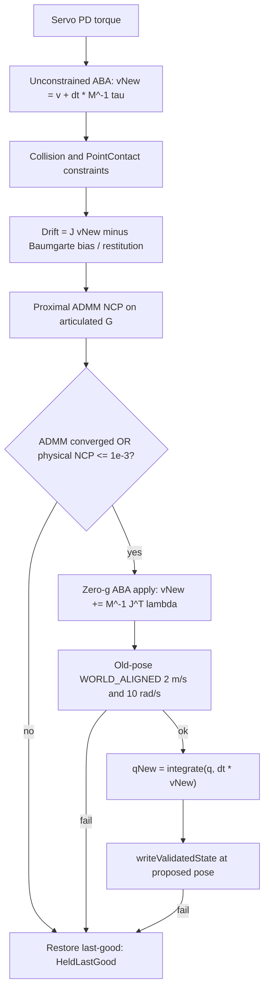

# Solver compliance research

Date: 2026-09-16
Status: research record plus last-resort NCP CCP recovery (2026-09-16). WSL
production remains `SolverMode = 1` (rigid proximal, cap 24, 0.14 m). This
document does **not** promote Mode 2. Silent rigid-to-compliant fallback inside
a healthy substep remains forbidden. A logged last-resort cone-QP write after
a rigid NCP miss is the implemented path-C leftover.

Related living documents (do not treat this file as a replacement):

- [`SEQUENTIAL_WALK_DISTANCE_LEFTOVERS.md`](SEQUENTIAL_WALK_DISTANCE_LEFTOVERS.md)
  — current sequential fails, root-cause depth, closed leftover patches
- [`PLAN_CONTACT_NCP_COMPLIANCE_AND_PRUNING.md`](PLAN_CONTACT_NCP_COMPLIANCE_AND_PRUNING.md)
  — investigation plan and Mode 2 campaign results
- [`PHYSICS_SIM_CONFIG_REFERENCE.md`](PHYSICS_SIM_CONFIG_REFERENCE.md) —
  solver keys, last-resort policy, speed guards
- [`PLAN_PINOCCHIO_DEFAULT_SWITCH.md`](PLAN_PINOCCHIO_DEFAULT_SWITCH.md) —
  why rigid proximal is the WSL default
- [`PLAN_COORDINATED_SWING_RATE_GOVERNOR.md`](PLAN_COORDINATED_SWING_RATE_GOVERNOR.md)
  — command-side rate leftover, not a contact-law change

## 1. Purpose

Rigid Mode 1 sequential walk-distance stays red. That is often described as
“the solver issue.” It is not one bug. The same plant produces at least four
leftover classes with different levers:

1. Frictional **NCP hold** on a redundant 5-contact set.
2. **SpeedLimit v1**: commanded composed swing-tibia rate already above 10 rad/s
   in `v_in`.
3. **SpeedLimit v2**: contact impulse *amplifies* femur/tibia rate into the
   10 rad/s guard.
4. Sequential **turn translation** versus the 0.21 m net gate.

Contact compliance can address (1) and maybe the `contact_dv` term of (3). It
cannot unwind (2). It is not the demonstrated lever for (4).

This report records what Mode 1 and Mode 2 actually do in this tree, what
“compliant” means today versus a physically calibrated spring-damper, and what
would change if the frozen campaign constraints were allowed to break.

## 2. Leftover map

| Leftover | Typical evidence | What it actually is | Can contact compliance help? |
| --- | --- | --- | --- |
| Reverse / sequential **NCP hold** | 5 tibia contacts; `ncp_dual` ~0.002–0.007, `ncp_comp` ~0.0026–0.0039 after cold last-resort; Delassus λ_min ~0.31–0.53, cond ~113–191 ([`reverse-failure-v3.json`](contact-snapshots/reverse-failure-v3.json), [`PLAN_CONTACT_NCP_COMPLIANCE_AND_PRUNING.md`](PLAN_CONTACT_NCP_COMPLIANCE_AND_PRUNING.md)) | Finite-iteration Signorini–Coulomb NCP on a hyperstatic set. Not a NaN mass matrix. | **Yes. Path C last-resort cone-QP recovery is the production leftover for this class.** Mode 2 experiment sequential: zero recovered NCP. |
| **SpeedLimit v1** commanded tibia | [`speed-limit-rigid-v1.json`](contact-snapshots/speed-limit-rigid-v1.json): swing `leg_0_tibia_body`, `winner_w` ~10.15, NCP accepted (dual ~8.4e-4), femur `vin` 7.07 / coxa 4.83, contact small | Composed serial-link WORLD_ALIGNED ω already illegal in `v_in`. ABA/contact are spectators. | **No as the primary fix.** Soft feet cannot unwind a commanded rate. |
| **SpeedLimit v2** contact-amplified | [`speed-limit-rigid-v2.json`](contact-snapshots/speed-limit-rigid-v2.json); latest schema-2 freeze [`speed-limit-sequential-contact-amplified-v1.json`](contact-snapshots/speed-limit-sequential-contact-amplified-v1.json): `speed_in` 2.90 → `speed_after` 11.21, femur/tibia `contact_dv` +12.15 / −15.06 | Impulse-space Δω on an already aggressive swing. `incoming_over_cap` empty on the 2026-09-16 freeze. | **Maybe the Δv term.** Logged λ-scale (`v_α = v_ABA + α (vNew−v_ABA)`) was tried 2026-09-16 and **reverted**: isolated reverse dropped 5/5 → 4/5 femur SpeedLimit. Frozen v2 remains open. Do not restack retry gain. Do not raise 10 rad/s. |
| Sequential **turn 0.21 m** | Frozen command census [`turn-sequential-census-v1.json`](contact-snapshots/turn-sequential-census-v1.json); CCP-plant recensus [`turn-plant-state-census-v1.json`](contact-snapshots/turn-plant-state-census-v1.json): isolated 0.169–0.196 m; after-reverse still under 0.21; after reverse+straight fails 0.264 / 0.235 m (r 0.153 / 0.134) | Extra equivalent radius after **straight following reverse**, not a yaw-command bug (`cmd_yaw` 0.45, Φ≈0). Slip does not split. | **Not demonstrated.** No production latch. Do not loosen 0.21 m. |

Census decisions (both 2026-09-16, Mode 1, governor off): **no production lever** for turn construction and commanded-tibia recapture. The schema-2 snapshot that *was* captured is v2 contact-amplified, not v1 commanded tibia. See [`speed-limit-commanded-tibia-census-v1.json`](contact-snapshots/speed-limit-commanded-tibia-census-v1.json).

HeldLastGood on an NCP miss is working as designed: the server bridge treats it
as an invalid sensor read (`bus_ok=false` → `BUS_TIMEOUT`). The 10 rad/s
all-body guard after ABA+contact is also working as designed. The rigid plant
is simply not always able to emit a *legal* frictional impulse on a redundant
set in 24–48 ADMM iterations, and swing commands can still compose or couple
into that same 10 rad/s envelope.

## 3. Mode 1 substep

Production WSL: `Runtime.PhysicsSim.SolverMode = 1`, `SolverIterations = 24`,
`ProximalMu = 1e-6`, `AbsoluteTolerance = 1e-8`, `RelativeTolerance = 1e-6`,
`ContactRegularization = 1e-10`, body height 0.14 m. Proximal internals run at
**1/480 s** regardless of command cadence.

Enum and session latch:

```64:73:hexapod-common/include/physics_sim_protocol.hpp
enum class PhysicsSolverMode : std::int32_t {
    LegacyPgs = 0,
    PinocchioProximal = 1,
    PinocchioProximalCompliant = 2,
};
```

`usesPinocchioProximal` is the only plant fork at step time. Mode 1 and Mode 2
share the Pinocchio tree; Mode 0 uses legacy PGS `world.Step`.



Implementation: [`hexapod-physics-sim/src/demo/pinocchio_hexapod.cpp`](../hexapod-physics-sim/src/demo/pinocchio_hexapod.cpp)
`advanceOnce`.

### 3.1 Dynamics and contact assembly

1. Critically damped position-PD torque (ω_n=25, ζ=1, stall 1.471 N·m,
   armature scale 0.25). This is a position-error law, not velocity
   feed-forward.
2. Unconstrained ABA in WORLD convention; `vNew = v + dt * a` (`~L1381–1390`).
3. `PrepareExternalContacts`; robot–static contacts only; penetration >
   0.05 m is `ExtremePenetration` before any solve.
4. `PointContactConstraintModel` (t0, t1, n). Coulomb μ is the average of
   **dynamic** frictions (scene 2.0/2.0).
5. Articulated `DelassusOperatorRigidBody`: `G = J M⁻¹ Jᵀ + ContactRegularization`
   (`1e-10`). That ε is numerical damping of G, not a rubber foot.
6. Drift: `J vNew`, then Catto-style velocity bias
   `min(v_max, 0.20 * max(0, φ − 2 mm) / dt)` subtracted from the normal
   (`~L1788–1804`). Scene: `penetrationSlop = 0.002`,
   `penetrationBiasFactor = 0.20`. Restitution is suppressed below 0.2 m/s.
   Pinocchio `BaumgarteCorrectorParameters` default Kp=Kd=0 and are never set.

### 3.2 Rigid NCP solve and accept

Spectral proximal ADMM, `solve_ncp = true`, `mu_prox = 1e-6`, Anderson 5,
τ=0.7, primal/dual ratio 5. Standing ADMM stop **1e-8** (raising it to 1e-3
lets the body sag ~10 cm). Sliding contacts (tangential free speed > 2 cm/s)
use the **1e-3** NCP floor as the ADMM stop as well
([`pinocchio_hexapod.hpp`](../hexapod-physics-sim/include/minphys3d/demo/pinocchio_hexapod.hpp)
L53–64).

Independently recomputed physical residuals (`~L2118–2200`):

| Residual | Meaning | First-attempt floor |
| --- | --- | --- |
| `ncpDualResidual` | Inf-norm of dual-cone projection after de Saxcé | 1e-3 + rel × ‖v_free_biased‖_∞ |
| `ncpComplementarityResidual` | Conic complementarity of (λ, v+s) | 1e-3 + rel × ‖λ‖_∞ ‖v‖_∞ |
| `coneResidual` | ‖λ − Π_Coulomb(λ)‖ | 1e-3 + rel × ‖λ‖_∞ |
| ADMM primal/dual/comp | Pinocchio’s scaled KKT | standing 1e-8 / sliding 1e-3 |

Default Mode 1 accept (`~L2219–2223`):

```text
accepted = converged || physicallyConverged
```

ADMM can report converged while independently recomputed dual is still ~4e-3.
Requiring physical residuals only (`HEXAPOD_PINOCCHIO_STRICT_NCP_ACCEPT`) was
tried and **reverted**: it traded SpeedLimit for an NCP-hold cascade. That flag
is not in source.

If `!accepted`, impulses are **not** applied. Status `SolverNotConverged`.

### 3.3 Apply, speed guard, integrate

Applied dynamics remain rigid even on Mode 2: `evalConstraintJacobianTransposeMatrixProduct`
plus a **zero-velocity, zero-gravity ABA** evaluates `M⁻¹ Jᵀ λ` (`~L2536–2567`).
There is no post-ABA `vNew` clamp.

SpeedLimit is checked on the **old pose** with `vNew` (WORLD_ALIGNED ω/v, every
body, 2 m/s / 10 rad/s). Fail → no write. Then `qNew = pinocchio::integrate(q, dt * vNew)`
and `writeValidatedState` re-checks the same bounds at the **proposed pose**.
Pose transport can fail after the old-pose guard passed
(`[proximal-integrated-speed-limit]`). Production keeps both guards.

### 3.4 Last-resort ladder

Retryable reasons: `SolverNotConverged` and `SpeedLimit` only.

| Attempt | dt | iters | PD | Warm | NCP floor |
| --- | --- | --- | --- | --- | --- |
| 1. Healthy | `dt` | 24 | 1.0 | previous | 1e-3 |
| 2. Same-dt retry | `dt` | 24 | **0.5 if SpeedLimit**, else 1.0 | failed λ minus worst contact | 1e-3 |
| 3. Warm half-steps | two × `dt/2` | 24 | same | restored pre-retry warms, worst dropped | 1e-3 |
| 4. Last-resort | two × `dt/2` | **max(2×cap, 48)** | same | **cold** | **2e-3 if NCP**, else 1e-3 |
| 5. NCP CCP recovery | two × `dt/2` | same ADMM sidecar; PGD 256 | same | **cold** | **projected residual 1e-3**, impulse ≤ 1.0 N·s, speed guards |

Step 5 runs only after step 4 still misses **and** the first attempt was
`SolverNotConverged` (not `SpeedLimit`), Mode 1 session, and
`HEXAPOD_PINOCCHIO_DISABLE_NCP_CCP_RECOVERY` is unset. It always logs
`[proximal-ncp-ccp-recovery]`. A passing write is `RecoveredRetry` with
`ncpCcpRecovery` set; it is a real integrated state, not `HeldLastGood`.
Healthy Mode 1 steps still never flip the law.

Code: `kSpeedLimitRetryGainScale = 0.5` (`pinocchio_hexapod.cpp` L227, L3059–3072).
[`PHYSICS_SIM_CONFIG_REFERENCE.md`](PHYSICS_SIM_CONFIG_REFERENCE.md) still says
SpeedLimit skips same-`dt` because ω is not a function of dt. **Production code
does same-dt at half PD**, then dt/2. Trust the code.

Last-resort keeps **all contacts**. Omit-of-complementarity-worst, graze
`minPenetration`, four `dt/4`, and last-resort 96 exist only as
`HEXAPOD_PROXIMAL_TRACE_FAILURES` probes. Omit dumped leftover ω into SpeedLimit.

On final failure (including CCP recovery miss or disable): restore last-good
(not the failed iterate), slew servo targets from measured angles,
`HeldLastGood`.

## 4. What Mode 2 is today

Mode 2 is a **session setting**, latched from `ConfigCommand.solver_mode` in
[`serve_mode.cpp`](../hexapod-physics-sim/src/demo/serve_mode.cpp) L1590–1591,
or from `HEXAPOD_PINOCCHIO_COMPLIANT_CONTACT_EXPERIMENT`. Header:

```71:76:hexapod-physics-sim/include/minphys3d/demo/pinocchio_hexapod.hpp
    /// Explicit protocol SolverMode=2 path. Also enabled by
    /// HEXAPOD_PINOCCHIO_COMPLIANT_CONTACT_EXPERIMENT. Healthy Mode 1 steps
    /// never switch to this law after a rigid reject. Last-resort NCP recovery
    /// may run the same cone QP once, logged, and only if residual/impulse/
    /// speed guards pass; see ncpCcpRecovery.
    bool compliantContact = false;
```

Retries and last-resort call the same `advanceOnce`. Healthy Mode 1 steps
**never** flip `compliantContact`. After rigid last-resort NCP still misses,
a logged cone-QP pair can pass `forceCompliantContact` for those two cold
half-steps only. A Mode 2 last-resort stays PGD (no extra CCP stage).

Same plant as Mode 1: free-flyer + 18 revolutes, PD, μ, 2 mm slop, 0.20
Baumgarte bias, 480 Hz, 10 rad/s / 2 m/s guards, last-resort policy.

Different **impulse law overlay** (`pinocchio_hexapod.cpp` ~L1981–2220):

1. Rigid ADMM NCP still runs in full.
2. Copy dense `G = delassus.undampedMatrix(true)`.
3. `G_nn += C_n` with default
   `HEXAPOD_PINOCCHIO_COMPLIANT_NORMAL_COMPLIANCE=1e-5`;
   `G_tt += C_t` with
   `HEXAPOD_PINOCCHIO_COMPLIANT_TANGENTIAL_REGULARIZATION=1e-6`.
4. Projected gradient on Coulomb cones, start from cone-projected ADMM λ,
   spectral step `1 / max row-ℓ1`, cap
   `HEXAPOD_PINOCCHIO_COMPLIANT_ITERATIONS` (default 256), stop at projected
   residual ≤ 1e-3 or Δλ ≤ 1e-8.
5. **Replace** `impulses` with that λ.
6. Contact velocity for warm-start/apply uses **unregularized**
   `delassus.applyOnTheRight(λ) + drift`.
7. Accept if finite, `‖λ‖∞ ≤ 1.0` N·s, and (projected residual ≤ 1e-3 **or**
   rigid NCP physical). Walking peaks cited ~0.06–0.10 N·s.
8. Unconverged compliant λ is not applied and not warm-started (early 20-iter
   caps injected hundreds of rad/s).

Apply is still rigid `M⁻¹ Jᵀ λ`. Solving `(G+C)λ + v* ≈ 0` then applying `Gλ`
leaves leftover contact velocity `≈ −Cλ`: a **tiny damper in impulse space**,
not millimetre sag.

Mode 2 is therefore:

- a SAP-like convex Coulomb-cone QP on a slightly regularized Delassus;
- **not** Hunt–Crossley / Kelvin–Voigt (`F = −kφ − bφ̇`);
- **not** Pinocchio `setCompliance` / `setBaumgarteCorrectorParameters`
  (library APIs exist on `PointContactConstraintModel` and are never called);
- **not** merely “looser NCP residuals” on the same equations (inner problem is
  CCP/cone projection, live gate is projected residual 1e-3);
- **not** the offline sweep’s `damping * penetration` term
  ([`tools/compliant_contact_sweep.py`](../tools/compliant_contact_sweep.py)
  L17–26), which live C++ does not implement.

`C = 1e-5` versus G eigenvalues ~0.31–60 is numerical well-posedness for
hyperstatic contacts (Carpentier / Montaut / Le Lidec proximal ADMM,
[arXiv:2405.17020](https://arxiv.org/abs/2405.17020)), not a calibrated foot
spring.

Legacy PGS `softContactCompliance` ([`types.hpp`](../hexapod-physics-sim/include/minphys3d/solver/types.hpp)
default 0) is a different, unused plant on the proximal path.

## 5. Why silent rigid-to-compliant fallback is forbidden

A mid-substep switch changes the map `x,u ↦ x⁺` even if collision, ABA, and
the 10 rad/s guard stay:

- **Energy.** Rigid NCP is ideally workless in stick. `(G+C)λ + v = 0`
  dissipates `½ λᵀ C λ`. Unconverged PGD can *inject* energy.
- **Bounce.** Restitution still lives in `drift`. Different λ ⇒ different
  `v_n⁺`. A rigid hold applies **zero** contact Δv; a fallback that *applies*
  compliant λ makes the foot bounce or stick when the rigid plant would freeze.
- **Sink-in.** Rigid + 2 mm slop + 0.2 Baumgarte keeps depth near 2 mm.
  Compliance *allows* φ>0 as the force law. Observed Mode 2 depths ~0.44–0.93 mm.
  A mid-step switch would change height and BODY_COLLAPSE classification.
- **Different SpeedLimit class mix.** Rigid census: contact can amplify swing ω
  (v2 femur `vin` 7.53 → `vnew` 12.39). Mode 2 often avoids NCP holds but had a
  femur leftover at **10.53 rad/s, 656 held** on protocol remesure. Same guard,
  different `contact_dv`, different retry (half PD vs 2× NCP).

That is why Mode 2 is opt-in on the session `ConfigCommand`, WSL stays `1`, and
a **healthy** rigid reject never flips the law mid-substep. Last-resort NCP
CCP recovery is the one authorized exception: it is logged, gated on residual /
impulse / speed, and applied as `RecoveredRetry` rather than a silent Mode 2
session. Promotion policy in
[`PLAN_CONTACT_NCP_COMPLIANCE_AND_PRUNING.md`](PLAN_CONTACT_NCP_COMPLIANCE_AND_PRUNING.md):
do not promote Mode 2 until **rigid Mode 1 sequential is green**; Mode 2 leftover
SpeedLimit is “serial-link class, not an NCP miss.” Path C does not change that
promotion gate.

Campaign snapshot:

| Path | Sequential walk-distance | Notes |
| --- | --- | --- |
| Env experiment (`HEXAPOD_PINOCCHIO_COMPLIANT_CONTACT_EXPERIMENT`) | 3/3 | 0 holds, 0 SpeedLimit, peak impulse 0.08–0.10 N·s |
| Protocol Mode 2 (`HEXAPOD_WALK_TEST_SOLVER_MODE=pinocchio-compliant`, experiment unset) | **2/3** | Zero recovered NCP; run 2 `straight_walk` femur SpeedLimit 10.53 rad/s, 656 held |
| Later Mode 2 budget 5 sequential | 4 pass, 1 straight speed-band miss | 0 SpeedLimit snapshots |
| Rigid Mode 1 sequential (promotion gate) | typically 1/5 | Mix of NCP, SpeedLimit, turn net |

## 6. Physical compliance versus numerical knobs

Today the velocity-level rigid law is:

```text
v⁺ = v_ABA + M⁻¹ Jᵀ λ
0 ≤ λ  ⊥  (G v_ABA + c)  ∈ K*
```

with tiny numerical `ContactRegularization = 1e-10` and proximal `μ = 1e-6`
that vanishes as ADMM iterates. That is **not** physical compliance.

A physics-compliant step keeps ABA, collision, integrate, SpeedLimit, and hold.
It **replaces** the impulse law.

| Symbol | Role | Today | Physical target |
| --- | --- | --- | --- |
| `ContactRegularization` | Numerical G damping | **1e-10** | keep as numerics; do not retarget as k |
| `ProximalMu` | ADMM proximal penalty | **1e-6** | keep as numerics; **not** ground friction |
| Mode 2 `C_n` | Diagonal ridge on G_nn | **1e-5** | too small for millimetre sag |
| Mode 2 `C_t` | Diagonal ridge on G_tt | **1e-6** | stick regularisation, not rubber |
| Baumgarte / ERP | Position correction in drift | slop 2 mm, factor **0.20** | already present; not a spring k |
| `k` | Normal stiffness (N/m) | **absent** | sag `mg/k`; ~10³–10⁴ N/m for ~1 mm on ~2 kg / 3 feet |
| `b` | Normal damping (N·s/m) | **absent** live (sweep-only) | dissipation / Hunt–Crossley |
| `R ≈ 1/(k Δt²)` or `Δt/b` | Impulse-space compliance | Mode 2’s tiny C | MuJoCo/SAP / implicit Euler |
| ERP, CFM | ODE map `ERP = kΔt/(kΔt+b)`, `CFM = 1/(kΔt+b)` | not named | can be derived from k,b |
| Impulse cap | Safety | Mode 2 **1.0 N·s** | safety, not stiffness |

Order-of-magnitude check: at 480 Hz, `Δt² ≈ 4.3e-6`. For k = 5×10³ N/m,
`R_n ≈ 1/(k Δt²) ≈ 4.6e-2`, **three orders of magnitude** above Mode 2’s
`C_n = 1e-5`. Using `C_n` as if it were k will not produce millimetre sag;
using k = 1/`C_n` = 1e5 N/m is a different, much stiffer foot than the sag
argument.

Constitutive options (none are production):

- Kelvin–Voigt: `F = −k φ − b φ̇`, `λ = F Δt`, Coulomb-projected.
- Hunt–Crossley: `F = −k φ^n − b φ^n φ̇`.
- Implicit Euler / SAP / MuJoCo: `(G + R) λ = −v*`.
- ODE ERP/CFM: `(G + CFM) λ = −v − (ERP/Δt) φ`.

Accept would move from Signorini complementarity to the **projected residual of
the regularized KKT**. Last-resort would be less about 5-contact NCP
infeasibility and more about impulse, penetration, and energy gates.

`Runtime.PhysicsSim` today exposes `SolverMode`, `SolverIterations`,
`ProximalMu`, `AbsoluteTolerance`, `RelativeTolerance`, `ContactRegularization`.
There is **no** wire field for k, b, PGD iterations, or Mode 2 impulse cap.
Those live as env vars.

## 7. If frozen constraints can break

Three honest options. They are mutually exclusive as *defaults*; mixing them
inside one substep is the forbidden fallback.

### A. Session-wide `G+R` with calibrated `k,b` (smallest honest plant change)

Wire `ContactStiffness` / `ContactDamping` (or `C_n`, `C_t` derived from k, Δt)
into ConfigCommand and TOML. Stop running rigid ADMM first. Solve the convex
cone QP on `G+R` once, with:

- `R_n ≈ 1/(k Δt²)` or `Δt/b`
- normal bias `+= b φ` (as the sweep tool already does offline)
- accept on projected residual of the regularized KKT
- **consistent apply**: either use `(G+R)λ` for both solve and `v⁺`, or put
  softness inside Pinocchio so Delassus itself is compliant

Treat this as a **new plant**: new fixtures, new gates, WSL `SolverMode = 2`
only after sequential is green **on that plant**. Keep the 10 rad/s
integrated-state guard. A compliant solver that injects ω is worse than a hold.

### B. Pinocchio native `setCompliance` / Baumgarte (least invented)

`PointContactConstraintModel` already has `m_compliance`, `setCompliance`,
`has_baumgarte_corrector = true`, and `setBaumgarteCorrectorParameters`. Hexapod
never calls them. Putting softness inside the same ADMM operator would drop the
dense PGD sidecar after rigid NCP (today: extra 256 PGD iters + mixed warm-start
history). This is the least-invented way to stop solving two different contact
problems per substep.

Still a plant change. Still needs a default-switch campaign. Still does not
green commanded tibia SpeedLimit.

### C. CCP accept without rubber feet (solver-side, still rigid-ish)

**Implemented 2026-09-16** as last-resort NCP recovery, not as a session Mode 2
default. Goal: no more 5-contact `HeldLastGood` writes when a legal cone-QP
impulse exists.

- After rigid last-resort (two cold `dt/2` at 2×) still misses Signorini, two
  further cold `dt/2` half-steps run the Mode 2 PGD law (`forceCompliantContact`).
- Apply only if projected residual ≤ 1e-3, peak impulse ≤ 1.0 N·s, and the
  10 rad/s / 2 m/s integrated-state guards pass. Status is `RecoveredRetry`
  with `ncpCcpRecovery`. `bus_ok` stays true.
- Always log `[proximal-ncp-ccp-recovery]`. Disable with
  `HEXAPOD_PINOCCHIO_DISABLE_NCP_CCP_RECOVERY=1`.
- Does not run on `SpeedLimit` first-fails, and does not run when the session
  is already Mode 2 / experiment.

C can green NCP holds without a calibrated spring. It will not green commanded
tibia SpeedLimit. It will not, by itself, make sequential walk-distance the
production-green bar. Remesure isolated reverse first, then sequential.

Rejected as production levers (already measured):

- last-resort omit / graze / `dt/4` / 96 iters
- runtime contact pruning (wrench-preserving basis fails 1e-6)
- `STRICT_NCP_ACCEPT`
- anti-windup / L1 rate cap (damaged turn)
- stacking SpeedLimit retry gain 0.5 → 0.25
- raising `maxAngularSpeed` 10 → 25
- clamping `vNew` after ABA
- publishing HeldLastGood as `bus_ok`

## 8. What still would not go green from compliance

**Commanded swing-tibia SpeedLimit (v1).** `v_in` already has WORLD_ALIGNED ω
> 10. Governors, L1, anti-windup, and predictor-to-commands were rejected.
The unused idea is a test-local measured-q/v **reference** slowdown, gated on
contact re-solve (`physical_gates_passed` is currently false for the coupled
predictor). Raising 10 rad/s hides the trip; MG996R no-load is ~7.48 rad/s.

**Contact-amplified SpeedLimit (v2).** Scaling `λ` after a legal cone QP
(`v_α = v_ABA + α (vNew − v_ABA)`, `α ≥ 0.05`) is still the legal leftover for
an ABA-under, apply-over trip. It was implemented 2026-09-16 and **reverted**
after isolated reverse femur SpeedLimit 4/5 (two batches). Frozen v2
(`speed_in` 2.90 → 11.21) remains the implement class; hunt tibia
`speed_free` 10.36 is ABA-over, not v2. Do not restack retry gain. Do not raise
10 rad/s.

**Turn 0.21 m.** Command construction remains the known-good path (explicit
0.45, `twist.z` left 0). CCP-plant recensus
[`turn-plant-state-census-v1.json`](contact-snapshots/turn-plant-state-census-v1.json):
isolated 5/5 at 0.169–0.196 m; reverse prefix does not grow r; reverse+straight
does (fails 0.264 / 0.235 m). Stance slip and `stand_end_v` do not explain the
delta. **No production lever** (class 3 prefix, no named warm-start/CRBA latch).
Do not loosen 0.21 m. Sequential ×5 this hunt aborted 4/5 on straight SpeedLimit
before turn — that is a different leftover.

**Sequential as a whole.** Experiment Mode 2 sequential 3/3 is real. Protocol
Mode 2 remesure 2/3 is also real. Promotion still requires sequential
walk-distance green **without** hiding SpeedLimit or turn drift behind a
different plant and without treating `./scripts/verify.sh` as production-green
while sequential is red.

## 9. Recommended direction

1. **Plant stays Mode 1.** Session-wide Mode 2 is still not promoted. Last-resort
   NCP CCP recovery is the leftover that writes a valid state instead of a
   5-contact hold. Do not blend laws on healthy first attempts.
2. **Calibrate stiffness from sag and energy, not from NCP residual** if a
   later default-switch campaign chooses a real `G+R` / `setCompliance` plant.
   Mode 2’s `C_n=1e-5` is not that calibration.
3. **Remesure in that order** on Mode 1 with CCP recovery: isolated reverse
   (NCP class), isolated turn (0.21 m and yaw band), then sequential. Keep
   aggressive governor screens. Any new ω injection or BODY_COLLAPSE is a
   revert of this recovery, not a reason to raise 10 rad/s.
4. **Keep the 10 rad/s integrated-state guard** and do not publish HeldLastGood
   as `bus_ok`.
5. Treat a real compliant law as a **new default-switch campaign**, not a
   leftover patch. Until that campaign is green on sequential Mode-2-as-default,
   WSL stays `SolverMode = 1`.

Highest-leverage remaining plant change, if later authorized: **path A or B**
— one session-wide physically compliant contact law, TOML `k,b` (or Pinocchio
`setCompliance`), no rigid ADMM sidecar. Path C is the current NCP-hold leftover.

## 10. Pointers

### Code

- [`hexapod-physics-sim/src/demo/pinocchio_hexapod.cpp`](../hexapod-physics-sim/src/demo/pinocchio_hexapod.cpp)
  — ABA, NCP, Mode 2 PGD, apply, SpeedLimit, last-resort
- [`hexapod-physics-sim/include/minphys3d/demo/pinocchio_hexapod.hpp`](../hexapod-physics-sim/include/minphys3d/demo/pinocchio_hexapod.hpp)
  — `ProximalSolverSettings`, `compliantContact`
- [`hexapod-physics-sim/src/demo/serve_mode.cpp`](../hexapod-physics-sim/src/demo/serve_mode.cpp)
  — ConfigCommand latch, 1/480 s substep
- [`hexapod-common/include/physics_sim_protocol.hpp`](../hexapod-common/include/physics_sim_protocol.hpp)
  — `PhysicsSolverMode`, `ConfigCommand`
- [`tools/compliant_contact_sweep.py`](../tools/compliant_contact_sweep.py) —
  fixture-only SAP-like solver with `damping * penetration`
- [`tools/audit_speed_limit_kinematics.py`](../tools/audit_speed_limit_kinematics.py)
  — schema-2 SpeedLimit replay (requires `schema_version == 2`)

### Config and env

| Key / flag | Default | Role |
| --- | --- | --- |
| `Runtime.PhysicsSim.SolverMode` | **1** (WSL) | 0 PGS, 1 rigid proximal, 2 compliant PGD overlay |
| `SolverIterations` | 24 | ADMM cap; last-resort `max(2×, 48)` |
| `ProximalMu` | 1e-6 | ADMM μ, not friction |
| `AbsoluteTolerance` | 1e-8 | standing ADMM stop |
| `ncpAbsoluteTolerance` | 1e-3 | NCP floor / sliding ADMM stop |
| `ContactRegularization` | 1e-10 | rigid Delassus ε |
| `HEXAPOD_PINOCCHIO_COMPLIANT_CONTACT_EXPERIMENT` | unset | same equations as Mode 2 without config change |
| `HEXAPOD_PINOCCHIO_COMPLIANT_NORMAL_COMPLIANCE` | 1e-5 | Mode 2 G_nn ridge |
| `HEXAPOD_PINOCCHIO_COMPLIANT_TANGENTIAL_REGULARIZATION` | 1e-6 | Mode 2 G_tt ridge |
| `HEXAPOD_PINOCCHIO_COMPLIANT_ITERATIONS` | 256 | PGD cap |
| `HEXAPOD_PINOCCHIO_DISABLE_NCP_CCP_RECOVERY` | unset | `1` skips last-resort cone-QP recovery |
| `HEXAPOD_PINOCCHIO_DENSE_ADMM` | off | A/B; not production |
| `HEXAPOD_PINOCCHIO_CONTACT_PRECONDITION` | off | A/B; accept physical NCP only |
| `HEXAPOD_SWING_LINK_RATE_EXPERIMENT` | off | command governor; not a contact law |

### Census and fixtures (do not overwrite)

- [`contact-snapshots/speed-limit-rigid-v1.json`](contact-snapshots/speed-limit-rigid-v1.json) — commanded tibia
- [`contact-snapshots/speed-limit-rigid-v2.json`](contact-snapshots/speed-limit-rigid-v2.json) — contact-amplified
- [`contact-snapshots/speed-limit-sequential-contact-amplified-v1.json`](contact-snapshots/speed-limit-sequential-contact-amplified-v1.json) — 2026-09-16 schema-2 v2-class freeze
- [`contact-snapshots/speed-limit-commanded-tibia-census-v1.json`](contact-snapshots/speed-limit-commanded-tibia-census-v1.json)
- [`contact-snapshots/turn-sequential-census-v1.json`](contact-snapshots/turn-sequential-census-v1.json)
- [`contact-snapshots/turn-plant-state-census-v1.json`](contact-snapshots/turn-plant-state-census-v1.json) — CCP-plant prefix split; do not overwrite the frozen 2026-09-16 command census
- [`contact-snapshots/speed-limit-reverse-census-v1.json`](contact-snapshots/speed-limit-reverse-census-v1.json)
- [`contact-snapshots/reverse-failure-v3.json`](contact-snapshots/reverse-failure-v3.json)
- [`contact-snapshots/compliant-sim-campaign-v2.json`](contact-snapshots/compliant-sim-campaign-v2.json)
- [`contact-snapshots/rigid-flake-census-v1.json`](contact-snapshots/rigid-flake-census-v1.json)
- v16 exact-replay fixture hash `ddc6008e0cc1ac97` — do not recapture for CTest
