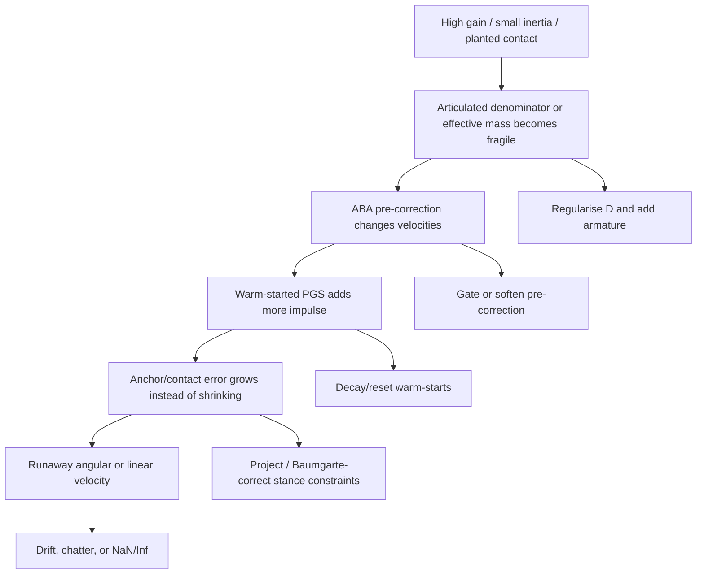

# Featherstone ABA instability and drift in rpharmer/hexapod

## Executive summary

The highest-confidence reading of the current `rpharmer/hexapod` codebase is that the occasional “numerical blow-up” is **not** primarily caused by a naïve or obviously incorrect use of the articulated-body algorithm itself. The repo already implements several sensible stabilisation measures: a semi-implicit velocity-first update, articulated-chain detection, an ABA-based pre-correction pass, warm-start decay across outer steps, explicit zero-G gain downscaling, chain-position correction, and contact/joint solver tuning. The residual risk comes from the **coupling** of ABA pre-correction, iterative contact/joint solving, float-precision arithmetic, aggressive servo gains, small link inertias, and contact-rich stance phases. That is exactly the regime where the literature says forward-dynamics formulations can become ill-conditioned or “stiff” in the numerical sense, even when the dynamics algorithm is formally correct. fileciteturn42file0L1-L1 fileciteturn44file0L1-L1 fileciteturn39file0L1-L1 citeturn11search12turn12search0turn11search3

The repo itself contains direct clues about the failure modes. The strongest ones are these: `World::Step()` halves cached servo warm-start impulses each outer step because reusing the full cached state “can inject energy into free-floating articulated rigs”; `ArticulationConfig` explicitly says velocity pre-correction is skipped for chains shorter than four links because it can **overshoot with warm-starting**; `test_servo_stability_regression.cpp` warns that very high position gain plus tiny link mass plus gravity can spike linear velocities into the **km/s** range; `RelaxZeroGravityHexapodServos()` exists because the normal gains “overdrive the free-floating articulated tree” in zero gravity; and the build explicitly disables FMA contraction because single-bit floating-point differences already change qualitative stability in regression scenes. Those are all red flags for an occasionally unstable discrete-time coupled solver, not for a purely algebraic ABA derivation error. fileciteturn42file0L1-L1 fileciteturn27file0L1-L1 fileciteturn31file0L1-L1 fileciteturn39file0L1-L1 fileciteturn30file0L1-L1

The steady-state error and “drift” story is similar. The repo already contains target-angle synchronisation at assembly time, zeroing of angle-stabilisation for built-in hexapod servos to avoid double stabilisation, and a separate planted-foot drift telemetry test. But the planted-foot drift test is merely diagnostic and prints metrics rather than failing on them, while `test_hexapod_live_pose_hold.cpp` currently runs with `kStrictStability = false`, which turns its caps into effectively non-binding million-unit limits. So the project has **some instrumentation but not yet strong CI gates** against slow stance drift or latent contact/servo instability. fileciteturn39file0L1-L1 fileciteturn32file0L1-L1 fileciteturn33file0L1-L1

My overall recommendation is to treat this as a **conditioning-and-discretisation** problem. Keep ABA for the fast path, but make it more defensive: regularise articulated denominators, add an armature-like diagonal stabiliser, reset or sharply decay warm-starts on abnormal impulses, project or Baumgarte-correct stance constraints, tighten zero-G and free-chain gains, and add a debug fallback that compares ABA output against a full mass-matrix solve for suspicious chains or frames. That recommendation matches both the repo’s own direction and the mainstream guidance from entity["people","Roy Featherstone","robotics researcher"], entity["software","Rigid Body Dynamics Library","RBDL C++ library"], entity["software","MuJoCo","physics engine"], entity["software","Open Dynamics Engine","physics engine"], entity["software","Bullet","physics engine"], and entity["software","Drake","robotics software"]. citeturn7search0turn9search6turn6search9turn10search0turn8search0

## What the repo is doing and where instability is exercised

The critical implementation locations are concentrated in a few files. `include/minphys3d/core/world.hpp` defines `ArticulationConfig`, including `enableVelocityPreCorrection`, `enableVelocityPreCorrectionFullForwardPass`, `enableVelocityPreCorrectionForwardCoriolis`, and `enableChainPositionSolve`. Its comments are especially revealing: the ABA velocity pre-correction pass is **on by default** for the validated 4-link hexapod legs, but is **explicitly skipped for chains shorter than four links** because those shorter chains “are better served by PGS alone” and the ABA velocity nudges can overshoot when warm-starting is tuned for uncorrected velocities. `src/core/world.cpp` runs the step pipeline; it decays cached servo warm-start terms by `0.5` each outer step, performs `PrepareArticulatedInertias()` before the PGS loop, then integrates orientation and runs articulation position solving. `src/core/world_private_methods.cpp` shows that the actual state update is velocity-first: forces first update velocities, then position/orientation advance, which is a semi-implicit or symplectic-Euler style pattern rather than a plain forward-position explicit Euler update. fileciteturn27file0L1-L1 fileciteturn42file0L1-L1 fileciteturn44file0L1-L1

The scene and actuator tuning live mostly in `src/demo/scenes.cpp` and `include/minphys3d/demo/hexapod_stability.hpp`. The built-in hexapod uses quite aggressive nominal servo parameters in scene construction: `kHexapodServoMaxTorque = 28`, `kHexapodServoPositionGain = 160 rad/s`, `kHexapodServoDampingGain = 1.24`, `kHexapodServoMaxSpeed = 8`. The same file also contains the countermeasures that were clearly added after instability was observed: `SyncBuiltInHexapodServoTargets()` to align targets to the assembled pose, `RelaxBuiltInHexapodServos()` to disable extra angle stabilisation and integral action, and `RelaxZeroGravityHexapodServos()` to scale max torque and gains by `0.25` because the Earth-gravity tuning overdrives the free-floating tree in zero-G. The pose-hold helper applies an additional tuning layer: solver position passes, hinge anchor bias/damping, early-out control, position-gain downscale to `0.70`, damping-gain upscale to `1.50`, speed downscale to `0.45`, and a small angle-stabilisation re-enable at `0.10`. fileciteturn39file0L1-L1 fileciteturn34file0L1-L1

The test suite tells you which scenarios the author themselves considers risky. `test_servo_chain_stability.cpp` and `test_servo_stability_regression.cpp` exercise free-fall chains, loaded chains with static bases, zero-G chains, five-link chains, and a visual servo arm. The loaded single-chain test contains the clearest “blow-up trigger” comment in the repo: very high position gain plus tiny link mass plus gravity can spike linear velocity into **km/s**, so the scenario intentionally keeps gains moderate. The zero-G regression measures servo error over 400 steps at `1/120 s`, while the free-fall and long-chain tests cap peak linear speeds at very large values, which implies the project is guarding mostly against order-of-magnitude explosions rather than against fine physical fidelity in those scenarios. fileciteturn48file0L1-L1 fileciteturn31file0L1-L1

The stance tests are weaker than they look. `test_hexapod_planted_foot_drift.cpp` measures per-leg contact-point drift after a settling window, but it only prints the drift and never asserts on it. `test_hexapod_live_pose_hold.cpp` is even more permissive at the moment: `kStrictStability` is set to `false`, and the test caps become `1e6` or `-1e6`, so the executable is effectively a telemetry run, not a meaningful stability gate. By contrast, `test_hexapod_zero_g.cpp` is genuinely strict: it requires `peakLinear < 0.05`, `peakAngular < 0.05`, `peakError < 1e-4`, and a tight final body-height window. That asymmetry strongly suggests that zero-G articulation has been brought under control, whereas stance/contact drift remains under-instrumented. fileciteturn32file0L1-L1 fileciteturn33file0L1-L1 fileciteturn54file0L1-L1

There is also explicit evidence that the project is already fighting floating-point sensitivity. The build system avoids `-ffast-math`, explicitly disables FMA contraction, and explains that single-bit FMA rounding differences can cascade through PGS iterations into qualitatively different stack stability. That is an unusually candid admission that the solver is operating close enough to numerical margins for roundoff, iteration ordering, and conditioning to matter. fileciteturn30file0L1-L1

## Why the blow-up happens

Featherstone’s original ABA is a linear-time, exact recursive forward-dynamics algorithm for tree structures; the instability usually comes from how forward dynamics is embedded into a **discrete constrained simulator**, not from the existence of ABA per se. The literature is very clear on this. entity["people","Roy Featherstone","robotics researcher"]’s 1983 paper presents ABA as a recursive forward-dynamics method built from articulated-body inertias, and later work on forward-dynamics formulations shows that numerical performance depends heavily on conditioning and the integration context. citeturn11search12turn12search0

The first root cause in this repo is **ill-conditioning of effective inertias**. entity["people","Roy Featherstone","robotics researcher"] later showed that the joint-space inertia matrix can be highly ill-conditioned and that its condition number can grow from \(O(N)\) to \(O(N^4)\) depending on mechanism structure and configuration. In practice, when mass is concentrated badly, links are very light, bases are effectively static compared with children, or contact creates stiff leverage patterns, the articulated scalar terms analogous to \(D_i\) and the effective masses seen by servo/contact rows can get dangerously small or numerically fragile. The repo’s own articulation tests reflect that concern by asserting positivity and finiteness of `D[1]`, root `Ia[0]`, and `SpatialMotionCompliance(Ia[0], h)`. citeturn11search3 fileciteturn46file0L1-L1

The second root cause is **formulation stiffness**: the fast forward-dynamics formulation can interact badly with the time integrator and the discrete constraint solver. Ascher, Pai, and Cloutier specifically show that the fastest forward-dynamics methods are not necessarily the most numerically stable in ill-conditioned cases, and that this can slow or destabilise integration. They also distinguish variants of ABA that are better behaved than more cancellation-prone mass-matrix approaches in some regimes. That maps closely onto the repo’s design: the author already added a special velocity pre-correction pass, but only for longer serial chains and only with explicit warnings about overshoot on short chains. citeturn12search0turn12search1 fileciteturn27file0L1-L1

The third root cause is **energy injection through warm-starting and cross-coupling with PGS contacts**. `World::Step()` itself explains that reusing the full cached impulse state across outer steps can inject energy into free-floating articulated rigs, so it applies a `0.5` decay. That is not a cosmetic choice; it is a direct acknowledgement of a mechanism by which stale constraint impulses and stale servo impulses can become non-physical work when the kinematic state has changed enough between frames. In contact-rich stance, the ABA pre-correction changes velocities before the joint/contact PGS loop, and then the warm-started iterative solver adds more impulses. If the effective masses are underdamped or under-regularised, that is exactly the recipe for a “rare but dramatic” blow-up. fileciteturn42file0L1-L1

The fourth root cause is **gain/mass mismatch**. The repo’s own tests are explicit that high gains and tiny masses are dangerous. This matches what engines such as entity["software","MuJoCo","physics engine"] and entity["software","Drake","robotics software"] document: larger damping or high feedback gains can destabilise discrete stepping unless handled implicitly or with appropriately small steps, and adding armature or reflected inertia is a standard way to improve stability. MuJoCo in particular recommends positive armature as a stability aid and handles joint damping implicitly in its Euler integrator for exactly this reason. Drake warns that its discrete model, although usually preferred for contact, can become unstable with large feedback gains, high damping, or large forcing. citeturn9search0turn9search6turn8search0

The fifth root cause is **float precision and iteration-order sensitivity**. The repo uses `float`-style thresholds throughout, and the build comment about FMA contraction confirms that small rounding differences already alter qualitative outcomes in iterative scenes. That matters more once articulated-body terms and contact Jacobians become ill-conditioned. In other words, the occasional blow-up is probably not “random”; it is likely the visible expression of a marginally stable region whose branch is selected by small numerical differences in contact persistence, ordering, or roundoff. fileciteturn30file0L1-L1

## Why the steady-state drift happens

The first steady-state drift mechanism is **constraint drift in stance contacts**. ABA gives you accelerations for the unconstrained tree dynamics, but planted feet are effectively equality-like constraints enforced through the contact solver. If constraint errors are corrected only weakly, or if solver iteration counts and substeps are marginal, the feet will creep. The repo already measures that creep in `test_hexapod_planted_foot_drift.cpp`, and ODE’s long-standing documentation explains the same phenomenon generically: if ERP is zero, joint/contact error will drift; if ERP is too aggressive, the correction itself can become problematic; and a non-zero CFM can reduce numerical problems, especially near singular systems. ODE also gives the standard ERP/CFM mapping to an implicit spring-damper interpretation. fileciteturn32file0L1-L1 citeturn6search9

The second mechanism is **double correction or mismatched actuator modelling**. `scenes.cpp` documents that the built geometry is assembled at non-zero femur/tibia angles while `CreateServoJoint()` defaults target angles to zero, so the repo had to add `SyncBuiltInHexapodServoTargets()` to stop the motors fighting a static offset from frame zero. The same file then disables integral action and angle stabilisation for the built-in hexapod in `RelaxBuiltInHexapodServos()` because the soft velocity-level servo plus extra positional hinge correction would otherwise become a double-stabilisation loop. That is exactly the kind of modelling mismatch that produces persistent offset, chatter, or slow creep rather than an immediate NaN explosion. fileciteturn39file0L1-L1

The third mechanism is **insufficient damping in the low-gravity or no-contact regime**. The repo contains a separate `RelaxZeroGravityHexapodServos()` because Earth-gravity gains overdrive the free-floating articulated tree in zero-G. The strict zero-G regression then enforces essentially no visible motion or joint error. That implies the author has already observed that “stable on the ground” and “stable in free space” require different servo scaling. If the wrong regime uses the wrong gains, the result is persistent rate error or low-frequency drift rather than a clean settle. fileciteturn39file0L1-L1 fileciteturn54file0L1-L1

The fourth mechanism is **insufficiently strict testing around stance quality**. `test_hexapod_live_pose_hold.cpp` currently does not enforce meaningful stability thresholds because its strict mode is disabled, and the planted-foot drift test does not fail on drift. That means the repo can pass CI while still showing unacceptable steady-state creep in a physically important standing or pose-hold scene. fileciteturn33file0L1-L1 fileciteturn32file0L1-L1

## Concrete fixes

The best fixes are layered. No single patch is likely to eliminate all blow-up cases, because the problem is the interaction of dynamics, contacts, and discretisation. The flow below matches the pattern visible in the repo and in the external engines. citeturn9search6turn6search9turn8search0turn10search0



### Algorithmic fixes

Keep ABA as the fast path, but add a **defensive fallback path** for suspicious frames or suspicious chains. entity["software","Rigid Body Dynamics Library","RBDL C++ library"] documents the cleanest conceptual split: `ForwardDynamics()` uses ABA, while `ForwardDynamicsLagrangian()` builds the full mass matrix \(H\) and solves \(H \ddot q = -C + \tau\) with a robust linear solver. In this repo, the analogue is not to replace the whole engine with CRBA/Lagrangian dynamics, but to add a debug or fallback mode: if any chain yields non-finite articulated inertia, a too-small \(D_i\), or a too-large compliance condition indicator, skip ABA velocity pre-correction for that chain in that frame and fall back to pure PGS, or compute a dense per-chain solve for comparison. ABA remains the production path; CRBA/dense solve becomes the oracle and safety net. citeturn7search0turn12search0

Do **not** switch the repo to a plain explicit Euler integrator. The current state update is already semi-implicit in the important sense that forces update velocities first and positions/orientations are then advanced from the new velocities. That is the right baseline for rigid-body simulation. What *should* be changed is that damping and stiff actuator terms should be treated more like MuJoCo does: either implicitly or with enough regularisation that the single-step update is not asked to resolve unrealistically stiff servo dynamics. fileciteturn44file0L1-L1 citeturn9search6turn9search0

### Regularisation and conditioning fixes

The most important code-level hardening is to **regularise articulated denominators** before they are used to produce correction impulses or velocity pre-corrections. The repo’s articulation test suite already treats `D[i] > 0` and finite compliance as invariants. Enforce those invariants operationally as well, not only in tests. A practical patch is to clamp \(D_i\) to a scale-aware floor and to disable articulation-specific correction for the joint on that substep if the value is non-finite or falls below the floor. This is an engineering inference built directly from the repo’s invariants and from the known ill-conditioning of joint-space inertia matrices. fileciteturn46file0L1-L1 citeturn11search3

```cpp
// world_solver.cpp, inside PrepareArticulatedInertias()
auto inertia_trace = [](const SpatialInertia& I) {
    return I.Ioo.m[0][0] + I.Ioo.m[1][1] + I.Ioo.m[2][2];
};

const float trace = std::max(1.0e-6f, inertia_trace(chain.Ia[i]));
const float D_floor = std::max(1.0e-6f, 1.0e-5f * trace);

if (!std::isfinite(chain.D[i]) || chain.D[i] < D_floor) {
    chain.D[i] = D_floor;
    // Per-frame fallback: do not trust articulation-only correction here.
    servoJoints_[chain.links[i].jointIdx].inArticulationChain = false;
}
```

A second regularisation fix is to add an **armature-like diagonal stabiliser** for servo joints. MuJoCo’s XML reference is explicit that positive armature adds inertia to the diagonal of the generalised inertia and often improves stability even when small. In this repo, the easiest analogue is a servo-joint “articulation armature” term added into the hinge-direction denominator or into the generalised inertia seen by the servo row. Recommended starting range for this repo is small: about `1e-4` to `1e-2 kg·m²` equivalent per hinge for the small leg joints, scaled by link size and mass. For the hexapod specifically, start at the low end on coxa joints and slightly higher on femur/tibia joints if they remain the most jitter-prone. That range is an engineering recommendation, not a value present in the repo today. citeturn9search0turn9search5

```cpp
// joints/types.hpp
float articulationArmature = 0.0f;

// world_solver.cpp
const float D_reg = chain.D[i] + std::max(0.0f, joint.articulationArmature);
chain.D[i] = std::max(D_reg, D_floor);
```

### Constraint-drift fixes

For planted feet and stance stability, the theoretical answer is not “more ABA”; it is **better constraint enforcement**. ODE’s ERP/CFM guidance and the Baumgarte literature both support adding explicit position/velocity error correction terms, while keeping them soft enough to avoid new oscillations. In this repo’s vocabulary, that means: keep `SolveArticulationPositions()`, keep hinge-anchor bias/damping, and strengthen them slightly for stance scenes; optionally add ERP/CFM-style softness for foot contacts or a post-step foot projection when a foot is confidently planted. Recommended initial equivalents are: ERP-like correction roughly `0.1–0.3` and a small CFM-like softness around `1e-6–1e-4` in SI-scaled units. Those numbers are conservative starting points, not exact law. citeturn6search9turn12search2

The repo already exposes the right knobs in `JointSolverConfig`: `hingeAnchorBiasFactor`, `hingeAnchorDampingFactor`, `servoPositionPasses`, and `servoPositionSolveStride`. For the grounded hexapod, I would treat the current pose-hold tuning as the baseline and explore the following ranges: `servoPositionPasses = 4–8`, `servoPositionSolveStride = 1–2`, `hingeAnchorBiasFactor = 0.25–0.40`, `hingeAnchorDampingFactor = 0.35–0.60`. For zero-G, keep `servoPositionPasses = 0–2` and do **not** reuse the grounded stance tuning. That split is consistent with the repo’s explicit zero-G special case. fileciteturn34file0L1-L1 fileciteturn39file0L1-L1

### Timestep and iteration fixes

The repo’s current operational point is effectively **outer frame `1/60 s`, 2 substeps, 30 PGS iterations per substep**, and the benchmarking commit records that this replaced `2 × 40` after velocity pre-correction reduced residual work entering the PGS loop. That is a sensible default, but it should be treated as a **contact-loaded nominal point**, not as proof that `1 × 20` or `1/120` stress tests are equally safe in all scenes. For stress triage, use these practical defaults:

| Scenario | Start with | If unstable |
|---|---:|---:|
| Grounded hexapod pose-hold | `dt=1/60`, `2` substeps, `30` iterations | `4` substeps or `40` iterations |
| Free-fall chain smoke test | `dt=1/120`, `24` iterations | halve `dt` before raising gains |
| Zero-G articulated tree | `dt=1/240`, `24` iterations, zero-G relaxed gains | keep gains low; do not “fix” with huge damping |
| Contact-heavy planted feet | `dt<=1/120` effective substep | add projection / ERP / CFM softness |

That guidance is consistent with the repo’s tests, current pose-hold constants, and the warnings from Drake and MuJoCo that stiff contact or high-gain forcing requires a step small enough to resolve the relevant time scales. fileciteturn34file0L1-L1 fileciteturn35file0L1-L1 fileciteturn52file0L1-L1 citeturn8search0turn9search6

### Warm-start and finite-guard fixes

The repo already decays warm-starts by `0.5`, but that should become **state-dependent**, not fixed. If any articulated or contact row exceeds a large impulse fraction, or if a frame shows abnormal acceleration, reset warm-starts for the affected island or chain entirely. This is a cheap and highly effective fix for occasional explosions caused by stale impulses. fileciteturn42file0L1-L1

```cpp
// world.cpp, after SolveIslands() or after finite checks
const bool abnormal =
    !std::isfinite(body.velocity.x) || !std::isfinite(body.angularVelocity.x) ||
    peakIslandLambda > 0.8f * peakAllowedImpulse ||
    peakIslandSpeed > speedAbortThreshold;

if (abnormal) {
    for (ServoJoint& j : servoJoints_) {
        j.impulseX = j.impulseY = j.impulseZ = 0.0f;
        j.angularImpulse1 = j.angularImpulse2 = 0.0f;
        j.servoImpulseSum = 0.0f;
    }
}
```

The same principle applies to ABA caches. Add a **finite-validation path** after `PrepareArticulatedInertias()` and before any velocity pre-correction is applied. If `Ia`, `Pa`, `u`, `D`, or derived compliance are non-finite, skip ABA correction for that chain and log the chain id, joint id, and body ids. The repo already has the telemetry culture to support this. fileciteturn46file0L1-L1 fileciteturn30file0L1-L1

## Recommended tests, thresholds, and troubleshooting

The current regression mix is informative, but it does not yet provide a strong “no drift, no occasional blow-up” gate. The first improvement is to **tighten and convert telemetry tests into failing tests**. `test_hexapod_live_pose_hold.cpp` should run in strict mode in CI, and `test_hexapod_planted_foot_drift.cpp` should fail above a stance-drift threshold. The second improvement is to add explicit finite/conditioning assertions during runtime, not only in unit tests. The third is to add an ABA-vs-dense oracle for suspicious chains. fileciteturn33file0L1-L1 fileciteturn32file0L1-L1 citeturn7search0

A practical CI gate set for this repo would be:

| Test | What to record | Recommended fail threshold |
|---|---|---|
| Zero-G hexapod hold | peak chassis linear/angular speed, peak joint error | keep current strict thresholds |
| Planted-foot stance | max per-foot contact-point drift after settle | `< 0.002–0.005 m` |
| Pose hold | settled peak speed, peak joint error, final speed | `< 0.02–0.05 m/s`, `< 0.05 rad`, `< 0.02 m/s` |
| Free-fall chain | finite state only, no order-of-magnitude speed explosion | fail on non-finite or `> 10×` baseline |
| Articulation internals | min `D[i]`, max compliance, finite `Ia/Pa/u` | fail on non-finite or `D[i] <= eps` |

Those stance thresholds are recommendations rather than existing repo thresholds; they are intentionally much stricter than the current telemetry-only tests because that is what is needed to detect steady creep before it becomes visible to a user. The direction is aligned with ODE’s and Baumgarte-style guidance that unconstrained drift will otherwise accumulate. citeturn6search9turn12search2

The most useful minimal reproduce/avoid pairs are also already visible from the repo:

| Case | How to provoke | How to avoid |
|---|---|---|
| Loaded single-link explosion | tiny link mass, high position gain, gravity, static/heavy base | moderate gains, more damping, smaller step, armature |
| Zero-G overdrive | use grounded gains in free-floating scene | call `RelaxZeroGravityHexapodServos()` |
| Stance drift | permissive pose-hold test, no contact drift assertion | strict stance drift gate and stronger planted-foot correction |
| ABA/PGS overshoot on short chains | enable aggressive pre-correction on short chains | keep current short-chain gating; add denominator regularisation |
| Floating-point-sensitive divergence | enable fast-math/FMA or reorder solver | keep deterministic build flags, avoid FMA contraction |

The repo already encodes the first two rows explicitly in comments and code. fileciteturn31file0L1-L1 fileciteturn39file0L1-L1 fileciteturn30file0L1-L1

A concise troubleshooting checklist for day-to-day use is this:

- If the failure is **zero-G only**, first verify that the zero-G relax path is active and that grounded gains were not reused. fileciteturn39file0L1-L1
- If the failure is **stance/contact only**, tighten planted-foot drift assertions and raise stance correction before touching ABA. fileciteturn32file0L1-L1
- If the failure is **short-chain only**, disable ABA pre-correction on short chains entirely and compare. The repo already hints this is the correct direction. fileciteturn27file0L1-L1
- If the failure is **rare and irreproducible**, suspect conditioning plus warm-start plus float sensitivity; add finite guards, denominator regularisation, and warm-start resets on abnormal frames. fileciteturn42file0L1-L1 fileciteturn30file0L1-L1
- If the failure persists, compare against a dense mass-matrix solve for the same chain or island. That is the quickest way to separate “ABA-specific issue” from “integration/contact issue”. citeturn7search0turn12search0

## Comparative view of the main fixes

The repo should not choose between “use ABA” and “be stable”. The realistic choice is how much protection to wrap around ABA. Official libraries and documentation all point the same way: use a fast recursive dynamics core, but regularise, soften, damp, or implicitly treat the stiff pieces, especially contact and high-gain actuation. citeturn7search1turn9search6turn6search9turn10search0turn8search0

| Fix | Complexity | Likely effectiveness | Runtime cost | Best target |
|---|---|---|---|---|
| Reduce gains / increase damping / lower max speed | Low | High | Low | Immediate runaway motion |
| Add articulated `D` floor and finite fallback | Low–Medium | High | Low | Rare NaN/Inf and short spikes |
| Add servo armature / reflected inertia | Medium | High | Low | Small-mass, high-gain joints |
| Reset warm-starts on abnormal frames | Low | High | Low | Rare, “once every N runs” blow-up |
| More substeps or more PGS iterations | Low | Medium–High | Medium–High | Contact-rich stance |
| Stronger stance projection / Baumgarte / ERP-CFM style softness | Medium | High for drift | Low–Medium | Planted feet and contact creep |
| CRBA/dense fallback or oracle | Medium–High | High for diagnosis | Medium–High | Hard-to-localise instability |
| Switch fully away from ABA | High | Usually unnecessary | High | Not recommended first |

## Open questions and limitations

This report is high confidence about the **classes of failure** and the **most plausible triggers** because the repo itself documents many of them directly. The main limitation is that I did not have a captured failing seed, replay log, or crash trace from your specific user-observed blow-up. So the report can localise the risky mechanisms and the weak test coverage, but not name a single already-observed frame number or state vector as “the” failure state. The most important immediate improvement, therefore, is to log chain id, joint id, `D[i]`, compliance, peak island impulse, and finite-state checks on the first abnormal frame, then make the planted-foot and pose-hold tests fail on physically meaningful thresholds. fileciteturn46file0L1-L1 fileciteturn32file0L1-L1 fileciteturn33file0L1-L1